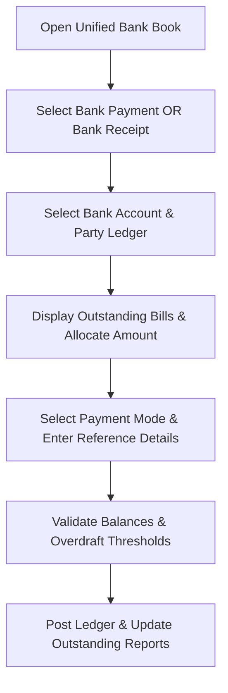

# DIAMO ERP – PHASE 10.1
## BANK BOOK – ARCHITECTURE & WORKFLOW SPECIFICATION

---

## 1. Executive Summary
This document defines the Enterprise Functional Specification Document (FSD) for the Bank Book module of DIAMO ERP. This module consolidates bank payment and receipt operations into a single unified Bank Book interface. Switching transaction types dynamically adjusts accounting models, outstanding allocations, and dashboard reports.

---

## 2. Business Purpose
Unified bank tracking secures treasury monitoring:
*   **Operational Context:** Manages supplier NEFT/RTGS payments, client wire collections, cheque clearings, and bank fee records.
*   **Operational Distinctions:**
    *   *Bank Book:* Records transactions affecting bank balances or electronic funds.
    *   *Cash Book:* Records physical currency transactions.
    *   *Journal Voucher:* Records non-cash adjustments.

---

## 3. Module Overview
*   **Module Location:** Transactions $\rightarrow$ Bank Book.
*   **Design Paradigm:** A single screen layout. Selecting `Bank Payment` or `Bank Receipt` dynamically switches transaction logic and database write paths.

---

## 4. Workflow
The processing pipeline executes the following checks:

---

## 5. Header
Tracks voucher session metadata:
*   **Company / Financial Year:** Active tenant context.
*   **Transaction Type:** Toggle selector (`Bank Payment` / `Bank Receipt`).
*   **Bank Account:** Selects active bank ledgers (Account Group = Bank).
*   **Voucher Date:** Transaction posting date.
*   **Voucher Number:** Manual field for bank deposit slip/advice registration.

---

## 6. Transaction Types
*   **Bank Payment:** Credits Bank, Debits Party/Expense accounts.
*   **Bank Receipt:** Debits Bank, Credits Party/Income accounts.

---

## 7. Bank Account
*   **Lookup Scope:** Dropdown list populated from the Account Master where the account group is `Bank`. Auto-populates branch details, masked account numbers, and current balances.

---

## 8. Reference Bill
*   **Bill Linkages:** The entry links to a source document: Sale Invoice, Purchase Invoice, Sales Return, Purchase Return, or Job Book ID.

---

## 9. Outstanding Bill Selection
When a party is selected, the system displays an outstanding bill allocation grid:
*   **Grid Columns:** Bill Number, Date, Original Value, Paid Value, Outstanding Balance, Payment Allocation.
*   *Allocation Types:* Supports single bill allocations, multi-bill splits, partial payments, and automatic allocation (allocates payments to the oldest bills first).

---

## 10. Manual Voucher Number
*   **Manual Entry:** Features a manual voucher input field to link entries to physical paper slips, bank advice documents, or internal reference books.

---

## 11. Payment Mode
Supports configurable transaction modes:
*   **Supported Modes:** Cheque, NEFT, RTGS, IMPS, UPI, Bank Transfer, Demand Draft, Cash Deposit.
*   *Conditional Fields:*
    *   *Cheque:* Cheque Number, Cheque Date.
    *   *Electronic (NEFT/RTGS/IMPS/UPI):* UTR Number, Transaction Reference.

---

## 12. Party Selection
*   **Auto-Lookup:** Selecting an account from the Account Master populates: Party Name, State prefix, GSTIN, PAN, and current outstanding balances.

---

## 13. Auto Fetch
Selecting a Reference Bill automatically fetches:
*   Bill Date, Bill Amount, Pending Outstanding Balance, and Customer/Supplier categorization.

---

## 14. Ledger Posting
Double-entry ledger rules applied dynamically:
*   **Bank Payment:**
    *   *Debit:* Party Account / Expense Ledger.
    *   *Credit:* Selected Bank Account.
*   **Bank Receipt:**
    *   *Debit:* Selected Bank Account.
    *   *Credit:* Party Account / Income Ledger.

---

## 15. Bank Balance
*   **Real-Time Cash Counter:** The screen displays: Opening Balance, Receipts, Payments, and Running Balance.
*   **Overdraft Validation:** If a transaction reduces balances below zero or active overdraft limits, the system blocks saving or displays warnings based on company policy.

---

## 16. Validation
*   **Voucher Integrity:** Checks for duplicate manual voucher numbers or UTR references.
*   **Period Lock:** Postings must fall within the active financial year and after the lock date.
*   **Amount Check:** Voucher amounts must be greater than `0.00`.

---

## 17. Business Rules
1.  **Direct Allocation Rule:** Receipts and payments must adjust outstanding invoices first before recording advances.
2.  **No Edits on Posted Bank Books:** Adjustments require posting a Reversal Voucher.
3.  **Cross-Party Allocation Check:** Users cannot allocate bank allocations to bills belonging to other parties.

---

## 18. Recent Entries
*   **Sidebar Panel:** Renders a list of the 10 most recent bank vouchers.
*   *Interaction:* Allows users to quickly open, edit, or reverse transactions from the list.

---

## 19. List Page
Displays bank adjustments:
*   *Columns:* Voucher Number, Date, Transaction Type, Party Name, Amount, status (Draft/Posted/Reversed), and User.

---

## 20. Search
Supports filters for: Voucher Number, Party Name, Reference Bill, Amount, Narration, and Date.

---

## 21. Filters
Provides filters for: Bank Payment, Bank Receipt, Today, Yesterday, This Month, and Amount Range.

---

## 22. Report Impact
Saving a Bank Book entry updates:
*   *Reports:* Bank Book, Bank Register, General Ledger, Trial Balance, Accounts Outstanding, and Balance Sheet.

---

## 23. Permissions
Access is regulated by the following flags:
*   `create_bank_voucher` / `post_bank_voucher`
*   `override_overdraft_limits` / `backdate_bank_entry`

---

## 24. Audit
Logs all status changes:
*   Tracks manual voucher overrides, UTR additions, and bank balance adjustments.
*   Logs before and after JSON snapshots, user IDs, and system timestamps.

---

## 25. Notifications
*   **Balance Alerts:** Warns users when bank balances drop below threshold limits.
*   **Transaction Alerts:** Sends notifications for bank payments or receipts above specified values.

---

## 26. Architect Recommendations
1.  **Unique Barcode Constraints:** Enforce unique packet numbers to prevent overlapping dispatches.
2.  **Stateless Tracking API:** Run ageing calculations in background worker processes to prevent UI lag.

---

## 27. Final Completion Checklist
*   [x] Document journal types and entry modes (Simple vs. Advanced).
*   [x] Map the posting pipeline and double-entry validation equations.
*   [x] Detail the reversal voucher workflow and status flows.
*   [x] Map validations, permissions, and audit log rules.
*   [x] Document report and ledger integrations.
