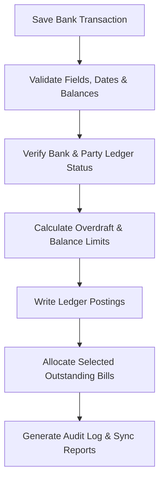

# DIAMO ERP – PHASE 10.3
## BANK BOOK – BANK POSTING ENGINE SPECIFICATION

---

## 1. Executive Summary
This document defines the Enterprise Functional Specification Document (FSD) for the Bank Posting Engine of DIAMO ERP. This engine manages validation, ledger updates, outstanding allocations, bank charges, interest accounting, and transaction history logging for all bank payments and receipts.

---

## 2. Business Purpose
Automating bank transaction postings prevents financial imbalances:
*   **Operational Context:** Reconciles system bank balances with actual bank statement transactions.
*   **Operational Distinctions:**
    *   *Bank Book:* Records transactions affecting bank balances or electronic funds.
    *   *Cash Book:* Records physical currency transactions.
    *   *Journal Voucher:* Records non-cash adjustments.

---

## 3. Posting Workflow
Double-entry updates are processed through this pipeline:

---

## 4. Ledger Posting
Ledger postings are executed in a single database transaction:
*   **Bank Payment:**
    *   *Debit:* Party Account / Expense Ledger.
    *   *Credit:* Selected Bank Account.
*   **Bank Receipt:**
    *   *Debit:* Selected Bank Account.
    *   *Credit:* Party Account / Income Ledger.

---

## 5. Outstanding Management
Manages customer/supplier balances:
*   **Outstanding Adjustment:** Reduces outstanding invoices by the transaction amount.
*   **Split Allocation:** Allows splitting a single bank entry across multiple unpaid bills.

---

## 6. Advance Management
*   **Advance Postings:** Payments or receipts without matching bills are posted to the Party's Advance Account.
*   **Reconciliation:** When a new invoice is posted, the system prompts the user to allocate the advance balance to the bill.

---

## 7. Partial Payment
*   **Balance Reduction:** Tracks partial payments, updating the invoice's outstanding balance:
    $$\text{Pending Balance} = \text{Original Value} - \sum \text{Payments}$$

---

## 8. Payment Status
Vouchers update invoice statuses:
*   `Pending`: No payments received.
*   `Partial`: Payments received, outstanding balance remains.
*   `Completed`: Fully paid.
*   `Advance`: Cash/bank receipt with no invoice.

---

## 9. Bank Balance Engine
*   **Available Balance:** Calculates active overdraft utilization:
    $$\text{Available Balance} = \text{Current Ledger Balance} + \text{Overdraft Limit}$$
*   **Overdraft Warnings:** Displays warning alerts if a transaction exceeds overdraft limits.

---

## 10. Bank Transaction History
*   **Operational Log:** Records Date, Transaction Type, Manual Voucher Number, UTR Number, Party Name, Bank Account, and Transaction Value.

---

## 11. Payment Mode Logic
Validates mode-specific references:
*   *Cheque:* Requires Cheque Number, Cheque Date.
*   *Electronic (NEFT/RTGS/IMPS/UPI):* Requires UTR Number, Reference Date.

---

## 12. Validation
*   **UTR Check:** Checks for duplicate UTR numbers to prevent duplicate postings.
*   **Cheque Verification:** Restricts cheque numbers from being reused for the same bank account.
*   **Inactive Check:** Blocks transactions involving deactivated accounts.

---

## 13. Business Rules
1.  **Direct Allocation Rule:** Receipts and payments must adjust outstanding invoices first before recording advances.
2.  **No Edits on Posted Bank Books:** Adjustments require posting a Reversal Voucher.
3.  **Cross-Party Allocation Check:** Users cannot allocate bank allocations to bills belonging to other parties.

---

## 14. Reversal Engine
*   **Reversal Workflow:** Posted vouchers cannot be modified. Corrections require posting a Reversal Voucher, which automatically generates opposing debit/credit lines and restores invoice outstanding balances.

---

## 15. Bank Charges
*   **Fee Postings:** Automatically posts transaction fees, processing charges, or UTR costs to the `Bank Charges Expense Account`.

---

## 16. Bank Interest
*   **Interest Postings:** Logs interest transactions:
    *   *Interest Earned:* Debits Bank Account, Credits `Interest Income Ledger`.
    *   *Interest Paid:* Credits Bank Account, Debits `Interest Expense Ledger`.

---

## 17. Report Impact
Saving a voucher updates:
*   *Reports:* Bank Book, General Ledger, Trial Balance, Profit & Loss, Balance Sheet, Accounts Outstanding.

---

## 18. Search
Supports filters for: Voucher Number, Party Name, Reference Bill, Amount, UTR/Cheque Number, and Date.

---

## 19. Filters
Provides filters for: Bank Payment, Bank Receipt, Today, Yesterday, This Month, and Amount Range.

---

## 20. Permissions
Access is regulated by the following flags:
*   `post_bank_voucher` / `reverse_bank_voucher`
*   `override_overdraft_limits` / `backdate_bank_entry`

---

## 21. Audit
Logs all status changes:
*   Tracks manual voucher overrides, UTR additions, and bank balance adjustments.
*   Logs before and after JSON snapshots, user IDs, and system timestamps.

---

## 22. Error Handling
*   **Rollback Protection:** System timeouts or validation failures during posting trigger database rollbacks to prevent ledger imbalances.

---

## 23. Edge Cases
*   **Advance Exceeding Outstanding:** Excess values are logged in the Party's Advance Account.
*   **Concurrent Postings:** Locks the Party Account table during posting to prevent double-allocations.

---

## 24. Future Enhancements
*   **AI Auto-Allocation:** Recommends optimal payment allocations based on invoice aging and discount terms.
*   **UPI QR Integration:** Generates dynamic UPI QR codes for cash-counter collections.

---

## 25. Architect Recommendations
1.  **Unique Barcode Constraints:** Enforce unique packet numbers to prevent overlapping dispatches.
2.  **Stateless Tracking API:** Run ageing calculations in background worker processes to prevent UI lag.

---

## 26. Final Completion Checklist
*   [x] Document journal types and entry modes (Simple vs. Advanced).
*   [x] Map the posting pipeline and double-entry validation equations.
*   [x] Detail the reversal voucher workflow and status flows.
*   [x] Map validations, permissions, and audit log rules.
*   [x] Document report and ledger integrations.
