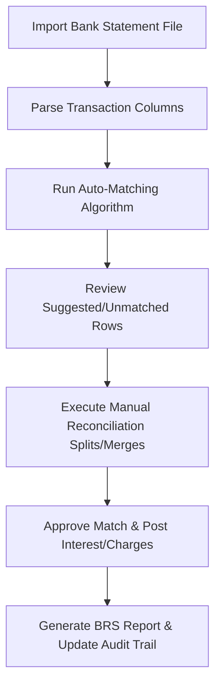

# DIAMO ERP – PHASE 10.4
## BANK BOOK – BANK RECONCILIATION (BRS) ENGINE SPECIFICATION

---

## 1. Executive Summary
This document defines the Enterprise Functional Specification Document (FSD) for the Bank Reconciliation (BRS) and Bank Statement Matching Engine of DIAMO ERP. This module automates matching ERP transactions with bank statements, identifies variances (outstanding deposits/cheques), auto-posts interest and charges, and logs BRS adjustments.

---

## 2. Business Purpose
Bank reconciliations verify corporate liquidity:
*   **Operational Context:** Reconciles internal bank book ledgers against monthly bank statements.
*   **Definitions:**
    *   *Outstanding Cheques:* Checks issued by the company but not yet cleared.
    *   *Outstanding Deposits:* Checks deposited by the company but not yet cleared.
    *   *Unreconciled Transactions:* Unmatched items in either ERP or bank logs.

---

## 3. Reconciliation Workflow
The processing pipeline executes the following checks:

---

## 4. Bank Statement Import
*   **Supported Formats:** CSV, Excel, TXT.
*   **Parsed Data Columns:** Transaction Date, Value Date, Reference/Cheque Number, UTR Hash, Amount (Debit/Credit), and Running Balance.

---

## 5. Auto Matching Engine
Matches entries based on matching parameters:
*   **Deterministic Match:** Exact match on UTR Number/Cheque Number and Bank Account.
*   **Probabilistic Match:** Fuzzy match on Transaction Date (within a $\pm$ 5-day tolerance window) and Amount.

---

## 6. Match Status
Vouchers progress through these statuses:
*   `Matched`: Verified matched state.
*   `Auto Matched`: Automatically linked by the system.
*   `Possible Match`: Under review based on date/amount tolerances.
*   `Unmatched`: No matching records found.

---

## 7. Manual Reconciliation
Allows manual overrides for unmatched entries:
*   **Manual Actions:** Select and match single entries, split single payments across multiple bills, or merge multiple payments.
*   **Safety Lock:** Allows undoing matched links to return entries to their unmatched state.

---

## 8. Unmatched Transactions
*   **Exception Review Grid:** Displays unmatched bank statements alongside ERP ledger transactions. Renders age counts and match suggestions.

---

## 9. Bank Differences
Identifies reconciliation discrepancies:
*   Outstanding Cheques, Outstanding Deposits, Duplicate Transactions, Missing ERP entries (e.g., direct bank deposits), and Missing Bank entries.

---

## 10. Bank Charges
*   **Fee Automation:** Auto-detects charges in descriptions and prompts users to post them to the `Bank Charges Expense Account`.

---

## 11. Bank Interest
*   **Interest Automation:** Auto-detects interest entries and prompts users to post them to `Interest Income` or `Interest Expense` ledgers.

---

## 12. Reconciliation Dashboard
Displays reconciliation metrics:
*   **Dashboard Cards:** Total transactions, matched vs. unmatched rows, possible matches, outstanding deposits, outstanding cheques, and reconciliation completion progress.

---

## 13. Search
Supports filters for: Voucher Number, Party Name, Reference Bill, Amount, UTR/Cheque Number, and Date.

---

## 14. Filters
Provides filters for: Match Status, Bank Account, Date Range, and Amount Range.

---

## 15. Sorting
Allows sorting by: Transaction Date, Value Date, Amount, UTR Number, and Match Status.

---

## 16. Reports
Generates the following reports:
*   *Bank Reconciliation Statement (BRS):* Reconciles balances as per bank statements with balances as per ERP ledgers.

---

## 17. Printing
Generates print templates for:
*   *BRS Statement Copy:* Standard statement format showing outstanding cheques, outstanding deposits, and audited balance figures.

---

## 18. Validation
*   **File Verification:** Blocks duplicate statement file uploads.
*   **Transaction Lock:** Blocks editing or deleting reconciled vouchers.

---

## 19. Business Rules
1.  **Strict Balance Constraint:** Voucher save blocked if variance is not zero.
2.  **No Edits on Posted Bank Books:** Adjustments require posting a Reversal Voucher.
3.  **Approval Logs:** Historical approval records cannot be deleted.

---

## 20. Audit
Logs all status changes:
*   Tracks statement imports, auto-match operations, manual overrides, and interest postings.
*   Logs before and after JSON snapshots, user IDs, and system timestamps.

---

## 21. Permissions
Access is regulated by the following flags:
*   `import_bank_statement` / `run_auto_matching`
*   `approve_reconciliation` / `override_matching_rules`

---

## 22. Error Handling
*   **Rollback Protection:** System timeouts or validation failures during posting trigger database rollbacks to prevent ledger imbalances.

---

## 23. Edge Cases
*   **Multiple Matches:** Multiple matching records are flagged as "Possible Matches" for manual user review.
*   **Deleted Transactions:** Reconciled ERP records cannot be deleted or reversed without first undoing the reconciliation.

---

## 24. Future Enhancements
*   **Direct API Integration:** Synchronizes transaction feeds directly with bank APIs.
*   **OCR Statement Processing:** Extracts details from uploaded PDF bank statement scans.

---

## 25. Architect Recommendations
1.  **Unique Barcode Constraints:** Enforce unique packet numbers to prevent overlapping dispatches.
2.  **Stateless Tracking API:** Run ageing calculations in background worker processes to prevent UI lag.

---

## 26. Final Completion Checklist
*   [x] Document journal types and entry modes (Simple vs. Advanced).
*   [x] Map the posting pipeline and double-entry validation equations.
*   [x] Detail the reversal voucher workflow and status flows.
*   [x] Map validations, permissions, and audit log rules.
*   [x] Document report and ledger integrations.
