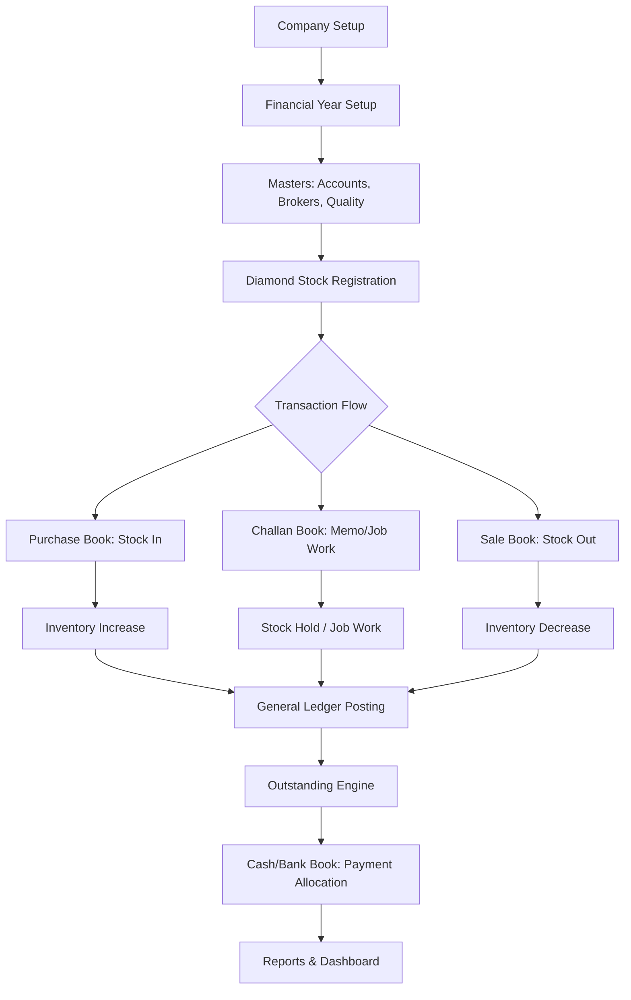
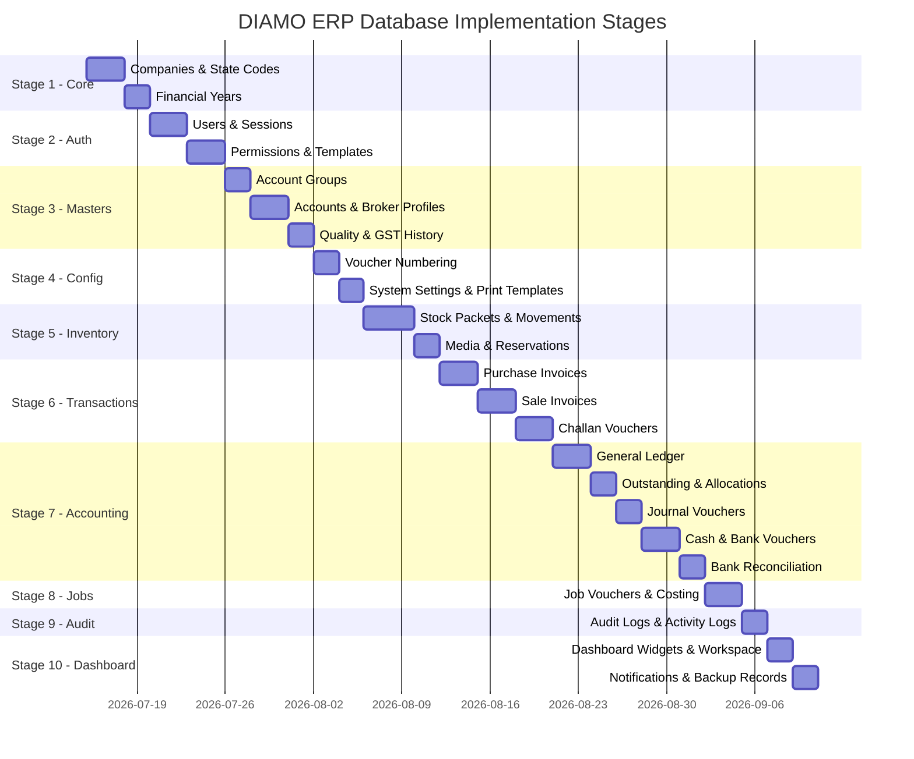

# DIAMO ERP
# ENTERPRISE DATABASE ARCHITECTURE & IMPLEMENTATION BLUEPRINT

---

> **Document Classification:** Chief Database Architect – Master Reference Document
> **Version:** 1.0
> **Status:** Awaiting Approval Before Prisma Schema Generation

---

## TABLE OF CONTENTS

1. [Executive Summary](#1-executive-summary)
2. [STEP 1 – Business Analysis](#step-1--business-analysis)
3. [STEP 2 – Common Entity Identification](#step-2--common-entity-identification)
4. [STEP 3 – Normalization Strategy](#step-3--normalization-strategy)
5. [STEP 4 – Relationship Analysis](#step-4--relationship-analysis)
6. [STEP 5 – Database Table Architecture](#step-5--database-table-architecture)
7. [STEP 6 – Multi-Company Design](#step-6--multi-company-design)
8. [STEP 7 – Financial Year Strategy](#step-7--financial-year-strategy)
9. [STEP 8 – Audit Strategy](#step-8--audit-strategy)
10. [STEP 9 – Soft Delete Strategy](#step-9--soft-delete-strategy)
11. [STEP 10 – Index Strategy](#step-10--index-strategy)
12. [STEP 11 – Naming Conventions](#step-11--naming-conventions)
13. [STEP 12 – Data Types](#step-12--data-types)
14. [STEP 13 – Performance Strategy](#step-13--performance-strategy)
15. [STEP 14 – Future Cloud Readiness](#step-14--future-cloud-readiness)
16. [STEP 15 – Implementation Roadmap](#step-15--implementation-roadmap)
17. [STEP 16 – Dependency Analysis](#step-16--dependency-analysis)
18. [STEP 17 – Risk Analysis](#step-17--risk-analysis)
19. [STEP 18 – Architect Recommendations](#step-18--architect-recommendations)

---

## 1. Executive Summary

This document presents the **complete Enterprise Database Architecture and Implementation Blueprint** for DIAMO ERP after exhaustive analysis of **80+ functional specification documents** spanning **17 phases** of the project.

DIAMO ERP is a diamond-industry-specific, offline-first desktop ERP built on **Electron + React + NestJS + Prisma ORM + MySQL**. The database must support:

- **Multi-company, multi-financial-year** isolated accounting
- **Packet-level diamond inventory tracking** with lifecycle and movement histories
- **Double-entry accounting** across Sales, Purchases, Challans, Job Books, Cash, Bank, and Journal Vouchers
- **Indian GST/TDS/TCS tax compliance** with HSN-level tax histories
- **Role-based access control** with page-level, module-level, and action-level permissions
- **Immutable audit trails** with JSON before/after snapshots
- **Sub-200ms search responses** on datasets exceeding 1 million records
- **15-year maintainability** with cloud migration readiness

> [!IMPORTANT]
> This blueprint must be approved **before** any Prisma schema, SQL, or migration code is generated.

---

## STEP 1 – Business Analysis

### 1.1 Business Modules Inventory

After analyzing every specification across all 17 phases, the following **16 functional modules** are confirmed:

| # | Module | Phase | Core Responsibility |
|---|--------|-------|---------------------|
| 1 | **Company & Financial Year** | 2, 13 | Legal entity setup, FY periods, tax activation flags |
| 2 | **Masters** | 2 | Account Groups, Accounts, Brokers, Quality catalog |
| 3 | **Sale Book** | 4 | Invoices, Credit Notes, Debit Notes |
| 4 | **Purchase Book** | 5 | Inward Bills, Debit Notes, Credit Notes |
| 5 | **Challan Book** | 6 | Jhanghad, Job Work, Sale/Purchase Orders, Lab Dispatch |
| 6 | **Job Book** | 7 | Job Income, Job Expense, Costing Engine |
| 7 | **Journal Voucher** | 8 | Multi-line accounting adjustments |
| 8 | **Cash Book** | 9 | Cash Receipts, Cash Payments |
| 9 | **Bank Book** | 10 | Bank Receipts, Bank Payments, Reconciliation (BRS) |
| 10 | **Reports Engine** | 11 | Ledger, Trial Balance, P&L, Balance Sheet, GST, TDS/TCS |
| 11 | **Diamond Inventory** | 12 | Stock Master, Movements, Availability, Barcodes, Media |
| 12 | **Settings & Configuration** | 13 | Voucher Numbering, Print Templates, Barcode Config, Backup |
| 13 | **User Administration** | 14 | Users, Sessions, Permissions, Templates, Activity Logs |
| 14 | **Dashboard & Analytics** | 15 | KPIs, Notifications, Workspace, Personalization |
| 15 | **System Maintenance** | 16 | Database health, Cache, Logs, Diagnostics |
| 16 | **Standards** | 17 | UI/UX System, Development Architecture |

### 1.2 Business Flow Summary



### 1.3 Data Classification

| Data Category | Description | Volume Estimate | Growth Rate |
|---|---|---|---|
| **Master Data** | Accounts, Brokers, Quality, Company | ~5,000 records | Slow (< 100/year) |
| **Transaction Data** | Sales, Purchases, Challans, JVs, Cash, Bank | ~100,000/year | High |
| **Stock Data** | Individual diamond packets, movements | ~50,000 packets | High |
| **Ledger Data** | General Ledger postings, outstanding bills | ~500,000/year | Very High |
| **Configuration Data** | Voucher numbering, print templates, settings | ~500 records | Minimal |
| **Audit Data** | Immutable change logs, login history | ~1,000,000/year | Very High |
| **Security Data** | Users, sessions, permissions, templates | ~100 records | Minimal |
| **Reporting Data** | Dashboard KPI cache, scheduled reports | ~10,000 records | Moderate |

---

## STEP 2 – Common Entity Identification

After cross-referencing all 80+ specifications, I have identified **48 core entities** grouped into 8 domains. Each entity exists **exactly once** — no duplicates.

### 2.1 Core Infrastructure Entities (4)

| Entity | Purpose | Key Relationships |
|--------|---------|-------------------|
| `Company` | Legal entity, GSTIN, PAN, TAN, bank details | Parent of all transactions |
| `FinancialYear` | Accounting period, lock dates, GST/TCS flags | Belongs to Company |
| `StateCode` | Indian state code lookup (01-37) | Referenced by GSTIN validation |
| `HsnCode` | Harmonized System of Nomenclature codes | Referenced by Quality, Tax engine |

### 2.2 Master Data Entities (5)

| Entity | Purpose | Key Relationships |
|--------|---------|-------------------|
| `AccountGroup` | Chart of accounts hierarchy (self-referencing tree) | Parent of Account |
| `Account` | Customers, Suppliers, Banks, Brokers, Ledgers | Belongs to AccountGroup |
| `BrokerProfile` | Broker-specific extensions (brokerage %, TDS) | One-to-One with Account |
| `Quality` | Diamond grade catalog (HSN, rates, UQC) | Referenced by all transactions |
| `QualityGstHistory` | Date-effective GST rate changes per Quality | Belongs to Quality |

### 2.3 Transaction Entities (12)

| Entity | Purpose | Key Relationships |
|--------|---------|-------------------|
| `VoucherNumberConfig` | Prefix, suffix, sequence per voucher type | Per Company + FY |
| `VoucherNumberSequence` | Running counter for each voucher type | Per Company + FY + Type |
| `SaleInvoice` | Sales invoice header | Has many SaleInvoiceItems |
| `SaleInvoiceItem` | Line items per sale invoice | Belongs to SaleInvoice, Quality |
| `PurchaseInvoice` | Purchase invoice header | Has many PurchaseInvoiceItems |
| `PurchaseInvoiceItem` | Line items per purchase invoice | Belongs to PurchaseInvoice, Quality |
| `ChallanVoucher` | Challan header (all purposes) | Has many ChallanItems |
| `ChallanItem` | Line items per challan | Belongs to ChallanVoucher, Quality |
| `JournalVoucher` | JV header (all journal types) | Has many JournalVoucherLines |
| `JournalVoucherLine` | Debit/credit lines per JV | Belongs to JournalVoucher, Account |
| `CashBankVoucher` | Unified Cash + Bank voucher header | Has many CashBankAllocations |
| `CashBankAllocation` | Outstanding bill allocation per payment | Belongs to CashBankVoucher |

### 2.4 Job Book Entities (3)

| Entity | Purpose | Key Relationships |
|--------|---------|-------------------|
| `JobVoucher` | Job Income / Job Expense header | References Account (Job Worker) |
| `JobVoucherItem` | Line items per job voucher | Belongs to JobVoucher, Quality |
| `JobCostEntry` | Cost capitalization records | References JobVoucher, StockPacket |

### 2.5 Accounting Engine Entities (4)

| Entity | Purpose | Key Relationships |
|--------|---------|-------------------|
| `GeneralLedgerEntry` | Double-entry journal posting rows | References Account, Voucher |
| `OutstandingBill` | Bill-level outstanding tracking | References Account, Source Voucher |
| `BillAllocation` | Payment-to-bill matching records | References OutstandingBill, CashBankVoucher |
| `BankReconciliation` | BRS matching records | References CashBankVoucher, BankStatement |

### 2.6 Diamond Inventory Entities (5)

| Entity | Purpose | Key Relationships |
|--------|---------|-------------------|
| `StockPacket` | Individual diamond unit (master record) | Core inventory entity |
| `StockMovement` | Lifecycle event log per packet | Belongs to StockPacket |
| `StockReservation` | Hold/allocation tracking per packet | Belongs to StockPacket, ChallanVoucher |
| `StockMedia` | Photos, videos, certificate PDFs | Belongs to StockPacket |
| `StockAuditBatch` | Physical verification batch records | Has many StockAuditItems |

### 2.7 Security & Administration Entities (8)

| Entity | Purpose | Key Relationships |
|--------|---------|-------------------|
| `User` | Employee/staff accounts | Has many UserCompanyAccess |
| `UserCompanyAccess` | Company-level access grants per user | Belongs to User, Company |
| `UserSession` | Active login session tracking | Belongs to User |
| `PermissionTemplate` | Predefined role profiles | Has many PermissionEntries |
| `PagePermission` | Page/menu visibility control | Belongs to User or Template |
| `ModulePermission` | Action-level CRUD controls | Belongs to User or Template |
| `ActivityLog` | User activity event tracking | Belongs to User |
| `LoginHistory` | Login/logout timestamps and details | Belongs to User |

### 2.8 System & Configuration Entities (7)

| Entity | Purpose | Key Relationships |
|--------|---------|-------------------|
| `SystemSetting` | Key-value system preferences | Per Company |
| `PrintTemplate` | Document print layout configurations | Per Company + VoucherType |
| `BackupRecord` | Backup execution history | System-level |
| `NotificationRecord` | Alert/reminder records | Per User + Company |
| `DashboardWidget` | User dashboard personalization | Per User |
| `UserWorkspace` | Favorites, quick actions, recent items | Per User |
| `AuditLog` | Immutable system-wide change log | References all entities |

---

## STEP 3 – Normalization Strategy

### 3.1 Recommended Normalization Level

> **Third Normal Form (3NF)** with **selective denormalization** for reporting performance.

### 3.2 Normalization Decisions

| Decision | Rationale |
|----------|-----------|
| **3NF for all master tables** | Account Groups, Accounts, Quality, Company, Users — fully normalized to eliminate update anomalies |
| **3NF for all transaction headers** | SaleInvoice, PurchaseInvoice, ChallanVoucher, JournalVoucher, CashBankVoucher — header-detail pattern |
| **3NF for accounting engine** | GeneralLedgerEntry, OutstandingBill — no calculated fields stored (computed on read) |
| **Denormalized: Transaction Items** | Store computed `terms_rate`, `gross_amount`, `gst_amount`, `net_amount` per line item. Recalculation on every read is too expensive for grids |
| **Denormalized: StockPacket** | Store `current_status`, `current_owner_id`, `current_location` directly on the packet (updated by StockMovement events) to avoid expensive JOINs for inventory searches |
| **Denormalized: Invoice Totals** | Store `total_gross`, `total_gst`, `total_net`, `total_outstanding` on invoice headers for fast list-page rendering |
| **Separate History Tables** | `QualityGstHistory` — date-effective GST rates stored separately from the Quality master |

### 3.3 Anti-Patterns Avoided

| Anti-Pattern | How We Avoid It |
|---|---|
| **Duplicate Party Info** | Brokers are NOT a separate table — they are an `Account` with `is_broker = true` and a linked `BrokerProfile` extension |
| **Repeated Company Columns** | Every transaction references `company_id` FK — company details are never stored on transaction rows |
| **Repeated Tax Columns** | GST rates are resolved at runtime from `QualityGstHistory` by date, not stored per-company |
| **Repeated Address Fields** | Single `Account` table with address fields — no separate address tables for this scope |

---

## STEP 4 – Relationship Analysis

### 4.1 One-to-One Relationships

| Parent | Child | Purpose |
|--------|-------|---------|
| `Account` | `BrokerProfile` | Extends accounts with brokerage-specific fields |
| `User` | `UserWorkspace` | Personal favorites and quick actions |

### 4.2 One-to-Many Relationships

| Parent (1) | Child (N) | Purpose |
|------------|-----------|---------|
| `Company` | `FinancialYear` | Each company has independent financial years |
| `Company` | `Account` | Accounts scoped per company |
| `Company` | `SaleInvoice` | Transactions isolated per company |
| `Company` | `PurchaseInvoice` | Transactions isolated per company |
| `Company` | `ChallanVoucher` | Transactions isolated per company |
| `Company` | `JournalVoucher` | Transactions isolated per company |
| `Company` | `CashBankVoucher` | Transactions isolated per company |
| `Company` | `StockPacket` | Diamond inventory per company |
| `Company` | `VoucherNumberConfig` | Numbering sequences per company |
| `AccountGroup` | `Account` | Chart of accounts hierarchy |
| `AccountGroup` | `AccountGroup` | Self-referencing parent-child tree |
| `Account` | `SaleInvoice` | Customer on sale invoice |
| `Account` | `PurchaseInvoice` | Supplier on purchase invoice |
| `Account` | `GeneralLedgerEntry` | Ledger postings per account |
| `Account` | `OutstandingBill` | Bills per party |
| `Quality` | `QualityGstHistory` | Date-effective tax rate changes |
| `Quality` | `SaleInvoiceItem` | Quality referenced in line items |
| `Quality` | `PurchaseInvoiceItem` | Quality referenced in line items |
| `SaleInvoice` | `SaleInvoiceItem` | Header-detail pattern |
| `PurchaseInvoice` | `PurchaseInvoiceItem` | Header-detail pattern |
| `ChallanVoucher` | `ChallanItem` | Header-detail pattern |
| `JournalVoucher` | `JournalVoucherLine` | Header-detail pattern |
| `CashBankVoucher` | `CashBankAllocation` | Payment bill allocations |
| `StockPacket` | `StockMovement` | Movement event log |
| `StockPacket` | `StockMedia` | Attached photos/certificates |
| `StockPacket` | `StockReservation` | Active holds/allocations |
| `User` | `UserSession` | Active sessions |
| `User` | `ActivityLog` | Action tracking |
| `User` | `LoginHistory` | Login/logout records |
| `User` | `UserCompanyAccess` | Company access grants |
| `User` | `NotificationRecord` | Personal alerts |
| `User` | `DashboardWidget` | Dashboard personalization |
| `PermissionTemplate` | `PagePermission` | Bulk page permissions |
| `PermissionTemplate` | `ModulePermission` | Bulk action permissions |

### 4.3 Many-to-Many Relationships

| Entity A | Entity B | Junction Table | Purpose |
|----------|----------|----------------|---------|
| `User` | `Company` | `UserCompanyAccess` | Multi-company user access |
| `OutstandingBill` | `CashBankVoucher` | `BillAllocation` | Payment-to-bill matching |

### 4.4 Self-Referencing Relationships

| Entity | Column | Purpose |
|--------|--------|---------|
| `AccountGroup` | `parent_group_id → AccountGroup.id` | Hierarchical chart of accounts |
| `SaleInvoice` | `reference_invoice_id → SaleInvoice.id` | Credit Notes linking to original invoices |
| `PurchaseInvoice` | `reference_invoice_id → PurchaseInvoice.id` | Debit Notes linking to original invoices |

### 4.5 Polymorphic References

| Entity | Field | References | Purpose |
|--------|-------|------------|---------|
| `GeneralLedgerEntry` | `source_voucher_type` + `source_voucher_id` | Sale/Purchase/JV/Cash/Bank/Job | Links ledger entries to any voucher type |
| `OutstandingBill` | `source_voucher_type` + `source_voucher_id` | Sale/Purchase | Origin of the bill |
| `AuditLog` | `entity_type` + `entity_id` | Any entity | Universal change tracking |
| `StockMovement` | `source_voucher_type` + `source_voucher_id` | Purchase/Sale/Challan/Job | Movement origin |

---

## STEP 5 – Database Table Architecture

### 5.1 Table Classification

#### Core Tables (4)
| Table | Records | Purpose |
|-------|---------|---------|
| `companies` | ~5-10 | Legal entities |
| `financial_years` | ~50 | Accounting periods |
| `state_codes` | 37 | Indian state reference |
| `hsn_codes` | ~500 | Tax classification codes |

#### Master Tables (5)
| Table | Records | Purpose |
|-------|---------|---------|
| `account_groups` | ~100 | Chart of accounts tree |
| `accounts` | ~5,000 | All parties and ledgers |
| `broker_profiles` | ~200 | Broker extensions |
| `qualities` | ~500 | Diamond grade catalog |
| `quality_gst_history` | ~2,000 | Date-effective GST rates |

#### Transaction Tables (12)
| Table | Records/Year | Purpose |
|-------|-------------|---------|
| `sale_invoices` | ~10,000 | Sales headers |
| `sale_invoice_items` | ~50,000 | Sales line items |
| `purchase_invoices` | ~5,000 | Purchase headers |
| `purchase_invoice_items` | ~25,000 | Purchase line items |
| `challan_vouchers` | ~20,000 | Challan headers |
| `challan_items` | ~80,000 | Challan line items |
| `journal_vouchers` | ~5,000 | JV headers |
| `journal_voucher_lines` | ~20,000 | JV debit/credit lines |
| `cash_bank_vouchers` | ~15,000 | Cash/Bank headers |
| `cash_bank_allocations` | ~30,000 | Bill allocations |
| `job_vouchers` | ~3,000 | Job headers |
| `job_voucher_items` | ~10,000 | Job line items |

#### Accounting Tables (4)
| Table | Records/Year | Purpose |
|-------|-------------|---------|
| `general_ledger_entries` | ~500,000 | Double-entry postings |
| `outstanding_bills` | ~30,000 | Bill tracking |
| `bill_allocations` | ~30,000 | Payment matching |
| `bank_reconciliations` | ~10,000 | BRS records |

#### Diamond Inventory Tables (5)
| Table | Records | Purpose |
|-------|---------|---------|
| `stock_packets` | ~50,000+ | Individual diamond units |
| `stock_movements` | ~200,000/yr | Lifecycle events |
| `stock_reservations` | ~5,000 active | Hold/allocation tracking |
| `stock_media` | ~100,000 | Photos/certificates |
| `stock_audit_batches` | ~100/yr | Physical verification |

#### Configuration Tables (5)
| Table | Records | Purpose |
|-------|---------|---------|
| `voucher_number_configs` | ~200 | Numbering format configs |
| `voucher_number_sequences` | ~200 | Running counters |
| `print_templates` | ~50 | Layout configurations |
| `system_settings` | ~500 | Key-value preferences |
| `backup_records` | ~1,000 | Backup history |

#### Security Tables (8)
| Table | Records | Purpose |
|-------|---------|---------|
| `users` | ~50 | Staff accounts |
| `user_company_access` | ~100 | Company grants |
| `user_sessions` | ~500 | Active sessions |
| `permission_templates` | ~10 | Role profiles |
| `page_permissions` | ~1,000 | Menu visibility |
| `module_permissions` | ~2,000 | Action CRUD controls |
| `activity_logs` | ~500,000/yr | Activity tracking |
| `login_history` | ~10,000/yr | Login records |

#### Log & Audit Tables (3)
| Table | Records/Year | Purpose |
|-------|-------------|---------|
| `audit_logs` | ~1,000,000 | Immutable change log |
| `notification_records` | ~50,000 | Alerts and reminders |
| `error_logs` | ~5,000 | System error tracking |

#### Dashboard Tables (2)
| Table | Records | Purpose |
|-------|---------|---------|
| `dashboard_widgets` | ~500 | User widget configs |
| `user_workspaces` | ~200 | Favorites, recent items |

**Total: ~48 tables**

---

## STEP 6 – Multi-Company Design

### 6.1 Isolation Strategy

> **Logical Partitioning via `company_id` Foreign Key Column**

Every company-scoped table carries a mandatory `company_id` column referencing `companies.id`. This provides complete data isolation without requiring separate databases or schemas.

### 6.2 Company-Scoped Tables (Isolated Per Company)

All transaction tables, accounting tables, inventory tables, outstanding tables, voucher numbering, print templates, system settings, and financial years.

### 6.3 Shared Tables (Cross-Company)

| Table | Sharing Logic |
|-------|--------------|
| `users` | Users can access multiple companies via `user_company_access` |
| `state_codes` | Reference lookup — global |
| `hsn_codes` | Reference lookup — global |
| `permission_templates` | Can be shared or company-specific (via nullable `company_id`) |
| `audit_logs` | Global but filtered by `company_id` |

### 6.4 Company Switching

- User selects active company on login or via header dropdown
- Backend injects `company_id` into every query via NestJS request interceptor
- All Prisma queries filter by `company_id` automatically

### 6.5 Account Group Sharing

Per spec Phase 2.1: Account Groups can be flagged as "Global" to share across companies. Implementation:
- `account_groups.is_global BOOLEAN DEFAULT FALSE`
- Global groups are visible to all companies; company-specific groups are filtered by `company_id`

---

## STEP 7 – Financial Year Strategy

### 7.1 Financial Year Table Design

```
financial_years
├── id (PK)
├── company_id (FK → companies)
├── from_date (DATE)
├── to_date (DATE)
├── is_active (BOOLEAN) — only one active per company
├── is_closed (BOOLEAN)
├── lock_transaction_upto_date (DATE, nullable)
├── gst_active (BOOLEAN, default TRUE)
├── tcs_active (BOOLEAN, default TRUE)
├── account_effect (BOOLEAN, default TRUE)
├── [audit columns]
└── UNIQUE(company_id, from_date, to_date)
```

### 7.2 Opening & Closing Balance Strategy

| Operation | Implementation |
|-----------|---------------|
| **Opening Balance** | Stored in `general_ledger_entries` with `voucher_type = 'OPENING'` and the new FY's `from_date` |
| **Closing Balance** | Calculated at runtime: `SUM(debit) - SUM(credit)` for all entries within the FY date range |
| **Year Carry Forward** | Closing wizard creates opening entries in the new FY for all Asset/Liability accounts |
| **P&L Transfer** | Net profit/loss is transferred to Retained Earnings via an automatic closing JV |

### 7.3 Year Lock Enforcement

- Every transaction write validates: `voucher_date > lock_transaction_upto_date`
- Only Super Admin can override locked periods (logged with high-priority audit)
- NestJS request interceptor validates date boundaries before controller execution

### 7.4 Historical Reporting

- Reports accept `financial_year_id` as filter parameter
- All queries use `WHERE voucher_date BETWEEN fy.from_date AND fy.to_date`
- Closed years remain fully queryable for reporting (read-only)

---

## STEP 8 – Audit Strategy

### 8.1 Standard Audit Columns

Every significant table includes these columns:

```
created_by      INT          — FK → users.id
created_at      DATETIME(3)  — Timestamp with milliseconds
updated_by      INT          — FK → users.id (nullable)
updated_at      DATETIME(3)  — Auto-updated timestamp
is_deleted      BOOLEAN      — Soft delete flag (default FALSE)
deleted_by      INT          — FK → users.id (nullable)
deleted_at      DATETIME(3)  — Soft delete timestamp (nullable)
version         INT          — Optimistic concurrency counter (default 1)
```

### 8.2 Tables That Include Full Audit Columns

All Master tables, all Transaction tables, all Accounting tables, all Inventory tables, all User/Permission tables, and all Configuration tables.

### 8.3 Tables Exempt From Audit Columns

| Table | Reason |
|-------|--------|
| `state_codes` | Static seed data, never modified |
| `hsn_codes` | Static seed data, rarely modified |
| `audit_logs` | Audit logs are immutable by definition |
| `login_history` | Append-only log table |
| `activity_logs` | Append-only log table |

### 8.4 Immutable Audit Log Table

```
audit_logs
├── id (PK, BIGINT AUTO_INCREMENT)
├── company_id (INT)
├── entity_type (VARCHAR 50) — e.g., 'SaleInvoice', 'Account'
├── entity_id (INT)
├── action (ENUM: CREATE, UPDATE, DELETE, CANCEL, REVERSE, APPROVE, LOGIN, EXPORT)
├── before_value (JSON, nullable) — Full JSON snapshot of previous state
├── after_value (JSON, nullable)  — Full JSON snapshot of new state
├── changed_fields (JSON, nullable) — List of modified field names
├── user_id (INT, FK → users.id)
├── ip_address (VARCHAR 45)
├── hostname (VARCHAR 100)
├── override_reason (TEXT, nullable)
├── created_at (DATETIME(3))
└── INDEX(entity_type, entity_id)
└── INDEX(company_id, created_at)
└── INDEX(user_id, created_at)
```

> [!CAUTION]
> This table has **NO UPDATE or DELETE** capabilities. Records are append-only. No foreign key cascades allowed.

---

## STEP 9 – Soft Delete Strategy

### 9.1 Soft Delete Tables

These tables use the `is_deleted`, `deleted_by`, `deleted_at` pattern:

| Table Category | Tables | Reason |
|---|---|---|
| **Masters** | `accounts`, `account_groups`, `broker_profiles`, `qualities` | Must preserve historical references from transactions |
| **Transactions** | All invoice, challan, JV, cash/bank, job voucher tables | Tax audit compliance requires preserving cancelled/deleted records |
| **Inventory** | `stock_packets`, `stock_movements` | Diamond traceability requires full history |
| **Users** | `users`, `permission_templates` | Login history and audit trails reference these records |

### 9.2 Hard Delete Tables

| Table | Reason |
|-------|--------|
| `user_sessions` | Expired sessions have no audit value |
| `stock_reservations` | Fulfilled/expired reservations can be purged |
| `notification_records` | Dismissed notifications can be purged after 90 days |
| `dashboard_widgets` | User personalization data, no audit requirement |
| `user_workspaces` | Personal data, no audit requirement |

### 9.3 Archive Strategy

| Table | Archive Trigger | Archive Destination |
|-------|----------------|---------------------|
| `audit_logs` | Records older than 5 years | `audit_logs_archive` (same structure) |
| `activity_logs` | Records older than 2 years | `activity_logs_archive` |
| `login_history` | Records older than 2 years | `login_history_archive` |
| `stock_movements` | Packets archived/sold > 3 years | `stock_movements_archive` |

---

## STEP 10 – Index Strategy

### 10.1 Primary Keys

All tables use `id INT AUTO_INCREMENT PRIMARY KEY`. No composite primary keys.

### 10.2 Critical Unique Keys

| Table | Unique Constraint | Purpose |
|-------|------------------|---------|
| `companies` | `(company_code)` | 3-letter company prefix |
| `companies` | `(company_name)` | Legal name uniqueness |
| `financial_years` | `(company_id, from_date, to_date)` | Prevent overlapping periods |
| `account_groups` | `(company_id, group_name)` | No duplicate group names per company |
| `accounts` | `(company_id, account_name)` | No duplicate account names per company |
| `qualities` | `(company_id, quality_name)` | No duplicate quality names per company |
| `qualities` | `(company_id, item_code)` | No duplicate item codes per company |
| `sale_invoices` | `(company_id, financial_year_id, bill_number)` | No duplicate bill numbers |
| `purchase_invoices` | `(company_id, financial_year_id, bill_number)` | No duplicate bill numbers |
| `users` | `(user_id_handle)` | Unique login handles |
| `users` | `(email)` | Unique email addresses |
| `stock_packets` | `(company_id, stock_id_number)` | Unique packet IDs |
| `stock_packets` | `(certificate_number)` | Unique certificates (nullable) |

### 10.3 Foreign Key Indexes

All foreign key columns are automatically indexed by Prisma. Key FKs:

- `accounts.account_group_id → account_groups.id`
- `accounts.company_id → companies.id`
- `sale_invoices.customer_id → accounts.id`
- `sale_invoices.broker_id → accounts.id`
- `sale_invoices.company_id → companies.id`
- `sale_invoices.financial_year_id → financial_years.id`
- `general_ledger_entries.account_id → accounts.id`

### 10.4 Performance Indexes

| Table | Index Columns | Purpose |
|-------|--------------|---------|
| `accounts` | `(company_id, status, is_deleted)` | Fast dropdown filtering |
| `accounts` | `(company_id, account_group_id)` | Group-based lookups |
| `qualities` | `(company_id, status, is_deleted)` | Transaction dropdown search |
| `sale_invoices` | `(company_id, invoice_date)` | Date-range report queries |
| `sale_invoices` | `(company_id, customer_id, status)` | Customer invoice lookup |
| `sale_invoices` | `(company_id, payment_status)` | Outstanding filtering |
| `purchase_invoices` | `(company_id, invoice_date)` | Date-range report queries |
| `general_ledger_entries` | `(company_id, account_id, voucher_date)` | Ledger report queries |
| `general_ledger_entries` | `(company_id, voucher_date)` | Day Book queries |
| `general_ledger_entries` | `(source_voucher_type, source_voucher_id)` | Voucher→Ledger lookup |
| `outstanding_bills` | `(company_id, account_id, status)` | Outstanding reports |
| `outstanding_bills` | `(company_id, due_date)` | Ageing analysis |
| `stock_packets` | `(company_id, current_status)` | Available stock search |
| `stock_packets` | `(company_id, shape, color, clarity)` | Multi-parameter diamond search |
| `stock_packets` | `(company_id, carat_weight)` | Weight-range searches |
| `stock_movements` | `(stock_packet_id, created_at)` | Timeline queries |
| `challan_vouchers` | `(company_id, purpose, status)` | Challan dashboard filters |
| `challan_vouchers` | `(company_id, expected_return_date)` | Overdue tracking |
| `audit_logs` | `(entity_type, entity_id)` | Entity history lookup |
| `audit_logs` | `(company_id, created_at)` | Date-range audit queries |
| `quality_gst_history` | `(quality_id, apply_date)` | Date-effective tax resolution |

### 10.5 Full-Text Search Indexes

| Table | Columns | Purpose |
|-------|---------|---------|
| `accounts` | `(account_name)` | Party name fuzzy search |
| `stock_packets` | `(stock_id_number, certificate_number)` | Packet/certificate lookup |

---

## STEP 11 – Naming Conventions

### 11.1 Tables

| Convention | Rule | Example |
|------------|------|---------|
| Format | `snake_case`, plural | `sale_invoices`, `account_groups` |
| Junction tables | Alphabetical entity names joined | `bill_allocations` |
| History tables | `{entity}_history` | `quality_gst_history` |
| Archive tables | `{entity}_archive` | `audit_logs_archive` |
| Audit tables | `audit_logs` (single universal) | `audit_logs` |

### 11.2 Columns

| Convention | Rule | Example |
|------------|------|---------|
| Format | `snake_case` | `account_name`, `invoice_date` |
| Primary key | `id` | Always `id` |
| Foreign key | `{referenced_table_singular}_id` | `company_id`, `account_id` |
| Boolean | `is_` prefix | `is_deleted`, `is_active`, `is_broker` |
| Amounts | `{qualifier}_amount` | `gross_amount`, `gst_amount`, `net_amount` |
| Percentages | `{qualifier}_pct` | `gst_pct`, `brokerage_pct`, `less_pct` |
| Dates | `{qualifier}_date` | `invoice_date`, `due_date`, `from_date` |
| Timestamps | `{qualifier}_at` | `created_at`, `updated_at`, `deleted_at` |
| Weights | `{qualifier}_carats` | `total_carats`, `available_carats` |
| Counts | `{qualifier}_count` | `piece_count`, `item_count` |
| Status | `status` or `{qualifier}_status` | `status`, `payment_status` |

### 11.3 Primary Keys, Foreign Keys, Indexes

| Convention | Format | Example |
|------------|--------|---------|
| Primary Key | `PK_{table}` | `PK_sale_invoices` |
| Foreign Key | `FK_{table}_{column}` | `FK_sale_invoices_company_id` |
| Unique Index | `UQ_{table}_{columns}` | `UQ_accounts_company_id_account_name` |
| Performance Index | `IX_{table}_{columns}` | `IX_sale_invoices_company_id_invoice_date` |
| Full-text Index | `FT_{table}_{columns}` | `FT_accounts_account_name` |

### 11.4 Enums

| Convention | Rule | Example |
|------------|------|---------|
| Name | `PascalCase` | `VoucherType`, `InvoiceStatus` |
| Values | `SCREAMING_SNAKE_CASE` | `SALE_INVOICE`, `CASH_PAYMENT` |

### 11.5 Prisma Model Names

| Convention | Rule | Example |
|------------|------|---------|
| Model | `PascalCase`, singular | `SaleInvoice`, `AccountGroup` |
| Relation fields | `camelCase` | `saleInvoiceItems`, `accountGroup` |

---

## STEP 12 – Data Types

### 12.1 String Types

| Usage | MySQL Type | Prisma Type | Max Length | Rationale |
|-------|-----------|------------|-----------|-----------|
| Names (account, company, quality) | `VARCHAR(150)` | `String @db.VarChar(150)` | 150 | Accommodates legal names |
| Codes (company code, item code) | `VARCHAR(30)` | `String @db.VarChar(30)` | 30 | Short identifiers |
| GSTIN | `VARCHAR(15)` | `String @db.VarChar(15)` | 15 | Fixed government format |
| PAN | `VARCHAR(10)` | `String @db.VarChar(10)` | 10 | Fixed government format |
| TAN | `VARCHAR(10)` | `String @db.VarChar(10)` | 10 | Fixed government format |
| IFSC | `VARCHAR(11)` | `String @db.VarChar(11)` | 11 | Fixed bank format |
| HSN Code | `VARCHAR(8)` | `String @db.VarChar(8)` | 8 | Government standard |
| Bill/Voucher Numbers | `VARCHAR(50)` | `String @db.VarChar(50)` | 50 | Formatted sequence numbers |
| Email | `VARCHAR(255)` | `String @db.VarChar(255)` | 255 | RFC 5322 compliance |
| Phone/Mobile | `VARCHAR(20)` | `String @db.VarChar(20)` | 20 | International format |
| Address Lines | `VARCHAR(255)` | `String @db.VarChar(255)` | 255 | Standard addresses |
| Narration/Remarks | `TEXT` | `String @db.Text` | 65,535 | Free-form text |
| File Paths (media) | `VARCHAR(500)` | `String @db.VarChar(500)` | 500 | Local file references |
| Enum Strings | `VARCHAR(30)` | `String @db.VarChar(30)` | 30 | Status/type values |

### 12.2 Numeric Types

| Usage | MySQL Type | Prisma Type | Precision | Rationale |
|-------|-----------|------------|-----------|-----------|
| IDs / Foreign Keys | `INT UNSIGNED` | `Int` | — | Auto-increment identifiers |
| Carat Weights | `DECIMAL(12,3)` | `Decimal @db.Decimal(12,3)` | 3 decimals | Industry standard: 0.001ct precision |
| Monetary Amounts | `DECIMAL(18,2)` | `Decimal @db.Decimal(18,2)` | 2 decimals | Indian Rupees, supports up to ₹9,999,999,999,999,999.99 |
| Tax Percentages | `DECIMAL(5,2)` | `Decimal @db.Decimal(5,2)` | 2 decimals | Rates like 0.25%, 3.00%, 18.00% |
| Brokerage Percentages | `DECIMAL(5,2)` | `Decimal @db.Decimal(5,2)` | 2 decimals | Range 0.00 – 10.00 |
| Discount Percentages | `DECIMAL(5,2)` | `Decimal @db.Decimal(5,2)` | 2 decimals | Range 0.00 – 99.99 |
| Piece Counts | `INT UNSIGNED` | `Int` | — | Whole numbers only |
| Dimensions (mm) | `DECIMAL(8,2)` | `Decimal @db.Decimal(8,2)` | 2 decimals | Length, Width, Depth |
| Version Counter | `INT UNSIGNED` | `Int @default(1)` | — | Optimistic concurrency |
| Sequence Numbers | `INT UNSIGNED` | `Int` | — | Voucher numbering counters |

### 12.3 Boolean Type

| Usage | MySQL Type | Prisma Type | Default |
|-------|-----------|------------|---------|
| All booleans | `TINYINT(1)` | `Boolean` | Context-dependent |

### 12.4 Date & Time Types

| Usage | MySQL Type | Prisma Type | Rationale |
|-------|-----------|------------|-----------|
| Business dates (invoice, voucher) | `DATE` | `DateTime @db.Date` | No time component needed |
| Timestamps (audit, sessions) | `DATETIME(3)` | `DateTime @db.DateTime(3)` | Millisecond precision |

### 12.5 JSON Type

| Usage | MySQL Type | Prisma Type | Rationale |
|-------|-----------|------------|-----------|
| Audit before/after snapshots | `JSON` | `Json` | Flexible schema for diverse entities |
| Dashboard widget config | `JSON` | `Json` | User personalization data |
| System settings value | `JSON` | `Json` | Mixed-type configuration values |

---

## STEP 13 – Performance Strategy

### 13.1 Query Optimization

| Strategy | Implementation | Target |
|----------|---------------|--------|
| **Covering Indexes** | Composite indexes include all columns needed by frequent queries | Report queries |
| **Pagination** | Cursor-based pagination (`WHERE id > ?`) for large result sets | List pages |
| **Selective Column Fetching** | Prisma `select` to fetch only required fields | All queries |
| **Connection Pooling** | NestJS Prisma connection pool (min: 2, max: 10) | All DB access |

### 13.2 Dashboard Performance

| Strategy | Implementation |
|----------|---------------|
| **Materialized KPI Cache** | Background worker calculates daily KPI values and stores them in a `dashboard_kpi_cache` table |
| **Incremental Updates** | Transaction save triggers update only the affected KPI cache entries |
| **Background Workers** | Heavy calculations (ageing, outstanding totals, stock valuations) run in Electron worker threads |

### 13.3 Search Performance

| Strategy | Implementation | Target |
|----------|---------------|--------|
| **Full-Text Indexes** | MySQL `FULLTEXT INDEX` on `account_name`, `stock_id_number` | < 200ms response |
| **Indexed Enum Columns** | Status/type columns indexed for filtered queries | Drop-down filtering |
| **Pre-computed Denormalization** | `stock_packets.current_status` avoids expensive JOINs to movements | Inventory search |

### 13.4 Large Dataset Support

| Scale | Strategy |
|-------|----------|
| **100K+ transactions/year** | Date-range partitioning via query filters (not MySQL partitioning yet) |
| **1M+ audit records** | Archive strategy moves old records to `_archive` tables |
| **50K+ stock packets** | Composite indexes on `(company_id, shape, color, clarity, carat_weight, status)` |

---

## STEP 14 – Future Cloud Readiness

### 14.1 Schema Compatibility

| Requirement | How Schema Supports It |
|-------------|----------------------|
| **REST APIs** | All entities map 1:1 to API resources with standard CRUD endpoints |
| **Microservices** | Module-aligned table groupings (Sales, Purchase, Inventory, Accounting) can be isolated into separate services |
| **Cloud Database** | Schema uses standard SQL types compatible with AWS RDS MySQL, Google Cloud SQL, Azure Database |
| **Multi-tenancy** | `company_id` column already provides logical tenant isolation — no schema changes needed |

### 14.2 Offline Sync Design

| Capability | Schema Feature |
|------------|---------------|
| **Conflict Detection** | `version` column on all tables enables optimistic concurrency |
| **Change Tracking** | `updated_at` timestamps enable delta sync queries |
| **Idempotent Writes** | Unique constraints prevent duplicate record creation during sync retries |
| **Audit Trail** | `audit_logs` table provides a complete event log for reconciliation |

### 14.3 Migration Path

| Phase | Action | Schema Impact |
|-------|--------|--------------|
| **Phase A** | Deploy MySQL to cloud (RDS/Cloud SQL) | Zero schema changes |
| **Phase B** | Add JWT auth column to `users` table | One column addition |
| **Phase C** | Add `sync_status` column to transaction tables | One column per table |
| **Phase D** | Enable real-time sync via Change Data Capture | No schema changes |

---

## STEP 15 – Implementation Roadmap

### 15.1 Staged Implementation Sequence



### 15.2 Stage Rationale

| Stage | Tables | Why This Order |
|-------|--------|---------------|
| **Stage 1: Core** | `companies`, `financial_years`, `state_codes`, `hsn_codes` | Everything depends on Company + FY. State/HSN are seed reference tables |
| **Stage 2: Auth** | `users`, `user_sessions`, `permission_templates`, `page_permissions`, `module_permissions`, `user_company_access`, `login_history` | Users must exist before any audit trail can reference `created_by` |
| **Stage 3: Masters** | `account_groups`, `accounts`, `broker_profiles`, `qualities`, `quality_gst_history` | All transactions reference these masters. Account Group tree must exist before Accounts |
| **Stage 4: Config** | `voucher_number_configs`, `voucher_number_sequences`, `system_settings`, `print_templates` | Numbering must be configured before any transaction can generate a voucher number |
| **Stage 5: Inventory** | `stock_packets`, `stock_movements`, `stock_media`, `stock_reservations`, `stock_audit_batches` | Diamond packets must be registered before they can be sold or issued |
| **Stage 6: Transactions** | `purchase_invoices`, `sale_invoices`, `challan_vouchers` + items | Purchase first (creates stock), then Sales (reduces stock), then Challans (holds stock) |
| **Stage 7: Accounting** | `general_ledger_entries`, `outstanding_bills`, `bill_allocations`, `journal_vouchers`, `cash_bank_vouchers`, `bank_reconciliations` | Ledger postings depend on transactions existing. Cash/Bank depends on Outstanding existing |
| **Stage 8: Jobs** | `job_vouchers`, `job_voucher_items`, `job_cost_entries` | Jobs reference both inventory and accounting tables |
| **Stage 9: Audit** | `audit_logs`, `activity_logs` | Can be created at any stage but bulk testing happens here |
| **Stage 10: Dashboard** | `dashboard_widgets`, `user_workspaces`, `notification_records`, `backup_records` | Dashboard is the last consumer — reads from all other tables |

---

## STEP 16 – Dependency Analysis

### 16.1 Dependency Graph

```mermaid
graph TD
    subgraph "Core Layer"
        CO[companies]
        FY[financial_years]
        SC[state_codes]
        HS[hsn_codes]
    end

    subgraph "Auth Layer"
        US[users]
        SE[user_sessions]
        PT[permission_templates]
        PP[page_permissions]
        MP[module_permissions]
        UC[user_company_access]
    end

    subgraph "Master Layer"
        AG[account_groups]
        AC[accounts]
        BP[broker_profiles]
        QU[qualities]
        QG[quality_gst_history]
    end

    subgraph "Config Layer"
        VN[voucher_number_configs]
        VS[voucher_number_sequences]
        SS[system_settings]
        PR[print_templates]
    end

    subgraph "Inventory Layer"
        SP[stock_packets]
        SM[stock_movements]
        SR[stock_reservations]
        SD[stock_media]
    end

    subgraph "Transaction Layer"
        SI[sale_invoices]
        PI[purchase_invoices]
        CV[challan_vouchers]
        JV[journal_vouchers]
        CB[cash_bank_vouchers]
        JB[job_vouchers]
    end

    subgraph "Accounting Layer"
        GL[general_ledger_entries]
        OB[outstanding_bills]
        BA[bill_allocations]
        BR[bank_reconciliations]
    end

    CO --> FY
    CO --> AG
    CO --> AC
    CO --> QU
    CO --> SP
    CO --> VN
    CO --> SS

    FY --> SI
    FY --> PI
    FY --> CV
    FY --> JV
    FY --> CB

    US --> UC
    US --> SE
    CO --> UC

    AG --> AC
    AC --> BP
    QU --> QG

    AC --> SI
    AC --> PI
    AC --> CV
    AC --> JV
    AC --> CB
    AC --> JB

    QU --> SI
    QU --> PI
    QU --> CV
    QU --> JB

    SP --> SM
    SP --> SR
    SP --> SD

    SI --> GL
    PI --> GL
    JV --> GL
    CB --> GL
    JB --> GL

    SI --> OB
    PI --> OB
    OB --> BA
    CB --> BA
    CB --> BR
```



### 16.2 Critical Path Dependencies

| Module | Cannot Start Until |
|--------|--------------------|
| Account Master | Company + Account Groups exist |
| Quality Master | Company exists |
| Voucher Numbering | Company + Financial Year exist |
| Stock Packets | Company + Quality exist |
| Purchase Invoices | Account + Quality + FY + Voucher Numbering exist |
| Sale Invoices | Account + Quality + FY + Voucher Numbering + Stock exist |
| General Ledger | At least one transaction type exists |
| Outstanding Bills | Sale or Purchase Invoices exist |
| Cash/Bank Vouchers | Accounts + Outstanding Bills exist |
| Bank Reconciliation | Bank Vouchers exist |

---

## STEP 17 – Risk Analysis

### 17.1 Database Risks

| Risk | Severity | Probability | Mitigation |
|------|----------|-------------|------------|
| **Concurrent invoice number generation** | High | High | `SELECT ... FOR UPDATE` on `voucher_number_sequences` within `$transaction` blocks |
| **Orphaned ledger entries** | Critical | Medium | All accounting writes wrapped in single `$transaction` — atomic commit or full rollback |
| **Circular account group references** | Medium | Low | Application-level validation preventing self-referencing parent chains |
| **Inconsistent outstanding balances** | High | Medium | Outstanding updates always occur within the same transaction as invoice saves |

### 17.2 Performance Risks

| Risk | Severity | Probability | Mitigation |
|------|----------|-------------|------------|
| **Slow stock search** | High | Medium | Composite indexes on `(company_id, shape, color, clarity, carat_weight, status)` |
| **Slow ledger reports** | High | High | Date-partitioned indexes, background worker pre-computation |
| **Audit log table bloat** | Medium | High | Archive strategy with `audit_logs_archive` for records > 5 years |
| **Dashboard query lag** | Medium | Medium | Materialized KPI cache table with background refresh workers |

### 17.3 Scalability Risks

| Risk | Severity | Probability | Mitigation |
|------|----------|-------------|------------|
| **Single MySQL instance bottleneck** | Medium | Low (next 5 years) | Read replicas for reporting queries when needed |
| **Table size > 50M rows** | Medium | Low (next 10 years) | Date-based query filtering, archive strategy |
| **Connection pool exhaustion** | High | Medium | Strict pool limits (max: 10), connection timeout: 30s |

### 17.4 Data Integrity Risks

| Risk | Severity | Probability | Mitigation |
|------|----------|-------------|------------|
| **Double-selling same stone** | Critical | Medium | `SELECT ... FOR UPDATE` lock on `stock_packets` during sale save |
| **Financial year overlap** | High | Low | Unique constraint + application-level date range overlap check |
| **Unbalanced journal entries** | Critical | Low | Database-level CHECK constraint: `SUM(debit) = SUM(credit)` per JV |
| **Negative stock** | High | Medium | Application-level stock check within `$transaction` block |

### 17.5 Migration Risks

| Risk | Severity | Probability | Mitigation |
|------|----------|-------------|------------|
| **Schema migration failures** | High | Medium | Prisma migration with `--create-only` for review before applying |
| **Data loss during migration** | Critical | Low | Automated pre-migration backup with verification |
| **Foreign key violation** | High | Medium | Staged migration sequence (core → masters → transactions) |

---

## STEP 18 – Architect Recommendations

### 18.1 Unified Transaction Pattern

> [!TIP]
> **Recommendation:** Use a shared base pattern for all transaction headers.

All transaction tables (Sale, Purchase, Challan, JV, Cash/Bank, Job) share common header columns:

```
[Shared Header Pattern]
├── id
├── company_id (FK)
├── financial_year_id (FK)
├── voucher_number (auto-generated)
├── bill_number (legal document number)
├── voucher_date
├── status (ENUM: DRAFT, SAVED, APPROVED, CANCELLED, DELETED)
├── narration (TEXT)
├── total_amount (DECIMAL)
├── [audit columns]
└── version
```

This enables uniform handling in the NestJS service layer and consistent audit logging.

### 18.2 Reusable Lookup Tables

| Table | Purpose | Shared By |
|-------|---------|-----------|
| `state_codes` | Indian state code reference | Company, Account, GST engine |
| `hsn_codes` | HSN classification reference | Quality, Invoice Items |
| `payment_modes` | Cheque, NEFT, RTGS, UPI etc. | Bank Book |

### 18.3 Common Component Tables

| Table | Purpose | Replaces |
|-------|---------|----------|
| `general_ledger_entries` | Unified double-entry ledger | Separate ledger tables per module |
| `outstanding_bills` | Unified bill tracking | Separate receivable/payable tables |
| `audit_logs` | Unified change log | Separate audit tables per module |
| `voucher_number_sequences` | Unified numbering engine | Hard-coded sequences per module |

### 18.4 History Strategy

| Pattern | Implementation | Example |
|---------|---------------|---------|
| **Date-effective records** | Separate history table with `apply_date` | `quality_gst_history` |
| **Change tracking** | JSON snapshots in `audit_logs` | All entity modifications |
| **Lifecycle events** | Dedicated movement table | `stock_movements` |
| **Version comparison** | `version` column + `audit_logs` before/after JSON | Optimistic concurrency |

### 18.5 Enterprise Best Practices

| Practice | Implementation |
|----------|---------------|
| **ACID transactions** | All multi-table writes use Prisma `$transaction` blocks |
| **Pessimistic locking** | `SELECT ... FOR UPDATE` on stock and voucher sequence tables |
| **Optimistic concurrency** | `version` column checked on every UPDATE — reject stale writes |
| **Cascading soft deletes** | Application logic propagates `is_deleted` to child records |
| **Immutable audit** | `audit_logs` table has no UPDATE/DELETE access at application level |
| **Connection pooling** | Prisma connection pool with min: 2, max: 10 |
| **Query timeouts** | 30-second query timeout to prevent long-running locks |
| **Automated backups** | MySQL `mysqldump` scheduled via NestJS cron, stored with checksums |

### 18.6 Future Improvements

| Enhancement | When | Impact |
|-------------|------|--------|
| **MySQL partitioning** | When transaction tables exceed 10M rows | Performance improvement for date-range queries |
| **Read replicas** | When reporting queries cause contention | Separates read/write workloads |
| **Full-text search service** | When stock search needs sub-50ms performance | Dedicated search engine (e.g., Meilisearch) |
| **Event sourcing** | Cloud migration phase | Complete audit trail from event log reconstruction |
| **GraphQL API layer** | Cloud migration phase | Efficient data fetching for web/mobile clients |

---

## APPENDIX A: Complete Entity Count Summary

| Category | Table Count |
|----------|-------------|
| Core Infrastructure | 4 |
| Master Data | 5 |
| Transaction Data | 12 |
| Accounting Engine | 4 |
| Diamond Inventory | 5 |
| Configuration | 5 |
| Security & Admin | 8 |
| Logs & Audit | 3 |
| Dashboard | 2 |
| **TOTAL** | **48 tables** |

---

## APPENDIX B: Approval Checklist

- [ ] Business Analysis reviewed and confirmed
- [ ] 48 entities validated — no missing, no duplicates
- [ ] Normalization level (3NF + selective denormalization) approved
- [ ] Relationship model (1:1, 1:N, M:N, self-ref, polymorphic) approved
- [ ] Multi-company isolation via `company_id` approved
- [ ] Financial year strategy (date-bounded, lock dates, carry-forward) approved
- [ ] Audit columns and immutable audit log design approved
- [ ] Soft delete vs. hard delete classification approved
- [ ] Index strategy reviewed for performance targets
- [ ] Naming conventions accepted as project standard
- [ ] Data types and precision levels confirmed
- [ ] 10-stage implementation sequence approved
- [ ] Dependency graph validated
- [ ] Risk mitigations reviewed and accepted
- [ ] Cloud migration readiness confirmed

> [!IMPORTANT]
> **Upon approval of this blueprint, the next deliverable will be the complete Prisma schema (`schema.prisma`) implementing all 48 tables with exact column definitions, relations, indexes, enums, and seed data scripts.**

---

*Document prepared by the Chief Database Architect of DIAMO ERP*
*Analysis based on 80+ specification documents spanning Phases 1–17*
