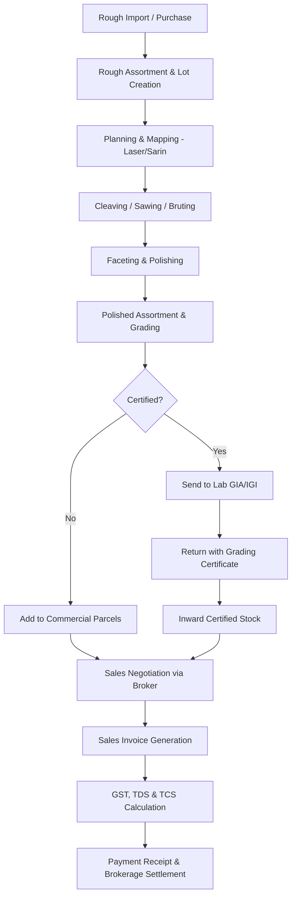

# DIAMO ERP – PHASE 1
## Vision, Requirements Gathering & Business Analysis Report

---

## 1. Executive Summary
DIAMO ERP is a next-generation desktop enterprise resource planning system designed specifically for the diamond industry. This document presents the Phase 1 Business Analysis, providing a comprehensive blueprint of diamond business operations, workflows, and requirements before any database schema design or coding begins. 

By centralizing and optimizing rough stone acquisition, manufacturing, polishing, grading, certification, inventory management, brokerage, accounting, and multi-currency operations, DIAMO ERP aims to replace disjointed spreadsheets and legacy systems with a single, high-performance, keyboard-friendly application.

---

## 2. Business Overview
The diamond industry operates on a global scale with specialized supply chain segments:
*   **Rough Sourcing & Importing:** Sourcing rough diamonds from mining corporations (e.g., De Beers, ALROSA) or open markets.
*   **Manufacturing & Assorting:** Planning, cleaving, sawing, bruting, faceting, and polishing rough stones into finished polished diamonds.
*   **Grading & Certification:** Sending polished diamonds to international laboratories (GIA, IGI, HRD) for carat, cut, color, and clarity verification.
*   **Trading & Sales:** Marketing parcels or certified stones to jewelry manufacturers, wholesalers, and retail chains, often utilizing specialized brokers.
*   **Financial & Compliance Operations:** Managing high-value inventory, complex brokerage structures, multi-currency transactions, and country-specific taxations (such as GST, TDS, and TCS in India).

---

## 3. Business Objectives
*   **Single Source of Truth:** Eliminate data silos between inventory, sales, production, and accounts.
*   **Real-time Stock Tracking:** Know the exact location, processing state, and valuation of every stone or parcel instantly.
*   **Enhanced Productivity:** Reduce data-entry overhead through keyboard-friendly interfaces and inline master creation shortcuts.
*   **Granular Profitability Analysis:** Track costs through the manufacturing pipeline to calculate the exact yield and profit margin per rough lot.
*   **Strict Security & Audit Trails:** Protect high-value assets with role-based permissions and complete change logs.

---

## 4. Stakeholders

| Stakeholder Role | Core Purpose & Responsibilities | Daily Activities | Permissions Required | Expected Reports |
| :--- | :--- | :--- | :--- | :--- |
| **Owner / Executive** | Strategic oversight, financial control, and company growth. | Reviewing high-level profitability, cash flows, and stock valuations. | Full access (read/write/delete overrides). | Consolidated Profit & Loss, Stock Valuation, Brokerage Analysis, Outstanding Receivables. |
| **System Administrator** | ERP maintenance, configuration, and security. | Managing user credentials, database backups, system settings, and audit logs. | Settings, User Access Control, Logs. | System Health, User Activity Logs, Security Audits. |
| **Purchase Manager** | Procurement of rough and polished diamond stock. | Negotiating prices, creating purchase orders, tracking imports, managing supplier accounts. | Purchase entries, Supplier Masters, Payment Requests. | Purchase Registers, Cost Analysis per Supplier, Pending Deliveries. |
| **Production Manager** | Oversight of the diamond manufacturing pipeline. | Stone planning, assigning stones to artisans, tracking weight loss at each stage. | Planning module, Artisan Masters, Weight Entry. | Yield Reports, Manufacturing Losses, Artisan Performance, Status of Lots. |
| **Inventory Controller** | Tracking, physical audit, and custody of high-value inventory. | Inwarding stock, processing assortments, preparing GIA shipments, physical stock audits. | Inventory adjustments, Assortment Sheets, Shipping logs. | Stock Ledger, Discrepancy Reports, GIA Status Report, Lot History. |
| **Sales Executive** | Generating revenue and managing client relations. | Communicating with clients, showing diamonds, creating quotes, generating sales invoices. | Sales module, Customer Masters, Price Lists. | Sales registers, Outstanding Invoices, Brokerage Sheets, Sales Commission. |
| **Broker** | Intermediary matching buyers and sellers. | Introducing buyers, showing stones, negotiating sales terms. | View-only filtered stock (via customer portal in future). | Brokerage Outstanding Reports, Deal History. |
| **Accounts Manager** | Financial auditing, tax compliance, and payroll. | Recording payments, reconciling bank statements, preparing tax filings (GST/TDS/TCS). | General Ledger, Bank/Cash, Tax entries, Journals. | Balance Sheet, Trial Balance, GST Registers, TDS/TCS Reconciliations. |
| **Quality Inspector** | Grading rough and polished stones. | Evaluating clarity, color, cut, fluorescence, and symmetry. | Quality parameters, Lab results entry. | Quality Discrepancy, Yield vs Planned Quality Report. |

---

## 5. Business Workflows

### Flow Descriptions:
1.  **Enquiries & Purchase:** Purchases of rough are made in lots. Lots are assigned unique internal control IDs.
2.  **Manufacturing:** Weight loss (yield) is tracked at every step (planning -> sawing -> bruting -> polishing) to ensure no precious material is misplaced.
3.  **Lab Certification:** Polished stones of specific sizes are sent to laboratories (like GIA). The ERP must track stones currently out at the lab.
4.  **Sales & Brokerage:** Diamonds are sold either directly or through brokers. Brokerage is calculated as a percentage of the sale value, requiring separate tracking.
5.  **Accounts & Taxation:** Invoices trigger financial entries, accounting for local/import taxes and specific withholding taxes (TDS/TCS).

---

## 6. Business Processes
*   **Core Processes:** Rough Procurement, Lot Assortment, Diamond Manufacturing, Lab Management (GIA), Polished Diamond Sales.
*   **Supporting Processes:** Brokerage Management, Artisan Performance Tracking, Safe Custody/Vault Management.
*   **Administrative Processes:** User Role Management, Audit Logging, Document Approvals.
*   **Financial Processes:** General Ledger, Accounts Receivable/Payable, Multi-Currency Revaluation, Bank Reconciliation.
*   **Inventory Processes:** Lot Splitting & Merging, Parcel Grading, Stock Reclassification.
*   **Compliance Processes:** GST Return Prep, TDS Deduction Logs, TCS Collection Registers.

---

## 7. Pain Point Analysis

*   **Lot Splitting & Merging Errors:** When one large rough lot is split into 100 individual stones for polishing, tracking the original cost yield across legacy Excel sheets is highly error-prone.
*   **Lab Dispatch Tracking:** Losing track of which stones are at which grading lab, their transit status, and associated lab fees.
*   **Complex Brokerage Computations:** Brokerage percentages often vary by dealer, transaction type, or stone quality. Manual calculation leads to discrepancies.
*   **Multi-Currency Volatility:** Purchases are often in USD, while local accounts are in INR. Lack of automated forex revaluation leads to inaccurate reporting.
*   **Slow Search and High Clicks:** In fast-paced diamond trading centers (like Surat, Mumbai, or Antwerp), traders need to instantly look up matching stones by size, clarity, and cut. Slow UI filters lose deals.

---

## 8. Business Requirements

### Functional Requirements:
*   **Inline Master Creation:** Users must be able to create Accounts, Groups, or Quality parameters on-the-fly using hotkeys (e.g., Ctrl + A) without leaving their current screen.
*   **Barcode/RFID Scanning Integration:** Support fast barcode check-ins/check-outs for inventory lots.
*   **Advanced Search Engine:** Search by multiple parameters simultaneously (e.g., "0.5-0.7ct, F-G, VS1-VS2, Triple Excellent").
*   **Lot Lineage Tracking:** Trace any polished stone back to its original rough lot.

### Non-Functional Requirements:
*   **Offline First / Local Network Operation:** The database must run locally on LAN to survive internet outages.
*   **Sub-second Response Times:** Search results must populate in less than 200ms.
*   **Audit Logging:** Every edit or deletion of a transaction must log the User, IP, Timestamp, Old Values, and New Values.
*   **Keyboard-Only Navigation:** Support tab orders, enter-key submissions, and hotkeys for every primary screen action.

---

## 9. Business Rules

1.  **No Negative Inventory:** The system must restrict sales or stock movements if the physical lot weight or stone count is insufficient.
2.  **Unique Party and Account Names:** Financial and trading accounts must have unique names.
3.  **Strict Document Locking:** Invoices or vouchers belonging to a closed financial year or a locked period cannot be edited or deleted.
4.  **TDS / TCS Automations:** Trigger alerts or auto-calculations when a transaction crosses government-specified tax thresholds.
5.  **Multi-User Locking:** If user A is editing a specific lot, user B must be restricted from modifying it to prevent concurrency conflicts.
6.  **Immutable Logs:** Audit logs cannot be modified or cleared by any user, including the Administrator.

---

## 10. Risk Analysis

| Risk Category | Description | Impact | Probability | Mitigation Strategy |
| :--- | :--- | :--- | :--- | :--- |
| **Operational** | Weight discrepancies during manufacturing transitions. | High | Medium | Require dual-authorization for weight differences exceeding 0.05ct between stages. |
| **Technical** | LAN server failure halting operations. | High | Low | Automated daily backups to secondary local NAS and secure cloud vault. |
| **Data Integrity** | Concurrency conflicts in multi-user environments. | High | Medium | Implement pessimistic/optimistic locking via Prisma ORM. |
| **Security** | Unauthorized extraction of stock databases. | Critical | Low | Encrypt local database backups, restrict exporting privileges to administrators. |

---

## 11. Future Vision
*   **AI Assistant:** An intelligent chatbot to query stock levels ("Show me VS2 round diamonds in vault A").
*   **Supplier & Customer Portals:** Allow external parties to view authorized inventory levels, request memos, or download invoices.
*   **OCR Integration:** Read and parse GIA certificates automatically via scanner or PDF upload.
*   **WhatsApp API:** Auto-generate and send PDF invoices, quotes, or payment reminders directly to buyers and brokers.

---

## 12. Missing Information
During our preliminary scope analysis, we identified the following missing business variables:
*   **Artisan Compensation Rules:** How are polishers paid? (Per carat, per stone, flat rate, or yield-performance bonuses?)
*   **Memo (Consignment) Rules:** What is the standard duration allowed for memo transactions before stock must be returned or invoiced?
*   **Local Tax Specifics:** Beyond GST/TDS/TCS, are there specific import duty rules or customs protocols that the ERP must generate documents for?

---

## 13. Comprehensive Business Questionnaire

### Company Information & Structure
1. What is the legal structure of the business (e.g., Sole Proprietorship, Partnership, Private Limited)?
2. Do you operate out of multiple physical locations, offices, or factories (e.g., Surat manufacturing unit and Mumbai sales office)?
3. Does the system need to support multi-company accounting under a single database instance?
4. What is your standard financial year calendar (e.g., April to March, or January to December)?
5. What reporting currency is used for auditing, and what currency is used for general trading?

### Inventory & Stock Management
6. How do you distinguish between rough diamonds, semi-processed diamonds, and finished polished diamonds in your inventory?
7. Do you track stones individually, in parcels, or as mixed lots?
8. What is the standard units of measurement used (e.g., Carats (cts), Points, Pieces)?
9. What are the specific vault locations or physical storage partitions within your offices?
10. How do you handle stock re-assortment (mixing stones of different lots to create a new uniform parcel)?
11. What is the maximum number of decimal places required for carat weight tracking (e.g., 2, 3, or 4 decimals)?
12. How do you manage "Memo" (Consignment) inventory sent to potential buyers?
13. How are weight loss tolerances calculated for manufacturing processes?

### Sourcing & Purchases
14. What are the typical terms of purchase for rough lots (e.g., cash, credit days, bank guarantee)?
15. How are import duties, shipping costs, and logistics fees allocated to the cost basis of a rough lot?
16. How do you record and reconcile differences between the invoice weight and the actual received weight of a rough parcel?
17. What documents are required during a rough import (e.g., Kimberley Process Certificate, Bill of Entry)?
18. Do you purchase polished diamonds from other traders, and how does that workflow differ from rough procurement?

### Manufacturing & Processing
19. What are the exact steps in your manufacturing pipeline (e.g., Planning, Laser Sawing, Bruting, Table Polishing, Bottom Polishing, Top Polishing)?
20. Are any manufacturing processes outsourced to external job-workers, and how is job-work tracked and invoiced?
21. How are individual stones identified and tracked once they are cut from a parent rough stone (e.g., barcode tags, physical packets)?
22. How is artisan performance tracked (e.g., yield percentage, speed, quality grade achieved)?
23. How are manufacturing scraps, dust, and industrial boart accounted for?

### Quality & Grading
24. What grading standard do you use internally (e.g., GIA scale, or a proprietary internal scale)?
25. How do you manage the workflow of sending stones to external laboratories (GIA, IGI) for certification?
26. How are laboratory fees (grading fees, shipping, insurance) recorded and allocated to a stone's cost?
27. How does the system handle re-grading or upgrading of a certified stone?

### Sales & Distribution
28. What is the typical sales pipeline (e.g., Quotation -> Memo -> Sales Order -> Invoice)?
29. How are price lists managed, and do you support custom discounts per customer category?
30. How are sales returns processed, especially if the returned diamond has been altered or re-polished?
31. Do you sell diamonds online through listing platforms (e.g., RapNet, IDEX), and should the ERP sync stock levels with them?

### Brokerage & Commissions
32. How are brokers assigned to transactions (e.g., buyer broker, seller broker, or joint brokers)?
33. Is brokerage calculated on the gross amount, net amount, or is it a fixed amount per carat?
34. When does brokerage become payable (e.g., on invoice generation, or upon receipt of payment from the buyer)?
35. How are brokerage rates managed and negotiated per broker or per transaction?

### Financials & Accounting
36. What is your chart of accounts structure?
37. How do you handle foreign exchange gain/loss calculations when invoicing in USD and receiving payments in local currency?
38. What are the rules for bank reconciliation and cash book management?
39. How do you track post-dated checks (PDCs) received from clients?
40. How is depreciation calculated for high-value manufacturing machines (e.g., Sarin planning machines, laser cutters)?

### Taxation & Compliance
41. What are the specific GST rates applicable to your transactions (e.g., 0.25% on rough, 3% on polished in India)?
42. How does TDS (Tax Deducted at Source) apply to your service payments (e.g., brokerage, job-work charges)?
43. How does TCS (Tax Collected at Source) apply to diamond sales when payments exceed statutory limits?
44. How does the ERP need to export data for tax audits and tax return filings?

### Security & Permissions
44. What are the standard user roles and their corresponding access matrices?
45. Do you require IP-based restrictions to prevent staff from accessing the ERP outside the office network?
46. How are double-entry overrides or transaction deletions approved?
47. How long should audit logs be retained in the active system?

### Systems & Architecture
48. What is the typical size of your local network, and how many concurrent users will be accessing the system?
49. What operating system versions are installed on your desktop clients (e.g., Windows 10/11, macOS Sequoia)?
50. What is your backup hardware configuration (e.g., NAS, local external drives)?

---

## 14. Recommendations
1.  **Keyboard-centric UI Design:** Prioritize keyboard accelerators (Alt, Ctrl, Tab) during the UI design phase to ensure operators can execute invoices in seconds without touching the mouse.
2.  **Strict Weight Loss Control:** Enforce a two-tier verification system when weight loss in sawing or bruting exceeds a standard standard margin (e.g., 55% loss).
3.  **Real-Time Dashboard caching:** Because MySQL handles high-volume inventory, build read-optimized views for inventory search screens to avoid query lags.

---

## 15. Phase 1 Completion Checklist
*   [x] Identify business domain objectives and challenges.
*   [x] Define stakeholders, responsibilities, and permissions.
*   [x] Document core workflows (Rough sourcing through finished sales).
*   [x] Formulate high-level functional/non-functional requirements.
*   [x] Establish core business logic and rules.
*   [x] Prepare a comprehensive business questionnaire for Phase 2 readiness.

---

## 16. Readiness Assessment for Phase 2
The project is **Ready to Proceed to Phase 2 (Database Design & API planning)** once the client provides answers to the **Comprehensive Business Questionnaire** listed in Section 13.
