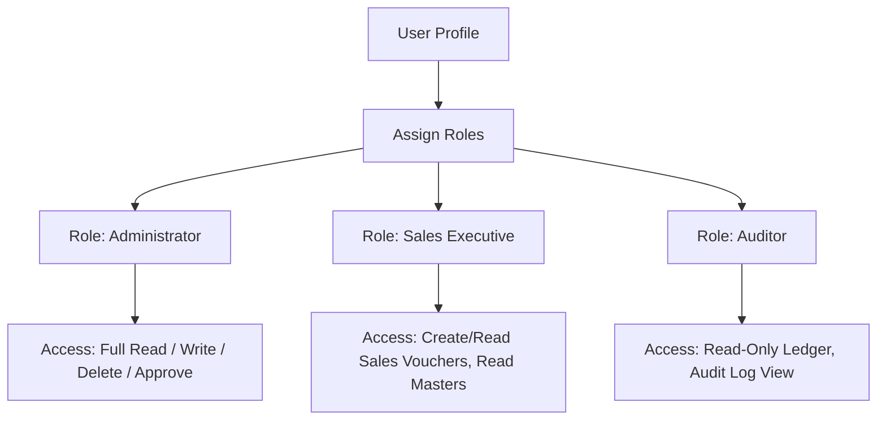
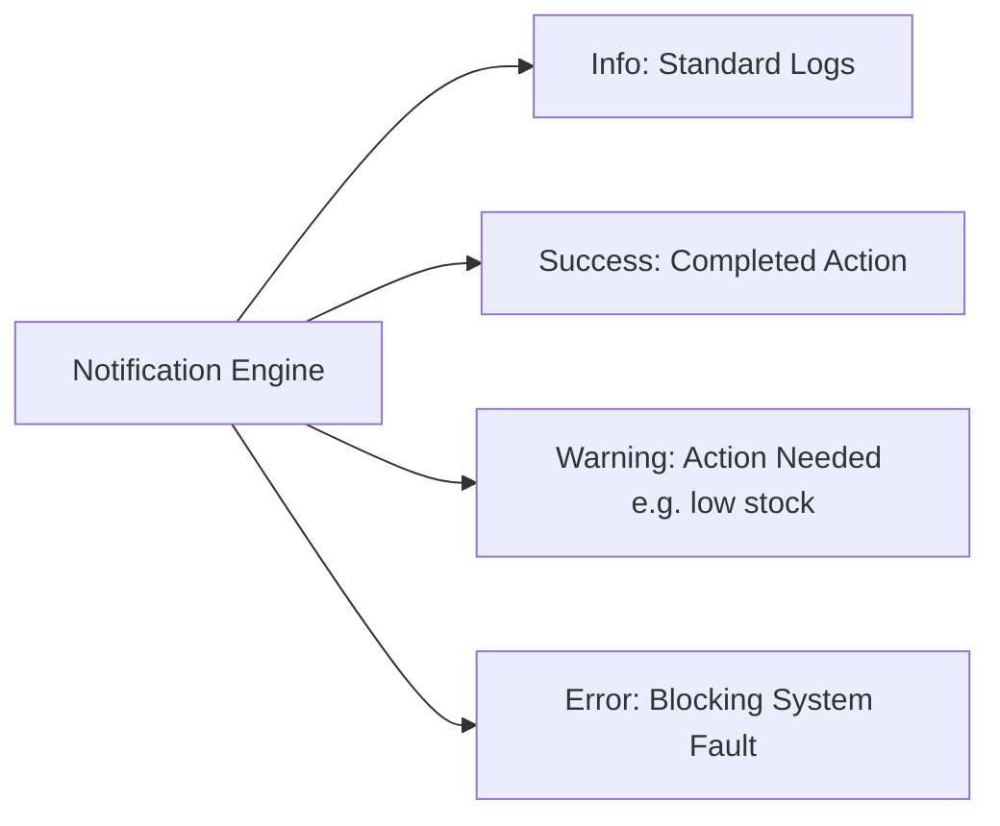

# DIAMO ERP – PHASE 2 PART 1
## GLOBAL SOFTWARE BLUEPRINT & FUNCTIONAL SPECIFICATION

---

## 1. Executive Summary
This document establishes the global blueprint and functional specification for DIAMO ERP. It serves as the primary system-wide standard for UI layout, navigation, keyboard-driven controls, data grid interactions, multi-user concurrency rules, security permission structures, and visual themes. All future modules of DIAMO ERP must strictly conform to these global behavioral specifications to ensure consistency, speed, and usability.

---

## 2. Software Blueprint
DIAMO ERP is structured as a keyboard-first, responsive, three-tier desktop application (Electron + React + NestJS + MySQL). 
*   **Desktop Layer:** The presentation layer manages low-latency rendering, local hotkeys, and system-level file access (printing/exporting).
*   **Business Layer:** Governs calculations, validation pipelines, role permissions, and local area network (LAN) data replication.
*   **Database Layer:** A local MySQL database (mapped via Prisma ORM) optimized for fast transactional reads/writes and reliable offline operation.

---

## 3. Global Navigation Structure

| Primary Module | Purpose | Navigation Path | User Roles | Core Dependencies | Future Expansion |
| :--- | :--- | :--- | :--- | :--- | :--- |
| **Dashboard** | Real-time performance indicators and shortcut access. | `/dashboard` | All Users | Transactions, Reports | Personalization, AI-driven summaries. |
| **Transactions**| Standard input for business entries (Sales, Purchase, Challans, Vouchers). | `/transactions/<type>` | Data Entry, Managers, Accounts | Masters, Settings | Multi-step approval workflows. |
| **Reports** | Data analysis, auditing, and tax preparation outputs. | `/reports/<type>` | Owners, Accounts, Managers | Transactions | Automated email scheduling. |
| **Masters** | Static configuration lists (Accounts, Brokers, Quality parameters). | `/masters/<type>` | Admins, Managers | None | CSV bulk importing/exporting. |
| **Settings** | Security management, user profiles, and database operations. | `/settings` | Admins, Owners | None | Multi-factor authentication. |
| **Configuration** | Hardware interfaces, backup rules, and update channels. | `/config` | Admins | Settings | Cloud auto-sync schedules. |

---

## 4. Module Hierarchy

### Transaction Modules
1.  **Sales Pipeline:**
    *   **Sale Book:** Records final sales invoices. Generates tax liabilities (GST/TCS).
    *   **Sale Return:** Processes returned polished goods. Issues credit notes.
    *   **Sale Debit Note:** Adjusts invoices upwards for interest, price changes, or errors.
2.  **Purchase Pipeline:**
    *   **Purchase Book:** Records incoming rough or polished lots. Capitalizes acquisition expenses.
    *   **Purchase Return:** Processes outbound returns. Receives debit notes.
    *   **Purchase Debit Note:** Supplier-side price adjustments.
3.  **Challans (Internal Movements):**
    *   **Issue for Job Work:** Tracks stones dispatched to polishers/laboratories. Retains owner custody.
    *   **Issue for Trading:** Sends diamonds to brokers on memo.
    *   **Issue for Sale/Purchase Order:** Allocates stock temporarily to open orders.
4.  **Job & Expenses:**
    *   **Job Income:** Tracks services provided to external merchants.
    *   **Job Expense:** Logs payment for external service providers (e.g., laser sawing).
5.  **Financial Vouchers:**
    *   **Journal Voucher:** Adjustments between accounts without cash impact.
    *   **Cash Receipt & Payment:** Cash drawer transactions.
    *   **Bank Receipt & Payment:** Bank ledger deposits and check issues.

### Report Modules
*   **Party Ledger:** Detailed transactions for a specific customer or supplier.
*   **Day Book:** Chronological journal of all transactions for the selected calendar day.
*   **Outstanding Statement:** Aging analysis of accounts receivable and payable.
*   **Stock Ledger:** Granular lot tracking showing input weight, process losses, and final yield.
*   **Trial Balance / Balance Sheet / Profit & Loss:** Standard financial reports.
*   **GST/TDS/TCS Reports:** Specialized tax books showing raw figures and prepared JSON structures for regulatory uploads.

### Master Modules
*   **Account Group & Account Master:** Financial chart of accounts and directories.
*   **Broker Master:** Directory of brokers, percentage terms, and payment terms.
*   **Company & Financial Year Masters:** Details governing database partitions.
*   **Quality Master:** Internal clarity, color, and cut options used during assorting.

---

## 5. Common Behaviour Standards
Every workspace view must contain the following core structures:
*   **Page Title:** Descriptive uppercase module label.
*   **Breadcrumbs:** Active path tracking (e.g., `Masters / Accounts / Create`).
*   **Toolbar:** Layout-specific button group (New, Edit, Save, Delete, Export, Print).
*   **Search & Filter Bar:** Dynamic text entry and drop-down selectors.
*   **Data Grid:** Listing interface displaying active records.
*   **Status Bar:** Active company, user session, network status, database connection, and error/success alerts.

---

## 6. Global UI Standards
*   **Consistent Form Layouts:** Left-aligned form fields with a default two-column layout for transaction parameters.
*   **Visual Notifications:** Toast notifications in the top-right corner that disappear after 3 seconds.
    *   *Success:* Green, quiet check icon.
    *   *Warning:* Amber, caution icon.
    *   *Error:* Red, blocking dialog with an error code.
*   **Loading State:** A thin, high-contrast blue progress bar running along the top edge of the window during database operations.

---

## 7. Global Search Standards
*   **Smart Search:** Single search input that resolves matches across different parameters (e.g., typing `1.02 VS1` searches both Weight and Clarity).
*   **Instant Filtering:** Grids must update in real-time as users type.
*   **Saved Queries:** Users can save complex combinations of filters (e.g., "High-value Round Stones") for quick retrieval.
*   **Wildcards:** Support standard operators like `*` (multi-character) and `?` (single character) in search bars.

---

## 8. Keyboard Navigation Standards

### Global Shortcuts

| Shortcut | Action | Description |
| :--- | :--- | :--- |
| **Ctrl + N** | Create New | Initiates creation form in current module. |
| **Ctrl + S** | Save | Submits and validates current form. |
| **Ctrl + E** | Edit | Toggles Edit mode for selected item. |
| **Ctrl + D** | Delete | Deletes selected item (requires confirmation). |
| **Ctrl + F** | Search | Highlights the search input bar. |
| **Ctrl + A** | Quick Master | Opens inline quick-create popup for focused field. |
| **Ctrl + P** | Print | Opens print preview overlay. |
| **Ctrl + X** | Export | Exports active view grid to Excel/PDF. |
| **Ctrl + K** | Global Search | Focuses the system-wide command palette. |
| **Esc** | Close / Cancel | Closes popups or exits current input focus. |
| **Enter** | Next Field | Moves focus to the next field (acts like Tab in forms). |
| **Shift + Enter** | Previous Field | Moves focus back to the previous input field. |
| **F5** | Refresh | Reloads data on the active page. |

---

## 9. Popup Framework
### Reusable Inline Master Creation (Ctrl + A Framework)
When a user is focused on a master drop-down field (e.g., "Broker Selection") and the target broker does not exist:
1.  **Trigger:** User presses `Ctrl + A` inside the field.
2.  **Instantiation:** The system launches a modal popup of the targeted Master Creation screen.
3.  **Submission:** The user fills the short form and presses `Ctrl + S`.
4.  **Verification:** The popup checks database constraints. If valid, the record is saved.
5.  **Return & Select:** The popup closes, returns focus back to the parent form, refreshes the dropdown list, and automatically selects the newly created item.

---

## 10. Data Grid Standards
All listings must render in an advanced, keyboard-navigable grid containing:
*   **Reordering & Resizing:** Columns can be dragged to reorder or double-clicked to auto-fit contents.
*   **Freeze Columns:** Users can lock key columns (e.g., Stone ID) to the left side during horizontal scrolling.
*   **Row Colors:** Dynamic indicators (e.g., Red rows for overdue invoices, Yellow for items out on memo).
*   **Keyboard Navigation:** Use Up/Down Arrow keys to select rows, and Enter to edit.

---

## 11. Form Standards
*   **Auto-Focus:** Opening a form automatically focuses the first logical input element.
*   **Visual Indicators:** Red asterisks (`*`) flag required fields. Validation messages appear inline directly beneath the input field.
*   **Dirty State Tracking:** Warn users if they attempt to navigate away from an unsaved form with modified values.

---

## 12. Permission Framework
DIAMO ERP uses a role-based access control (RBAC) model:

Permissions are enforced at three logical levels:
*   **Module Level:** Access to general pipelines (e.g., hiding the Purchase module from Sales Executives).
*   **Action Level:** Restricting specific actions (e.g., restricting invoice deletion to Administrators).
*   **Record Level:** Limiting visibility based on Company profile.

---

## 13. Audit Framework
Every database transaction must maintain immutable record metadata:
*   **Standard Audit Fields:**
    *   `created_by` (User ID reference)
    *   `created_date` (Timestamp)
    *   `updated_by` (User ID reference)
    *   `updated_date` (Timestamp)
    *   `version` (Revision integer for optimistic concurrency control)
*   **System Change History Log:** Edits to transactions write a row to a separate history database containing the original and modified JSON states.

---

## 14. Multi Company Strategy
*   **Data Partitioning:** Each company's transactions are logically partitioned. Users must select an active company upon login.
*   **Company Switching:** A global header selector allows users with appropriate permissions to swap companies without logging out.
*   **Master Sharing:** General parameters (like the Quality Master or Account Group configurations) can be flagged as "Global" to avoid redundant data entry across companies.

---

## 15. Multi User Strategy (LAN)
DIAMO ERP operates in multi-user office environments over local networks:
*   **Pessimistic Record Locking:** When a user opens an invoice or lot in Edit mode, the backend sets an active lock. Other users attempting to edit the record receive a warning indicating that the record is locked by the active user.
*   **Real-time Synchronization:** List views push updates to connected clients using WebSocket channels to maintain consistent views.

---

## 16. Notification Framework
Notifications are divided into four severity classifications:

System-triggered alerts (such as database backup failures or software updates) are displayed globally in the status bar.

---

## 17. Theme & Design Standards
The software features a clean, high-contrast corporate aesthetic designed to reduce eye strain:

*   **Color Palette (Light Theme):**
    *   *Primary Color:* Deep Navy Blue (`#0B192C`)
    *   *Secondary Color:* Slate Grey (`#1E3E62`)
    *   *Accent Color:* Diamond Cyan (`#008DDA`)
    *   *Base Background:* Light Grey (`#F5F7F8`)
    *   *Card Background:* Clean White (`#FFFFFF`)
*   **Color Palette (Dark Theme):**
    *   *Primary Color:* Rich Charcoal (`#121212`)
    *   *Secondary Color:* Deep Slate (`#1E1E1E`)
    *   *Accent Color:* Electric Blue (`#40A2E3`)
    *   *Base Background:* Pitch Black (`#0B0B0B`)

---

## 18. Recommended Improvements
1.  **Database Connection Pooling:** Set up strict local pooling parameters on the NestJS backend to prevent performance degradation when multiple instances query the local MySQL server.
2.  **Optimized Keyboard Traversal:** Implement field-level jump settings, allowing users to configure which fields are skipped during standard Enter/Tab navigation to speed up data entry.

---

## 19. Missing Considerations
*   **Scale Precision:** We need to confirm whether rough weight is calculated using standard carats (2 decimal places) or points (3 decimal places) to align backend database parameters.
*   **Auto-Backup Target:** Define the destination path for automated daily backups (e.g., secondary office NAS or local storage).

---

## 20. Phase 2 Part 1 Completion Checklist
*   [x] Establish Global UX and Layout templates.
*   [x] Define Module Navigation hierarchy and dependency rules.
*   [x] Design the Ctrl + A Popup Framework.
*   [x] Specify Global Keyboard Shortcuts.
*   [x] Design multi-user, multi-company, and local concurrency rules.
*   [x] Establish Theme, Notification, and Audit frameworks.
