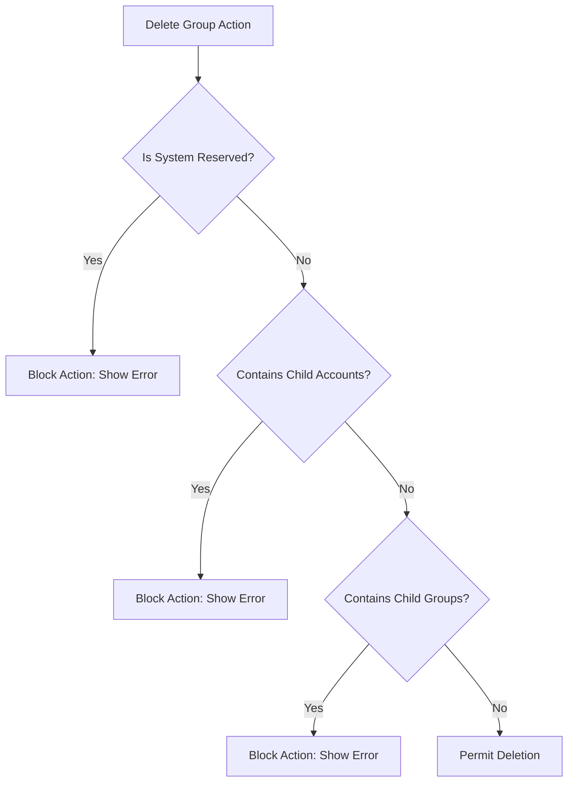

# DIAMO ERP – PHASE 2 PART 3.1
## ACCOUNT GROUP MASTER – FUNCTIONAL SPECIFICATION

---

## 1. Executive Summary
This Functional Specification Document (FSD) defines the operational, business, and user-experience parameters of the Account Group Master in DIAMO ERP. This module provides a clean and structured framework for grouping individual accounts into standard financial classes, serving as the foundational hierarchy for generating all legal, tax, and management reports.

---

## 2. Business Purpose
Account Groups organize individual ledger accounts into structured, manageable classifications:
*   **Logical Organization:** Instead of managing thousands of raw ledgers (e.g., individual customer balances), accounts are grouped under logical headers like "Sundry Debtors".
*   **Reporting Hierarchy:** Financial reports (Balance Sheet, Profit & Loss) query account groups to calculate aggregate totals.
*   **Governance:** Restricts incorrect transactional postings by defining the general accounting nature of individual ledgers.
*   **Enforced Association:** Every Account in DIAMO ERP must belong to exactly one Account Group to prevent orphaned balances.

---

## 3. Business Importance
Account Groups form the backbone of accounting integrity in DIAMO ERP:
*   **Balance Sheet Integration:** Groups define whether a ledger belongs to Assets, Liabilities, Equity, or Retained Earnings.
*   **Profit & Loss Classification:** Differentiates between Direct Income, Indirect Income, Direct Expenses, and Indirect Expenses.
*   **Tax Auditing (GST/TDS/TCS):** Organizes purchase and sales accounts to match tax return categories.
*   **Data Consistency:** Standardizes reporting across multiple offices or companies under the same database server.

---

## 4. Page Overview
The Account Group Master page provides the user interface to view, search, create, edit, or toggle the status of accounting groups.
*   **Primary Objective:** Provide a fast, keyboard-driven interface to manage the chart of accounts hierarchy.
*   **Secondary Objectives:** Prevent duplicate group creation, enforce parent-child relations, and protect reserved system groups.
*   **Success Criteria:** A ledger group can be configured or updated in under 3 seconds using hotkeys, without database integrity issues.

---

## 5. Users & Permissions

| Role | Operations Allowed | Purpose |
| :--- | :--- | :--- |
| **Owner / Executive** | View, Export | Reviewing the chart of accounts structure. |
| **System Administrator** | View, Create, Edit, Delete, Restore, Export | Maintenance of core accounting rules. |
| **Accountant** | View, Create, Edit, Export | Establishing groups for new business streams. |
| **Manager** | View | General verification. |
| **Data Entry User** | View | Referencing groups during inline account creation. |
| **Auditor** | View, Export | Verifying tax and bookkeeping classifications. |

---

## 6. Navigation
*   **Module:** Masters
*   **Sub-Module:** Accounting Masters
*   **Breadcrumb Path:** `Masters / Accounting Masters / Account Group Master`
*   **Target Page URI:** `/masters/accounting/account-groups`

---

## 7. Screen Layout
The layout uses a split-pane structure optimized for desktop resolutions:
1.  **Left Navigation Pane (Tree View):** A hierarchical directory tree showing Parent Groups and nested child groups.
2.  **Right Detail Pane (Form/Grid View):** 
    *   *Grid Tab:* Lists all groups matching active search criteria.
    *   *Form Tab:* Standard section-based form for adding/editing a group.
3.  **Action Header:** Contextual buttons (New, Edit, Save, Cancel, Delete, Export, Print) aligned along the top right.
4.  **Footer Status Bar:** Shows record count, active selection, version control, and current user.

---

## 8. Field Specification Review

| Field Name | Type | Required? | Validation Rules | Default Value | Business Purpose |
| :--- | :--- | :--- | :--- | :--- | :--- |
| **Group Name** | Text (100 char) | Yes | Must be unique. No special characters except hyphen or slash. | None | Primary name identifying the account classification. |
| **Parent Group** | Dropdown | Optional | Must reference a valid existing group. Cannot reference self or children. | Root | Establishes hierarchical parent-child associations. |
| **Primary Type** | Dropdown | Yes | Choice of: Assets, Liabilities, Income, Expenses. | None | Determines financial statement classification. |
| **System Reserved**| Boolean | Yes | View-only. Set by system migration seeds. | False | If True, blocks deletion or renaming. |
| **Status** | Dropdown | Yes | Choice of: Active, Inactive, Locked. | Active | Governs usability in child accounts. |

---

## 9. Button Behaviour
*   **New (`Ctrl + N`):** Clears the form fields, focuses the "Group Name" input, and switches to Form view.
*   **Save (`Ctrl + S`):** Performs local validation. On success, writes to database, updates the Left Tree View, and displays a success toast.
*   **Cancel (`Esc`):** Discards unsaved modifications and reverts form to read-only state.
*   **Delete (`Ctrl + D`):** Validates if group is Reserved or contains accounts. If clear, prompts with confirmation dialog before deleting.

---

## 10. Business Rules

1.  **Strict Name Uniqueness:** No two account groups can share the same name within the active company partition.
2.  **Reserved Safety:** Core groups seeded by default (e.g., "Sundry Debtors", "Sundry Creditors", "Cash Accounts", "Bank Accounts") are immutable.
3.  **Active Status Enforced:** Accounts cannot be created under a group that is marked as Inactive.
4.  **No Circular References:** A parent group cannot be assigned as a child of its own sub-groups.

---

## 11. Validation Rules
*   **Required Fields:** Group Name and Primary Type must be filled.
*   **Character Limits:** Group Name must not exceed 100 characters.
*   **Status Locking:** If a group is marked as "Locked", its name and parenting parameters cannot be edited.
*   **Special Characters:** Prevent script injections by sanitizing input fields (allow only spaces, letters, numbers, hyphens, and slashes).

---

## 12. Dependencies
*   **Account Master:** Sub-accounts query the Account Group list for classification during creation.
*   **General Ledger & Vouchers:** Transactions query Account Groups indirectly via their linked Account.
*   **Tax Masters:** Specific tax configurations (like TCS on Sales) use Account Groups to identify eligible parties.

---

## 13. Transaction Impact
*   **Purchase/Sales:** When recording an invoice, the system logs VAT/GST totals under the "Duties & Taxes" group.
*   **Cash/Bank Vouchers:** Cash receipts verify that the destination ledger belongs to the "Cash Accounts" or "Bank Accounts" group.

---

## 14. Report Usage
*   **Balance Sheet:** Displays asset and liability balances grouped by their designated parent groups.
*   **Profit & Loss:** Groups operational expenses (e.g., "Administrative Expenses") separate from cost of sales.
*   **Trial Balance:** Runs recursive additions across the group hierarchy to verify matching debits and credits.

---

## 15. User Experience Review
*   **Keyboard Speed:** Users can search using `Ctrl + F`, navigate matching rows via Arrow Keys, and press `Enter` to edit a group.
*   **Tree Interactivity:** Keyboard navigation allows expanding (`Right Arrow`) and collapsing (`Left Arrow`) node hierarchies in the Left Tree view.
*   **Data Density:** Clean grid styling optimized to display up to 50 rows without layout overflow.

---

## 16. Security Considerations
*   **Data Segregation:** If multi-company sharing is disabled, users in Company A cannot view or associate ledger groups configured for Company B.
*   **Action Restriction:** Only users with `manage_chart_of_accounts` permission can save or delete groups.

---

## 17. Edge Cases
*   **Circular Nesting:** Guard against assigning a Parent Group that results in an infinite hierarchy loop.
*   **Mass Renaming:** Changing the name of a heavily populated group (e.g., "Sundry Debtors") must trigger an asynchronous background update to avoid locking the accounts table.
*   **Inactive Toggling:** Toggling a group to Inactive does not affect existing accounts but blocks new account creation.

---

## 18. Future Enhancements
*   **Nested Infinite Groups:** Support unlimited levels of parenting.
*   **AI Auto-Grouping:** Suggest appropriate parent categories based on input account names.
*   **Bulk Migration Tools:** Enable importing a standard chart of accounts from Excel files.

---

## 19. Architect Recommendations
1.  **Strict Seed Lock:** Ensure the migration engine flags standard accounting groups with a `system_reserved: true` flag in the MySQL database.
2.  **Parent-Child Loop Prevention:** Implement validation checks on parent updates to verify that the selected parent group is not a child of the current group.

---

## 20. Final Completion Checklist
*   [x] Document business purpose and importance of Account Groups.
*   [x] Design screen layout and field specification.
*   [x] Define validation rules and circular nesting prevention rules.
*   [x] Map dependencies, transaction impact, and reporting metrics.
*   [x] Detail keyboard workflows, safety parameters, and security considerations.
