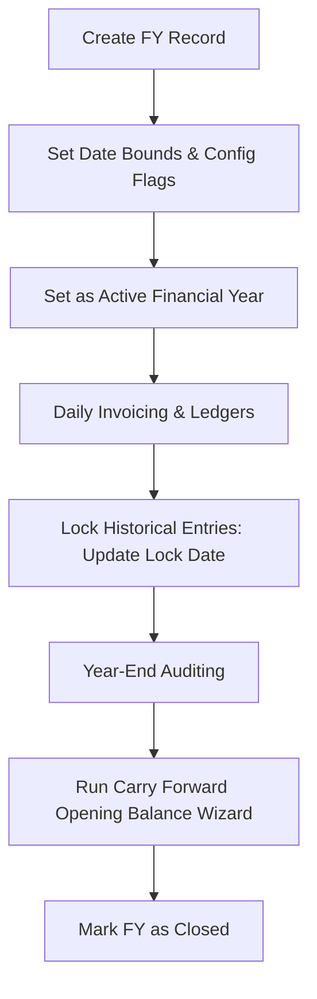

# DIAMO ERP – PHASE 2 PART 3.5
## FINANCIAL YEAR MASTER – ENTERPRISE FUNCTIONAL SPECIFICATION

---

## 1. Executive Summary
This document defines the Enterprise Functional Specification Document (FSD) for the Financial Year Master module in DIAMO ERP. The Financial Year Master governs accounting periods, transaction locking boundaries, GST/TCS activation flags, general ledger posting statuses (Account Effect), and year-end carry-forward workflows. It ensures that transactions conform to designated auditing intervals and protects historical data from retroactive modification.

---

## 2. Business Purpose
The Financial Year Master controls the active calendar bounds for corporate bookkeeping:
*   **Auditable Accounting Cycles:** Segmenting business operations into distinct 12-month periods (e.g., April to March) to generate tax and performance audits.
*   **Retroactive Data Security:** Enforces "Lock Transaction Upto Date" variables to prevent staff from altering historical accounts post-audit.
*   **Balance Transitions:** Coordinates the transfer of closing balances to the next financial year.

---

## 3. Business Importance
*   **Transactional Boundary Enforcer:** Blocks posting sales or purchase invoices outside the active financial year's dates.
*   **Tax Compliance Control:** Activates or deactivates GST and TCS routines on a year-by-year basis to adapt to legal updates.
*   **Financial Reporting Accuracy:** Standardizes date bounds for the Trial Balance, Balance Sheet, and Profit & Loss statements.

---

## 4. Page Overview
*   **Primary Objective:** Provide a form and grid interface to configure company financial years and control transaction locks.
*   **Secondary Objectives:** Enforce non-overlapping date bounds and control accounting post-authorization flags.
*   **Success Criteria:** Zero date-boundary overlaps, immutable locked transactions, and smooth financial year transitions.

---

## 5. Users & Permissions

| Role | Permissions | Operation Scope |
| :--- | :--- | :--- |
| **Owner / Executive** | View | Reviewing audit periods and active locking dates. |
| **System Administrator** | Full Access | Creating/editing financial years, modifying lock dates, force-unlock overrides. |
| **Accounts Head** | Create, Edit, View | Closing years, updating lock dates, setting account effects. |
| **Auditor** | View, Export | Examining date boundaries and audit freeze intervals. |

*   *Restrictions:* Standard sales and purchase operators are blocked from modifying this master.

---

## 6. Navigation
*   **Module:** Masters
*   **Sub-Module:** Business Masters
*   **Breadcrumb Path:** `Masters / Business Masters / Financial Year Master`
*   **Target Page URI:** `/masters/business/financial-years`

---

## 7. Existing Screen Review
The Financial Year Master screen uses a split layout:
*   **Top Pane (Form Entry):** Selection fields for Firm/Company, Date From, Date To, and config flags (TCS Active, Account Effect, Lock Transaction Upto Date).
*   **Bottom Pane (Grid View):** Columnar listing displaying all configured financial years, showing: From Date, To Date, Company Name, Active status, TCS/GST flags, and Lock Dates.
*   **Toolbar Buttons:** Save, Delete, Clear.

---

## 8. Field Review

| Field Name | Type | Required? | Validation Rules | Default | Business Purpose |
| :--- | :--- | :--- | :--- | :--- | :--- |
| **Firm / Company** | Dropdown | Yes | Must reference active Company record. | None | Maps the period to a specific company partition. |
| **Date From** | Date | Yes | Must be prior to Date To. No overlaps. | None | Starting date of the financial year. |
| **Date To** | Date | Yes | Must be after Date From. Max 366 days. | None | Ending date of the financial year. |
| **TCS Active** | Boolean | Yes | Checkbox. | True | Enables TCS validation rules during the period. |
| **GST Active** | Boolean | Yes | Checkbox (visible in grid). | True | Enables GST calculation engine. |
| **Account Effect** | Boolean | Yes | Checkbox. | True | Controls whether entries post to ledger balances. |
| **Lock Date** | Date | Optional | Must be between Date From and Date To. | None | Restricts edits to vouchers dated on or before this date. |

---

## 9. Button Behaviour
*   **Save:** Validates input parameters (overlap checks, chronological order). On success, saves the record, refreshes the listing grid, and displays a success toast.
*   **Delete:** Checks if any transactions are recorded within the target date range. If transactions exist, blocks deletion; otherwise, requests confirmation before deleting.
*   **Clear:** Resets the input form fields to blank values.

---

## 10. Business Rules
1.  **Single Active Period:** Only one financial year can be marked as "Active" (current) per company at any time.
2.  **Date Integrity Check:** Date From must be strictly earlier than Date To.
3.  **Overlap Prevention:** No two financial years belonging to the same company can overlap.
4.  **Transaction Boundary Enforcement:** Invoices dated outside the active financial year's bounds are blocked during voucher submission.

---

## 11. Validation Rules
*   **Sequence Validation:** The system verifies: $\text{Date From} < \text{Lock Date} \leq \text{Date To}$.
*   **Overlap Query:** Scans for existing records where:
    $$\text{New From Date} \leq \text{Existing To Date} \quad \text{and} \quad \text{New To Date} \ge \text{Existing From Date}$$
    If matched, blocks creation.

---

## 12. Financial Year Workflow

---

## 13. Lock Transaction Logic
The **Lock Transaction Upto Date** prevents historical data modification:
*   **Execution Rule:** Any voucher (Sales, Purchase, Journal) dated on or before the Lock Date cannot be created, edited, or deleted by standard users.
*   **Privileged Override:** Only the System Administrator can edit locked transactions (logs a high-priority audit record).
*   **Benefit:** Prevents accidental modification of tax accounts during active government audits.

---

## 14. GST / TCS Configuration
*   **GST Active:** Toggles tax computation fields in sales/purchase books. Disabling this flag routes tax columns to zero values.
*   **TCS Active:** Automates TCS collection validations (Section 206C) on sales invoices when customer collection thresholds are breached.

---

## 15. Account Effect
*   **Purpose:** Determines whether transactions recorded in the year update ledger balances.
*   **Use Cases:** Useful when creating a "Trial/Testing" financial year to simulate transaction flows without impacting actual financial balances.
*   **Default:** Must be set to `True` for standard operational years.

---

## 16. Dependencies
*   **Company Master:** Each financial year belongs to a parent Company profile.
*   **Transactions (Vouchers):** Invoices pull active financial year constraints to authorize invoice numbering sequences.

---

## 17. Transaction Impact
*   **Sales / Purchase Book:** Rejects invoice dates that fall within a locked date range or outside the active financial year bounds.
*   **Balance Sheet / Profit & Loss:** Generates calculations using the active financial year’s dates as date boundaries.

---

## 18. Report Usage
*   **Trial Balance / Balance Sheet:** Restricts data querying to the currently active financial year.
*   **GST Registers:** Generates returns only for tax transactions posted during the active year.

---

## 19. User Experience Review
*   **Date Presets:** Provide auto-fill buttons (e.g., "April to March" or "January to December") based on the company's business type.
*   **Alert Dialogs:** Warning dialogs notify users if they attempt to save vouchers near the financial year transition dates.

---

## 20. Edge Cases
*   **Locking the Wrong Date:** If a user accidentally locks the entire year, the Administrator must edit the master record to roll back the Lock Date.
*   **Leap Year Handling:** Date validation systems must dynamically adjust to support 366-day intervals for leap years.

---

## 21. Future Enhancements
*   **Year Closing Wizard:** Step-by-step assistant that audits ledger matches, validates tax balances, closes the current year, and creates the new financial year.
*   **Opening Balance Wizard:** Automatically carries forward closing asset/liability balances into the new year.

---

## 22. Architect Recommendations
1.  **Backend Date Interceptors:** Build NestJS request interceptors to validate transaction voucher dates against the `Lock Date` in the MySQL database before committing writes.
2.  **Unique Company-FY Constraint:** Implement a database index constraint in MySQL: `UNIQUE(company_id, from_date, to_date)`.

---

## 23. Final Completion Checklist
*   [x] Document business purpose and role of the Financial Year Master.
*   [x] Review screen layout panels, fields, and grid columns.
*   [x] Map validation rules, overlap checks, and date sequence rules.
*   [x] Detail the transaction locking mechanism and override roles.
*   [x] Map the year-end carry forward and closing workflow.
