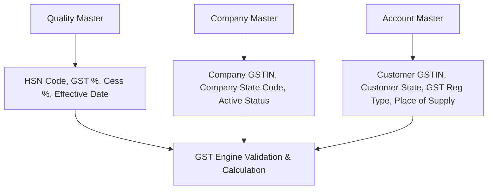

# DIAMO ERP – PHASE 4.1.4
## SALE BOOK – GST ENGINE & TAX CALCULATION SPECIFICATION

---

## 1. Executive Summary
This document defines the Enterprise Functional Specification Document (FSD) for the GST Engine and Tax Calculation logic of the Sale Book in DIAMO ERP. This module automates place-of-supply resolution, tax splits (CGST/SGST/IGST), Cess calculations, and GSTIN formatting audits. It operates in compliance with Indian GST regulations.

---

## 2. GST Architecture
The GST Engine functions as an asynchronous verification step inside the Sale Book billing cycle:
*   **Data Resolution:** Pulls structural tax configurations from Company, Customer, and Quality files.
*   **Decision Matrix:** Matches state codes dynamically to select tax routing.
*   **Calculation Loop:** Computes net values using tax parameters before posting invoices to the database.

---

## 3. GST Data Sources
The engine aggregates data parameters from three database masters:

---

## 4. Auto Fetch Logic
*   **Customer Selection:** Loads Customer GSTIN and GST Registration Type (Registered, Composition, Unregistered, SEZ). Sets the destination state code from the GSTIN prefix.
*   **Quality Selection:** Queries item HSN numbers and applicable tax percentages.
*   **Company Selection:** Resolves Company State Code and GSTIN prefix.

---

## 5. GST Decision Engine
The system determines CGST, SGST, and IGST applicability using state-code comparisons:
*   **State Code Resolution:** The engine extracts the first 2 digits of the customer and company GSTINs (e.g., `24` for Gujarat, `27` for Maharashtra).
*   **Tax Splits Decision:**
    *   *Intra-State:* If $\text{Company State Code} = \text{Customer State Code}$, the transaction is classified as Intra-State. The engine calculates CGST and SGST. IGST is locked to `0.00`.
    *   *Inter-State:* If $\text{Company State Code} \neq \text{Customer State Code}$, the transaction is classified as Inter-State. The engine calculates IGST. CGST and SGST are locked to `0.00`.

---

## 6. GST Calculation Engine
Calculations follow standard tax formulations:
*   **Taxable Amount:**
    $$\text{Taxable Value} = \text{Gross Amount} - \text{Line Discounts} + \text{Taxable Outlay Charges}$$
*   **GST Amount:**
    $$\text{GST Amount} = \text{Taxable Value} \times \frac{\text{GST \%}}{100}$$
*   **Intra-State Split:**
    $$\text{CGST} = \frac{\text{GST Amount}}{2} \quad \text{and} \quad \text{SGST} = \frac{\text{GST Amount}}{2}$$
*   **Inter-State Split:**
    $$\text{IGST} = \text{GST Amount}$$
*   **Cess calculation:**
    $$\text{Cess Amount} = \text{Taxable Value} \times \frac{\text{Cess \%}}{100}$$

---

## 7. GST Validation Rules
*   **Unregistered Match:** If a customer is flagged as Unregistered, the engine overrides the Quality GST percentage and locks GST values to `0.00`.
*   **GST Active Status:** If the Company or active Financial Year has `GST Active: False`, all tax calculations are bypassed.
*   **Tax Rate Change Validation:** Validates that the GST rate matches the active tax bracket set for the invoice date.

---

## 8. GSTIN Validation
*   **Structure Format:** Enforces 15-character alphanumeric format check:
    `^[0-9]{2}[A-Z]{5}[0-9]{4}[A-Z]{1}[1-9A-Z]{1}Z[0-9A-Z]{1}$`
*   **State Mismatch Warning:** If the first 2 digits of the customer GSTIN do not match the state selected in the customer address block, the system displays a warning.

---

## 9. Place of Supply Logic
*   **Standard Rule:** Place of Supply is determined by the state code of the customer's billing address.
*   **SEZ Transactions:** If the customer's GST Registration type is set as "SEZ Developer" or "SEZ Unit", the transaction is treated as Inter-State (IGST calculated) regardless of state matching.

---

## 10. HSN Management
*   **Direct Validation:** HSN codes must match the 8-digit numeric codes defined in the Quality Master.
*   **No Manual Overrides:** Users are blocked from manually editing HSN values in the invoice grid.

---

## 11. CESS Calculation
*   **Filing Class:** cess amounts are calculated per line item and aggregated separately on invoice print layouts. If Cess is `0.00%`, it renders as zero.

---

## 12. GST Summary Panel
The GST Summary Panel updates instantly in the UI:
*   **Taxable Value:** Sum of taxable line totals.
*   **Tax Splits:** Displays CGST, SGST, IGST, and Cess aggregates.
*   **Total Tax:** Sum of CGST, SGST, IGST, and Cess.
*   **Net Balance:** Net invoice total including tax values and round-off offsets.

---

## 13. Business Rules
1.  **Read-Only Calculations:** Users cannot edit calculated tax values (CGST, SGST, IGST) directly.
2.  **State Mismatch Enforcement:** Place of Supply is locked to the customer's master address configuration.
3.  **Draft Exemption:** Tax calculations run on draft invoices but are finalized only when the invoice status is updated to Saved/Approved.

---

## 14. User Experience
*   **Zero manual selection:** Users select items and parties, and the system resolves state matches and tax divisions automatically.
*   **Immediate UI Updates:** Calculations process locally to prevent latency.

---

## 15. Dependencies
*   **Quality Master:** Source for HSN, Cess, and GST percentages.
*   **Account Master:** Source for customer GSTIN, address state, and registration type.
*   **Company Master:** Source for own GSTIN and base state code.

---

## 16. Edge Cases
*   **Unregistered Clients:** All GST amounts are zeroed.
*   **Composition Dealers:** Classified as tax-exempt on sales invoices. CGST, SGST, and IGST values are set to `0.00`.
*   **Exempt Items:** If an item is flagged as tax-exempt in the Quality Master, the GST engine overrides rate matches and sets tax amounts to `0.00`.

---

## 17. Audit Requirements
Modifying tax parameters logs an audit record containing:
*   Original GST rate and HSN code.
*   Modified GST rate and HSN code.
*   User ID, date, time, and override reason.

---

## 18. Future Enhancements
*   **GSTIN Online Lookup:** Direct integration with GST portal APIs to verify client credentials during customer registration.
*   **E-Invoice Integration:** Auto-generates IRN numbers upon invoice approval.

---

## 19. Architect Recommendations
1.  **Centralized Tax Engine Service:** Implement the GST Decision Engine as a separate utility service in the NestJS backend to share validation rules across Sales, Purchases, Debit Notes, and Credit Notes.
2.  **State-Code Mapping Table:** Maintain an internal JSON state-code prefix map to validate GSTIN numbers before DB commit.

---

## 20. Final Completion Checklist
*   [x] Document GST data sources, auto-fetch logic, and decision engines.
*   [x] Map calculation formulas for CGST, SGST, IGST, and Cess.
*   [x] Integrate GST bypass rules for unregistered customers and composition dealers.
*   [x] Define GSTIN validation rules and Place of Supply logic.
*   [x] Map audit parameters, edge cases, and summary panels.
