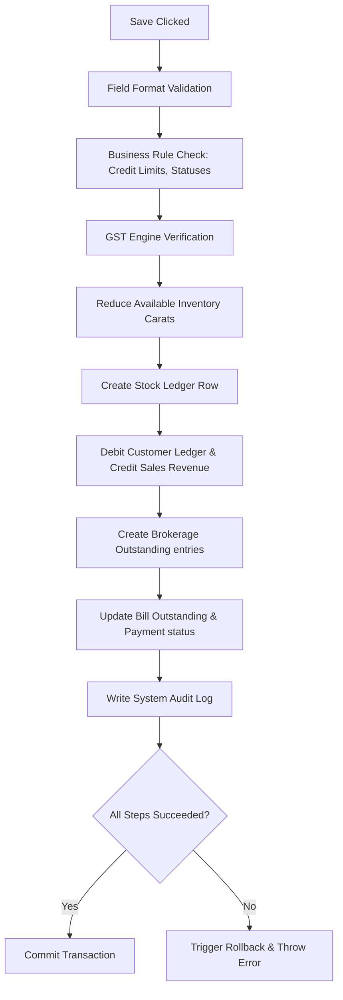

# DIAMO ERP – PHASE 4.1.5
## SALE BOOK – INVENTORY, LEDGER & OUTSTANDING ENGINE SPECIFICATION

---

## 1. Executive Summary
This document defines the Enterprise Functional Specification Document (FSD) for the transactional processing engine of the Sale Book in DIAMO ERP. This specification outlines the automated processes triggered upon saving, editing, deleting, or cancelling invoices, detailing how the system coordinates real-time inventory adjustments, double-entry ledger postings, outstanding debtor tracking, audit logging, and ACID database rollbacks.

---

## 2. Save Transaction Workflow
When a user clicks "Save", the system executes the following operational pipeline in a single database transaction block:

---

## 3. Inventory Engine
The Inventory Engine processes carat weight updates:
*   **Stock Reduction:** Deducts the carat weight of sold items from warehouse locations.
*   **Available vs. Reserved Stock:** If a sale references an allocated sales order, the engine moves stock status from Reserved to Sold, reducing both Available and Reserved totals.
*   **Locking:** Locks targeted stock records during processing to prevent other sales transactions from double-allocating the same stones.

---

## 4. Quality Stock Logic
1.  **Item Match:** Matches invoice lines to active Quality records.
2.  **Deduction:** Decrements current available carat weight in the inventory balance sheet.
3.  **Stock Ledger Entry:** Generates transactional rows in the Stock Ledger.
4.  **Signal Recalculation:** Notifies the dashboard and stock reports of updated weights.

---

## 5. Negative Stock Strategy
The system handles negative stock scenarios using three configurable corporate rules:
*   **Block Transaction (Default):** The save process is aborted and displays an error message if the invoice carat weight exceeds the available lot weight.
*   **Warn User:** Displays a warning modal, allowing standard users to bypass the stock constraint.
*   **Override Authorization:** Restricts saving to administrators or managers who must input an override credentials key.

---

## 6. Stock Ledger
The engine automatically generates a Stock Ledger row for each line item containing:
*   `transaction_id`, `invoice_number`, `transaction_date`.
*   `quality_id` reference.
*   `quantity_carats` (negative value showing stock reduction).
*   `running_balance_carats` (new current stock level after the transaction).
*   `user_id` of the billing operator.

---

## 7. Customer Ledger
The ledger engine creates balanced double-entry accounting records:
*   **Invoice Debit:** Debits the customer's account for the total invoice value (Net Amount).
*   **Jama Credit:** If the invoice has a Jama (cash receipt) value, the system creates a credit entry in the customer's ledger, offsetting the debit.

---

## 8. Broker Ledger
If a broker is selected on the invoice:
*   **Commission Credit:** Credits "Broker Commission Outstanding" liabilities.
*   **Broker Ledger Posting:** Records credit entries against the broker's personal ledger account.
*   **Settlement Status:** Initializes the commission status as "Outstanding", waiting for cash clearing.

---

## 9. Outstanding Engine
*   **Record Creation:** Creates an outstanding ledger row mapping the Bill Number, Customer ID, Invoice Date, Due Date, and Net Balance.
*   **Ageing Calculations:** Group balances by credit days (e.g., 0-30 Days, 30-60 Days) to generate outstanding statements.

---

## 10. Payment Status
Payment status is evaluated using the following matrix:

| Payment State | Evaluation Condition |
| :--- | :--- |
| **Unpaid** | $\text{Allocated Receipts} = 0$ |
| **Partial** | $0 < \text{Allocated Receipts} < \text{Net Invoice Amount}$ |
| **Paid** | $\text{Allocated Receipts} \ge \text{Net Invoice Amount}$ |
| **Overdue** | $\text{Current Date} > \text{Due Date} \quad \text{and} \quad \text{Status} \neq \text{Paid}$ |

---

## 11. Jama Logic
*   **Definition:** Jama represents the immediate cash deposit received during the invoice entry process.
*   **Processing Rules:** If $\text{Jama} > 0$:
    *   Create a cash receipt voucher under the same transaction ID.
    *   Post a credit entry to the customer's ledger.
    *   Reduce invoice outstanding balances.
    *   Update payment status to Paid (if matching the invoice total) or Partial.

---

## 12. Accounting Impact
*   **Customer Account:** Debited for Net Invoice Value.
*   **Sales Revenue Account:** Credited for Taxable Value.
*   **GST Accounts (CGST/SGST/IGST):** Credited for calculated tax amounts.
*   **Broker Commission Account:** Credited for commission liabilities.
*   **Cash/Bank Account:** Debited for the Jama amount.
*   **Round Off Account:** Adjusted for minor rounding differences.

---

## 13. Report Impact
Saving an invoice updates downstream reports:
*   *Stock Report:* Deducts sold carats.
*   *Outstanding Report:* Appends new receivable balances.
*   *P&L / Balance Sheet:* Records sales revenues, taxes, and cash assets.
*   *Day Book:* Appends new voucher logs.

---

## 14. Edit Workflow
Editing a saved invoice re-triggers the validation loops:
1.  **Voucher Unlock:** Verifies invoice date is not locked. Sets edit locks.
2.  **Reverse Previous State:** Temporarily reverses original stock deductions and accounting postings.
3.  **Recalculation:** Re-runs calculations based on new inputs.
4.  **Save New State:** Re-applies stock deductions, updates ledger accounts, updates outstanding balances, and writes an edit log.

---

## 15. Delete Workflow
DIAMO ERP uses soft-deletions to maintain audit trails:
*   **Record Retention:** The invoice is not deleted from database tables.
*   **Flag Modification:** Sets the invoice `status` field to "Deleted".
*   **Reversal Actions:** Reverses stock deductions and ledger postings.
*   **Safety check:** Block deletion if any payment receipts are allocated to the invoice.

---

## 16. Cancel Workflow
*   **Status Toggling:** Updates the invoice status to "Cancelled".
*   **Automatic Reversal:** Reverses stock deductions and ledger postings, ensuring cancelled invoices do not impact balance sheets or physical stock reports.
*   *Restraints:* Cancelled invoices are read-only.

---

## 17. Transaction Locking
*   **Pessimistic Edit Locking:** When a user opens an invoice in edit mode, the backend sets a temporary database lock. Other users attempting to edit the record receive a warning.
*   **Optimistic Version Checking:** Prisma `version` column checks block saves if the record was modified by another operator during editing.

---

## 18. Rollback Strategy
*   **ACID Compliance:** All writes (Inventory, Ledgers, Outstanding, Audits) must be wrapped in a single database transaction block.
*   **Failure Recovery:** If any write operation fails (e.g., database network disconnects, stock balances drop below limits), the database transaction aborts. All changes are rolled back, and the client displays an error warning.

---

## 19. Audit Engine
Every write operation generates an entry in the Audit Log containing:
*   Voucher ID, Bill Number, and Action (Create, Edit, Delete, Cancel).
*   Before Value (JSON state) and After Value (JSON state).
*   User ID, date, time, system hostname, and override reasons.

---

## 20. Validation Rules
*   **Stock Validation:** Checks that carats are available in inventory.
*   **FY Validation:** Checks that the transaction date falls within the active company's financial year bounds.
*   **Lock Validation:** Blocks saves dated on or before the company's active Lock Date.

---

## 21. Business Rules
1.  **Immutable Audits:** Completed audit logs cannot be modified or cleared.
2.  **No Edits on Cancelled Invoices:** Cancelled invoices are locked from further editing or status modifications.
3.  **Balanced Transactions:** Ledger posting blocks abort if debit totals do not match credit totals.

---

## 22. Edge Cases
*   **Double-Click Save:** Debounce submit buttons on the UI to prevent duplicate voucher creation.
*   **Power Failure mid-save:** Database transactional rollbacks ensure that half-saved invoices are discarded on server reboot.
*   **Back-dated Invoices:** Checked against active Lock Dates. If valid, ledger balances are recalculated dynamically.

---

## 23. User Experience
*   **Save Indicators:** Displays a loading spinner during saves.
*   **Error Prompts:** If a rollback triggers, show a clear warning specifying the failure reason (e.g., "Rollback Triggered: Quality Round 0.50 VS1 F has insufficient stock").

---

## 24. Future Enhancements
*   **Warehouse Location Routing:** Direct stock reduction from specific warehouse locations.
*   **Packet Tracking Engine:** Auto-deduct stock based on unique diamond packet barcode scans.

---

## 25. Architect Recommendations
1.  **Nested Transaction Scope:** Use Prisma's interactive transaction `$transaction` client to execute stock checks and ledger writes sequentially.
2.  **Unique Invoice Indexing:** Enforce a composite unique constraint index in MySQL on `(company_id, financial_year_id, bill_number)` to prevent invoice number collisions.

---

## 26. Final Completion Checklist
*   [x] Document save transaction workflows and rollback strategies.
*   [x] Map the Inventory Engine logic (Stock reduction, stock ledger logs).
*   [x] Map customer and broker ledger postings.
*   [x] Define Outstanding and Payment Status calculations.
*   [x] Map edit, delete, cancel, and lock rules.
