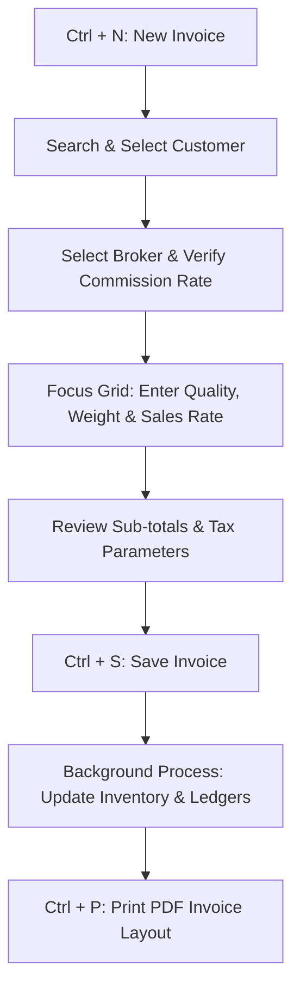

# DIAMO ERP – PHASE 4.1.1
## SALE BOOK – ARCHITECTURE & USER EXPERIENCE SPECIFICATION

---

## 1. Executive Summary
This document defines the Architecture & User Experience Functional Specification Document (FSD) for the Sale Book module in DIAMO ERP. As a primary entry screen for finished diamond sales, this module is optimized for high-volume billing, low-latency search filters, and keyboard-first operations. It serves as the UX template for all other transactional books in the ERP.

---

## 2. Business Purpose
The Sale Book registers sales invoices for polished diamonds:
*   **Asset Invoicing:** Records physical outgoing shipments of diamond lots.
*   **Balance Sheet Impact:** Directly initiates debtor balances and routes sales revenues.
*   **Auditable Billing History:** Generates official tax invoices containing own legal parameters and buyer registration credentials.

---

## 3. Business Importance
*   **Revenue Ledger Posting:** Links sales transactions to company sales revenue accounts.
*   **Customer Balances:** Sets outstanding debtor metrics used in aging reports.
*   **Inventory Verification:** Deducts sold carats from the diamond inventory catalog.
*   **Tax Integration:** Feeds invoice data to corporate GST, TDS, and TCS compliance reports.

---

## 4. Page Overview
*   **Primary Objective:** Provide a fast, keyboard-first form to generate sales invoices.
*   **Secondary Objectives:** Validate buyer credit terms, select active brokers, and log audit details.
*   **Success Criteria:** Sub-second invoice generation, keyboard-only record traversal, and zero duplicate entries.

---

## 5. Users & Permissions

| Role | Permissions | Operation Scope |
| :--- | :--- | :--- |
| **Owner / Executive** | View, Export | Reviewing sales trends and gross profit margins. |
| **Administrator** | Full Access | Voucher creation, edits, deletion overrides, setting lock overrides. |
| **Billing Executive** | Create, View | Generating daily sales invoices. Cannot delete or edit completed invoices. |
| **Sales Executive** | Create, View | Initiating quotes and memos. |
| **Accounts Department** | View, Edit | Reconciling invoice postings, updating tax classifications. |
| **Auditor** | View, Export | Examining tax audit logs. |

---

## 6. Navigation
*   **Module:** Transactions
*   **Category:** Sales
*   **Breadcrumb Path:** `Transactions / Sales / Sale Book`
*   **Target Page URI:** `/transactions/sales/invoice`

---

## 7. Existing Screen Review
The existing Sale Book screen operates as a single-page form with clear visual zones:
*   **Header & Party Area:** Groups bill numbers, customer dropdowns, and broker selectors.
*   **Itemized Entry Grid:** Main table for entering diamond line items.
*   **Summary Column:** Renders calculations, tax totals, and remarks fields.
*   *Verdict:* Mechanically sound, but needs a modernized card-based layout, better focus styling, and unified keyboard navigation.

---

## 8. Modern UI Architecture
The layout uses a structured card grid optimized for 1080p desktop monitors:
1.  **Top Header Card:** Displays metadata (Voucher ID, Date, Financial Year, active Company).
2.  **Middle Left Column (70%):** Party Selection Card, Broker Allocation Card, and the Itemized Details Grid.
3.  **Middle Right Column (30%):** Summary Totals Card, Tax Breakdown Panel, and Remarks Card.
4.  **Bottom Action Strip:** Aligns command buttons and current user/audit status.

---

## 9. Section-wise Layout
1.  **Header Section:** Displays Invoice Date, Voucher Number, associated Challan Number, active Company, and status.
2.  **Customer Section:** Customer Name, address lines, GSTIN, credit terms, and current outstanding balance.
3.  **Broker Section:** Broker selector, default commission percentage, and computed commission amount.
4.  **Item Grid:** Table showing columns for: Sr No, Quality ID, HSN, Weight, Rate, Line Discount, and Total Taxable Value. Supports inline master creation (`Ctrl + A`).
5.  **Summary Panel:** Displays sub-totals, discounts, additional transport charges, tax totals (CGST/SGST/IGST/Cess), round-off offsets, and final invoice value.
6.  **Remarks:** Internal memos, invoice print footnotes, and future attachment drop zones.

---

## 10. Keyboard Workflow

### Shortcuts Matrix

| Shortcut | Target Action | Description |
| :--- | :--- | :--- |
| **Ctrl + N** | New Sale | Clears details, focuses customer selector dropdown. |
| **Ctrl + S** | Save Invoice | Triggers validations and writes voucher to database. |
| **Ctrl + P** | Print Invoice | Opens the PDF print preview window. |
| **Ctrl + L** | Open Listing | Navigates to the invoice listing search grid. |
| **Ctrl + F** | Search Customer | Focuses the search input in the Customer field. |
| **Ctrl + A** | Quick Master | Opens inline quick-create popup for focused master dropdown. |
| **Enter** | Next Input | Moves focus to the next logical field (replaces Tab). |
| **Shift + Enter** | Previous Input | Moves focus to the previous input field. |
| **Esc** | Close / Cancel | Discards input focus or closes active modal popups. |

---

## 11. Sale Workflow

---

## 12. Dependencies
*   **Account Master:** Verified client profiles provide default billing details and tax codes.
*   **Broker Master:** Provides default commission percentages during invoicing.
*   **Quality Master:** Validates diamond carat weights and HSN numbers in the item grid.
*   **Company & Financial Year Masters:** Restricts transactions to valid calendar ranges.

---

## 13. Search & List Page
The Sale Book Listing Page `/transactions/sales` provides a summary of invoices:
*   **Analytical Filters:** Filter by Customer, Broker, Date Range, Bill Status, or Quality grade.
*   **List Grid:** Displays Invoice Number, Date, Customer Name, Net Value, Broker, and Status.
*   **Keyboard Navigation:** Use Up/Down Arrow keys to select rows, and press `Enter` to open an invoice in edit mode.

---

## 14. Performance Recommendations
*   **Virtual Grid Rendering:** Use virtualization library components to render the item grid when invoices exceed 100 lines.
*   **Local Caching:** Cache Customer and Quality lists locally to support instant autocompletion in search dropdowns.

---

## 15. Future Enhancements
*   **Approval Gateways:** Require manager approval before releasing invoices exceeding client credit limits.
*   **Digital Share Integration:** Automatic generation of PDF invoices, sending them directly via WhatsApp or email upon transaction save.
*   **AI Credit Estimator:** Displays warnings if a customer’s payment patterns suggest potential collection issues.

---

## 16. Recommendation Summary
1.  **Strict Tab Traversals:** Ensure form layouts utilize simple HTML tabindex parameters to avoid focus trapping in custom React components.
2.  **Grid Input Buffering:** Design the item grid cell inputs to buffer numeric entry values locally before committing them to the state, preventing input lag on low-spec desktop terminals.

---

## 17. Final Completion Checklist
*   [x] Document business purpose and transactional role of the Sale Book.
*   [x] Establish the layout sections (Header, Customer, Broker, Item grid, Summary).
*   [x] Map the keyboard shortcuts and tab focus traversal rules.
*   [x] Map the sale workflow sequence.
*   [x] Document the listing grid filters and performance guidelines.
