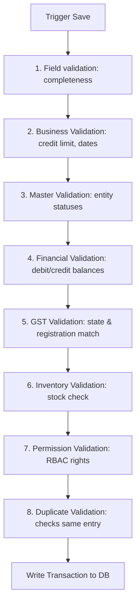

# DIAMO ERP – PHASE 4.1.6
## SALE BOOK – VALIDATION, BUSINESS RULES & EDGE CASES SPECIFICATION

---

## 1. Executive Summary
This document defines the Enterprise Functional Specification Document (FSD) for the Validation Rules, Business Rules, Permissions, Error Handling, and Edge Cases of the Sale Book module in DIAMO ERP. This specification outlines data entry validation pipelines, Role-Based Access Control (RBAC) rights, error diagnostics, and system safety procedures required to preserve database integrity.

---

## 2. Validation Philosophy
Every transaction voucher undergoes a structured validation sequence before writing to the database:

---

## 3. Header Validation
*   **Bill Number Uniqueness:** The system checks that the proposed bill number does not duplicate existing invoices within the active company partition.
*   **Date Bounds Check:** Verifies that the Invoice Date falls within the active Financial Year.
*   **Lock Date Violation:** Blocks postings dated on or before the active `Lock Transaction Upto Date`.

---

## 4. Customer Validation
*   **Customer Existence & State:** Verifies the customer profile is active in the selected Company.
*   **Credit Boundary check:** Evaluates if outstanding balances exceed credit limits.
*   **Blocked Status:** Restricts blocked customers from initiating new transactions.

---

## 5. Broker Validation
*   **Optional Match:** A broker is optional. If the invoice line's Brokerage % is greater than `0.00%`, a Broker select profile becomes mandatory.
*   **Active Verification:** The system blocks the selection of inactive or suspended brokers.

---

## 6. Quality Validation
*   **Direct Quality Reference:** Line items must match active Quality Master profiles.
*   **Status Check:** Blocks selling items marked as Inactive or Locked in the master database.

---

## 7. Quantity & Rate Validation
*   **Weight Constraints:** Carat weights must be greater than `0.000` (up to 3 decimal places).
*   **Rate Limits:** Sales Rates and Terms Rates must be positive values.
*   **Cost Check:** Triggers manager approval checks if the sales rate falls below the lot cost basis.

---

## 8. Discount & Brokerage Validation
*   **Discount Cap:** Restricts discounts to a maximum threshold (e.g., `25.00%`). Values exceeding this cap require manager override authorization.
*   **Brokerage Rate Check:** Restricts brokerage percentages to the configured maximum (e.g., `5.00%`).

---

## 9. GST Validation
*   **Master Sourced Rates:** Tax rates (CGST, SGST, IGST) must pull directly from Master records. Direct manual inputs are blocked.
*   **State Agreement:** Verifies Place of Supply matches GSTIN prefixes.

---

## 10. Payment Validation
*   **Jama Limit Check:** Cash deposits (Jama) cannot be negative and cannot exceed the Net Invoice Value.
*   **Payment Status Resolution:** Evaluates payment statuses (Unpaid, Partial, Paid) based on deposit values.

---

## 11. Total Validation
*   **Balancing Verification:** Ensures Net Invoice Values match taxable totals, discounts, shipping charges, and tax aggregates.
*   **Zero Balance Checks:** Prevents invoices from saving with negative net totals.

---

## 12. Save/Edit/Delete Validation
*   **Save Check:** Runs the full validation pipeline (Header through Duplicate checking).
*   **Edit Check:** Verifies that the invoice is not locked by another user or belongs to a locked period.
*   **Delete/Cancel Check:** Blocks deletes if receipts are already allocated to the invoice. Enforces soft-deletes.

---

## 13. Duplicate Detection
Before committing saves, the system compares the Customer Name, Invoice Date, and Net Value against recently saved invoices (e.g., within the last 15 minutes). If a match is found, it prompts the user with a confirmation warning to prevent double-billing.

---

## 14. Permission Matrix

| Action | Restricted Role | Administrator Override Required? |
| :--- | :--- | :--- |
| **View Invoices** | None | No |
| **Create Invoice** | Sales, Billing | No |
| **Edit Saved Invoice** | Billing | Yes (If locked or past 24 hours) |
| **Delete Invoice** | Billing, Sales | Yes (Soft-delete only) |
| **Cancel Invoice** | Billing | Yes |
| **Discount Override** | Billing | Yes (If > 25.00%) |
| **Negative Stock Sale**| None | Yes |

---

## 15. Error Handling
Error prompts are designed to be user-friendly, descriptive, and actionable:
*   *Quality Error:* "Quality Round 0.50 VS1 F has insufficient stock. Available: 1.20ct, Requested: 1.50ct."
*   *Date Error:* "Invoice Date is outside the active Financial Year (April 2026 - March 2027)."
*   *Broker Error:* "A Broker profile is required because the Brokerage Percentage is greater than 0.00%."

---

## 16. Warning Messages
*   *Credit Warning:* "Customer outstanding has reached 92% of their Credit Limit."
*   *Rate Warning:* "Sales Rate is below the average cost basis. Gross profit margin will be negative."
*   *Duplicate Warning:* "An invoice with the same customer and total amount was saved 2 minutes ago. Do you want to proceed?"

---

## 17. Success Messages
*   "Sales Invoice JD-SALE-2026-000452 saved successfully."
*   "Invoice cancelled successfully. Stock and ledger balances reversed."

---

## 18. Edge Cases
*   **Double-Click Saves:** UI submit buttons are debounced to prevent duplicate requests.
*   **Power/Network Failure:** The backend wraps writes in transactions. Half-saved entries are automatically rolled back by the MySQL engine.
*   **Concurrent Editing:** Employs optimistic lock versioning. If User A saves changes while User B has the record open, User B is prompted to refresh before saving.

---

## 19. Security Rules
*   **Company Isolation:** Users can view and post transactions only within the Company profile assigned to their active session.
*   **Financial Year Isolation:** Restricts transaction entry and modification to active year parameters.

---

## 20. Audit Rules
Modifications to transaction records write to an immutable audit ledger:
*   Original database values (JSON).
*   New modified database values (JSON).
*   Timestamp, User ID, workstation name, IP, and override reasons.

---

## 21. Performance Rules
*   **Instant Recalculation:** Client-side calculation engines run locally to ensure zero layout lag.
*   **Indexed Search queries:** Listing searches use composite database indexes to ensure sub-second search returns.

---

## 22. Future Enhancements
*   **AI Fraud Guard:** Analyzes invoice parameters to flag abnormal discount volumes or pricing variances.
*   **Credit Prediction:** Uses client payment histories to estimate invoice settlement timelines.

---

## 23. Architect Recommendations
1.  **Strict Transaction Middleware:** Ensure NestJS controller endpoints execute validation interceptors before hitting database services.
2.  **Debounce State Updates:** Debounce search criteria input boxes to prevent duplicate DB queries during list page filtering.

---

## 24. Final Completion Checklist
*   [x] Document the validation philosophy sequence.
*   [x] Map header, customer, broker, quality, and quantity rules.
*   [x] Define save/edit/delete validations and soft-delete/cancellation rules.
*   [x] Construct the RBAC Permission Matrix and security rules.
*   [x] Detail user-friendly error/warning/success messages and edge cases.
