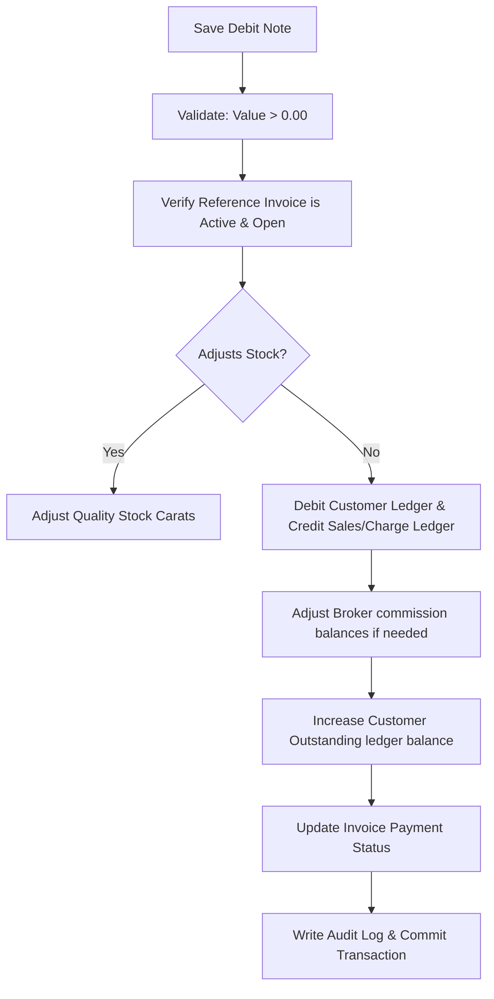

# DIAMO ERP – PHASE 4.3
## SALE DEBIT NOTE – ENTERPRISE FUNCTIONAL SPECIFICATION

---

## 1. Executive Summary
This document defines the Enterprise Functional Specification Document (FSD) for the Sale Debit Note module in DIAMO ERP. A Sale Debit Note is used to recover additional charges, price differences, or tax corrections from customers post-invoice generation. It inherits interface styles, search filters, and database triggers from the Sale Book while establishing debit-note-specific workflows for reference invoice mapping, non-inventory updates, and outstanding customer balance additions.

---

## 2. Business Purpose
A Sale Debit Note corrects billing deficits or records post-sale outlays:
*   **Voucher Scope:** Used when the final transaction value increases after invoice validation.
*   **Operational Comparison:**
    *   *Sale Book:* Establishes primary asset values and debtor balances.
    *   *Credit Note (Sale Return):* Reverses outstanding amounts and restocks assets.
    *   *Debit Note (Sale):* Increases debtor receivables without modifying physical inventory levels.

---

## 3. Debit Note Workflow
The save transaction engine executes the following checks:

---

## 4. Screen Layout
*   **Header Card:** Displays Debit Note Number, date, company, and status tags.
*   **Reference Selector Card:** Field to link the parent Sales Invoice.
*   **Details Pane:** Displays read-only customer and broker masters.
*   **Grid Panel:** 
    *   *For Pricing Adjustments:* Renders a pre-populated Quality Grid displaying original prices and editable rate-revision cells.
    *   *For Charge Adjustments:* Displays a service charges panel (e.g., Freight, Packing, Insurance inputs).
*   **Totals Card:** Displays Gross adjust, CGST/SGST/IGST, Round-off, Net Debit value, and outstanding additions.

---

## 5. Header
*   **Debit Note Number:** Automatically generated. Format:
    $$\text{DN Number} = \text{Company Prefix} - \text{SDN} - \text{YYYY} - \text{Sequential Number}$$
    *Example:* `JD-SDN-2026-000034`
*   **Debit Note Date:** Defaults to system date (checked against FY bounds).

---

## 6. Reference Sale Invoice
*   **Primary Mapping:** Selecting a reference invoice auto-populates Customer, Broker, original item grids, outstanding balances, and GST states. Re-entering billing fields manually is disabled.

---

## 7. Debit Note Types
*   **Price Difference / Rate Revision:** Adjusts base prices per carat.
*   **Freight / Packing / Insurance Charges:** Recovers logistics outlays from the buyer.
*   **Miscellaneous Charges:** Adds flat-fee billing corrections.
*   **GST Adjustment:** Recovers tax differences due to rate corrections.

---

## 8. Quality Grid
*   **Pure Charge Debits:** The Quality Grid is read-only or hidden (invoices display only the service charge lines).
*   **Price Adjustments:** Displays line items from the original invoice. Users edit the "Price Difference" column to recalculate line values.

---

## 9. Calculation Engine
Calculates additional balances:
*   **Net Debit Calculation:**
    $$\text{Net Debit Amount} = \text{Taxable Charge Difference} + \text{GST Difference} + \text{Cess Difference} \pm \text{Round Off}$$
*   **Outstanding Adjustment:** Adds the Debit value to outstanding receivables:
    $$\text{New Outstanding} = \text{Original Outstanding} + \text{Net Debit Amount}$$

---

## 10. GST Engine
*   **Tax Recalculation:** If the Debit Note increases the taxable value of an item, the engine calculates the additional tax liability using the original invoice GST rate.
*   **Exemptions:** Unregistered customer logic overrides tax calculations, forcing GST amounts to `0.00`.

---

## 11. Inventory Behaviour
*   **Default Behavior:** No inventory or stock ledger updates.
*   **Configurable Corrections:** If company settings permit "Quantity Corrections" on debit notes, the engine adjusts available carats and writes a stock ledger entry.

---

## 12. Ledger Engine
Accounting posts the following entries:
*   **Customer Account:** Debited for Net Debit Value.
*   **Sales Revenue (or Charge Accounts):** Credited for Taxable Difference.
*   **GST Accounts (CGST/SGST/IGST):** Credited for tax differences.

---

## 13. Outstanding Engine
*   **Balance Additions:** Appends the debit value to the reference invoice's outstanding balance.
*   **Aging Statements:** Shifts the invoice outstanding into higher aging brackets if payment terms are breached.

---

## 14. Validation Rules
*   **Voucher Checks:** Additional value must be greater than `0.00`.
*   **FY Integrity:** Date must fall within active year limits and after active Lock Dates.
*   **Deleted/Cancelled checks:** Block references to deleted or cancelled invoices.

---

## 15. Business Rules
1.  **Linked Reference Mandatory:** Every Debit Note must reference a valid, active Sales Invoice.
2.  **GST State Alignment:** Tax calculations use the place of supply of the parent invoice.
3.  **Multiple Debit Notes:** The system allows posting multiple partial debit notes against a single invoice.

---

## 16. Edit/Delete Rules
*   **Edit Rules:** Editing is allowed in "Draft" or "Open" status. Re-calculates and overrides outstanding and tax ledgers.
*   **Soft Delete:** Marks record status as Deleted, reverses ledger additions, and writes a history audit log.

---

## 17. Print & Export
*   **Printed Layout:** Displays reference sales invoice number, reason, and debit values. Supports PDF and Excel exports.

---

## 18. List Page
The Debit Note list page `/transactions/sales/debit-notes` supports:
*   Searching by Debit Note Number, Reference Invoice, or Customer.
*   Filtering by Date, Amount, Status, and Debit Type.

---

## 19. Audit
Maintains complete snap history logs showing:
*   `created_by`, `created_date`, `modified_by`, `modified_date`.
*   Before Value (JSON) and After Value (JSON) audit states.

---

## 20. Permissions
Access is regulated by the following flags:
*   `create_debit_note` / `cancel_debit_note`
*   `override_debit_amount` / `override_debit_gst`

---

## 21. Edge Cases
*   **Duplicate Debit Notes:** Alerts the user if a debit note with the same value and customer is saved twice within 10 minutes.
*   **Parent Invoice Closed:** Allows posting a debit note to recover outlays even if the parent invoice balance is cleared (re-opens outstanding balance).

---

## 22. Future Enhancements
*   **Charge Templates:** Preset charge structures (e.g., "Standard Insured Shipping") to auto-populate freight, packing, and insurance cells.
*   **Approval Workflows:** Require manager authorization for debit adjustments exceeding specific values.

---

## 23. Architect Recommendations
1.  **Unified Ledger Registry:** Standardize posting pipelines to map Debit Notes as standard ledger vouchers in the database.
2.  **Parent Status Check:** Ensure backend validations verify the parent invoice status before committing edits.

---

## 24. Final Completion Checklist
*   [x] Document business purpose and workflow details for the Sale Debit Note.
*   [x] Review the layout sections (Header, Reference Selector, Grid, Totals).
*   [x] Define calculations, additional charges, and outstanding balances.
*   [x] Map the non-inventory default behaviour and configurable stock corrections.
*   [x] Document validation rules, edit/delete constraints, and permissions.
