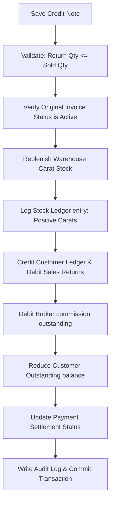

# DIAMO ERP – PHASE 4.2
## SALE RETURN (CREDIT NOTE) – ENTERPRISE FUNCTIONAL SPECIFICATION

---

## 1. Executive Summary
This document defines the Enterprise Functional Specification Document (FSD) for the Sale Return (Credit Note) module in DIAMO ERP. The Sale Return module tracks the return of polished diamond shipments from clients. It inherits formatting, GST engines, and audit controls from the Sale Book while establishing credit-note-specific workflows for reference invoice tracking, return type classifications, stock replenishment, and ledger balance reversals.

---

## 2. Business Purpose
A Sale Return (Credit Note) reconciles transactions when a customer returns diamonds after invoice generation:
*   **Credit Note Issuance:** A legal document offsetting original debtor balances, reducing receivables without cash exchanges.
*   **Operational Distinction:**
    *   *Sale Book:* Records asset outflow and revenue creation.
    *   *Sale Return:* Reverses asset outflow, restocks inventory, and decrements sales revenue.
    *   *Sale Debit Note:* Adjusts invoice prices upwards without changing inventory balances.

---

## 3. Sale Return Workflow
The processing pipeline executes the following checks upon saving a Credit Note:



---

## 4. Screen Layout
The layout uses a card-based format optimized to display reference data alongside return inputs:
*   **Header Card:** Credit Note ID, date, status, and active company metadata.
*   **Reference Selector Card:** Input field to search and link an active Sales Invoice.
*   **Detail Panes:** Displays original customer and broker profiles as read-only.
*   **Quality Grid (Main):** Pre-populated table showing original invoice line items, editable columns for Return Qty, Return Reason, and Remarks.
*   **Summary Columns:** Calculated aggregates (Gross, GST splits, Round-off, Net Credit, Outstanding balance adjustments).

---

## 5. Header
The Credit Note Header displays the transaction metadata:
*   **Credit Note Number:** Automatically generated. Format:
    $$\text{CN Number} = \text{Company Prefix} - \text{SRET} - \text{YYYY} - \text{Sequential Number}$$
    *Example:* `JD-SRET-2026-000084`
*   **Credit Note Date:** Defaults to current system date (validated against lock boundaries).
*   **Voucher Number:** Unique internal transaction code.

---

## 6. Reference Invoice
The Reference Invoice field is the primary data source:
*   **Selector Search:** Users search by invoice number or customer name.
*   **Auto-Population:** Selecting an invoice loads Customer name, billing details, broker profiles, original line weights, prices, and tax rates. Re-keying of original billing variables is blocked.

---

## 7. Return Types
The return type classification controls audit routing:
*   **Full Return:** Returns the entire invoice shipment. Sets the original invoice outstanding to zero.
*   **Partial Return:** Returns a subset of items or carat weights.
*   **Damaged Goods:** Restocks inventory with a quality alert tag (transfers stock to "Repair/Repolish Vault").
*   **Price Adjustment:** Adjusts invoice prices without physical stock movement.

---

## 8. Quality Grid
*   **Auto-Loading Grid:** Displays original invoice rows.
*   **Locked Columns:** Quality ID, HSN, Base Rate, and original GST % are read-only.
*   **Editable Columns:** Return Quantity (Carats), Return Reason, and Remarks.

---

## 9. Calculation Engine
The system reuses the core Sale Book calculations, executing them in reverse:
*   **Terms Rate & Gross Reversal:** Calculated based on entered Return Quantity and original invoice rates.
*   **Outstanding Adjustment:** Recalculates remaining customer balances:
    $$\text{Remaining Outstanding} = \text{Original Outstanding} - \text{Net Credit Amount}$$

---

## 10. GST Engine
*   **Automatic Reversal:** Reverses original GST liabilities (CGST/SGST or IGST) based on the matched sales invoice state prefix.
*   **Rate Lock:** The tax rate matches the original invoice GST percentage. Manual overrides are blocked.

---

## 11. Inventory Engine
Saving a Credit Note triggers the Inventory Engine to:
*   **Increase Stock:** Restocks the returned carat weight to the active inventory catalog.
*   **Write Stock Ledger:** Records a positive carat update line.
*   *Validation:* Verifies that the returned carat weight does not exceed the originally sold weight.

---

## 12. Ledger Engine
Accounting posts the following entries:
*   **Customer Account:** Credited for Net Credit Value.
*   **Sales Returns Account:** Debited for Taxable Value.
*   **GST Accounts (CGST/SGST/IGST):** Debited for reversed tax values.
*   **Broker Commission Account:** Debited for reversed commission liabilities.

---

## 13. Outstanding Engine
*   **Outstanding Reduction:** The credit note amount is allocated against the reference invoice.
*   **Receivable Adjustments:** Adjusts the customer’s active aging statement totals.

---

## 14. Payment Status
Determines the adjustment status of the Credit Note:
*   **Open:** Credit Note created but not yet allocated to customer ledger balances.
*   **Partially Adjusted:** A portion of the credit value is applied to outstanding invoices.
*   **Fully Adjusted / Closed:** The total credit value is fully offset against the customer's receivables.

---

## 15. Reasons
The **Return Reason** field is mandatory. Configurable options include: Customer Return, Damaged Goods, Wrong Quality, Price Difference, and Transport Damage.

---

## 16. Business Rules
1.  **Reference Required:** Every Credit Note must link to a valid Sales Invoice.
2.  **Limit Check:** The cumulative returned carat weight across multiple partial credit notes cannot exceed the original invoice weight.
3.  **Active Check:** Credit notes cannot reference cancelled or soft-deleted sales invoices.

---

## 17. Edit/Delete Rules
*   **Edit Constraints:** Allowed only if the credit note is in "Draft" or "Open" status. Editing reverses restocked carats before applying new edits.
*   **Soft Delete:** Marks the record as Deleted. Reverses the restocked inventory carats and ledger adjustments, then logs an audit record.

---

## 18. Print & Export
*   **Printed Layout:** Includes the company logo, reference sales invoice number, return reason, and tax credit breakdown. Supports PDF and Excel exports.

---

## 19. List Page
The Credit Note Listing Page `/transactions/sales/returns` supports:
*   Searching by Credit Note Number, Reference Invoice Number, or Customer.
*   Filtering by Return Date, Amount, Status, and Return Type.

---

## 20. Permissions
Access is regulated by the following flags:
*   `create_credit_note` / `cancel_credit_note`
*   `override_return_quantity` (allows adjusting returns weight).

---

## 21. Edge Cases
*   **Multiple Partial Returns:** If a customer returns 1.00ct on Day 5 and 0.50ct on Day 10, the system tracks cumulative returns to block entries exceeding the original invoice total (e.g., 1.50ct).
*   **GST Rate Shifts:** The engine calculates tax using the rate active on the original invoice date, ignoring subsequent tax rate changes.

---

## 22. Future Enhancements
*   **Barcode Returns:** Scan lot tags to automatically resolve the reference sales invoice and populate the return grid.
*   **Visual Damage Log:** Attach photos of returned damaged diamonds directly to the credit note record.

---

## 23. Architect Recommendations
1.  **Return Accumulator Queries:** Implement database functions to check cumulative returned weights before saving new Credit Notes:
    ```sql
    SELECT SUM(return_qty) FROM sale_return_items WHERE original_invoice_line_id = ?
    ```
2.  **Unified Transaction scope:** Run stock updates and ledger entries in a single database transaction to prevent inventory mismatches.

---

## 24. Final Completion Checklist
*   [x] Document business purpose and workflows for the Sale Return module.
*   [x] Review the layout sections (Header, Reference Selector, Return types, Quality grid).
*   [x] Map the inventory restock rules and customer/broker ledger credits.
*   [x] Detail due date adjustments, Payment statuses, and validation rules.
*   [x] Map edit/delete rules, permissions, and edge cases.
