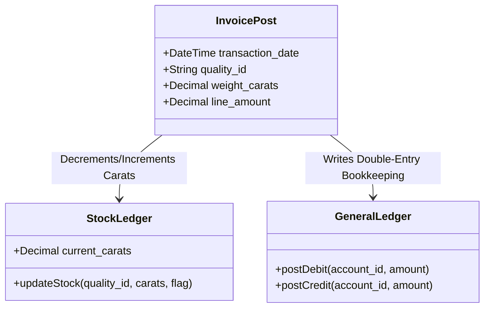

# DIAMO ERP – PHASE 4
## TRANSACTIONS MODULE – ENTERPRISE FUNCTIONAL SPECIFICATION

---

## 1. Executive Summary
This document defines the Enterprise Functional Specification Document (FSD) for the Transactions Module of DIAMO ERP. As the operational heart of the system, this module manages all business activities across Sales, Purchases, Challans, Outsource Jobs, Journal Vouchers, and cash/bank positions. It coordinates double-entry ledger bookkeeping, real-time stock balances, tax compliance calculations (GST/TDS/TCS), and historical audit locking to ensure corporate financial integrity.

---

## 2. Transactions Module Architecture
The Transactions Module uses a decoupled three-tier operational sequence:
*   **Presentation Layer (Electron/React):** Form elements capture entries, run quick validations, and calculate totals in real-time.
*   **Business Logic Layer (NestJS/Prisma):** Validates inventory availability, enforces credit days/limits, computes taxes, and executes ledger postings in database transactions.
*   **Database Layer (MySQL):** Employs pessimistic locking to prevent duplicate entries and locks historical records.

---

## 3. Common Transaction Standards
Every transaction posted in DIAMO ERP must contain:
*   **Metadata Header:** Active Company ID, Financial Year, Date, Transaction Code, running sequence number, and active User ID.
*   **Entity Mapping:** Target Party Ledger, primary Broker (where applicable).
*   **Itemized Details Grid:** Table of line items mapping to Quality IDs, carat weights, rate per carat, discounts, and tax codes.
*   **Voucher Numbering:** Generated using the format:
    $$\text{Voucher Number} = \text{Company Code} - \text{Financial Year Suffix} - \text{Voucher Type Abbreviation} - \text{Sequential Number}$$
    *Example:* `DMO-2627-SAL-00402` (Diamo Company, FY 2026-27, Sales Voucher, sequence #402).

---

## 4. Sales
The Sales Pipeline records transactions for polished diamonds:
1.  **Sale Book (Invoice):**
    *   *Purpose:* Registers completed polished stone sales.
    *   *Impact:* Reduces inventory, increases Debtor ledger balance, posts to Sales Revenue, and calculates GST/TCS liabilities.
2.  **Sale Return (Credit Note):**
    *   *Purpose:* Records returned polished diamonds.
    *   *Impact:* Restores carats to inventory, posts debit entries to Sales Returns, and credit entries to the customer's ledger.
3.  **Sale Debit Note:**
    *   *Purpose:* Adjusts invoices upwards for price differences or interest charges.
    *   *Impact:* Increases Debtor ledger balance, credits Sales Revenue. No inventory impact.

---

## 5. Purchase
The Purchase Pipeline handles incoming rough or polished diamond lots:
1.  **Purchase Book (Inward Invoice):**
    *   *Purpose:* Records rough lot imports or polished purchases.
    *   *Impact:* Increases inventory stock, increases Creditor outstanding liabilities, and capitalizes logistic costs.
2.  **Purchase Return (Debit Note):**
    *   *Purpose:* Records returned rough/polished parcels.
    *   *Impact:* Reduces inventory carats, posts debit to supplier outstanding, and credits Purchase Returns.
3.  **Purchase Debit Note:**
    *   *Purpose:* Adjusts inward invoice amounts upwards.
    *   *Impact:* Increases supplier outstanding, debits Purchase ledger. No inventory impact.

---

## 6. Challan Book
Challans track physical stock movements where legal ownership does not change:
1.  **Issue for Job Work:**
    *   *Purpose:* Sends rough/polished stones to external polishers or grading labs (GIA).
    *   *Impact:* Restricts stones from general sales, transfers location to Job-Work-Vault. No accounting ledger postings.
2.  **Issue for Trading (Memo):**
    *   *Purpose:* Hands diamonds to brokers for showcasing to buyers.
    *   *Impact:* Marks stock status as "On Memo". No accounting ledger impact.
3.  **Issue for Sale/Purchase Order:** Allocates inventory to open orders, preventing double-selling.

---

## 7. Job Book
The Job Book logs external processing services:
1.  **Job Income:** Logs income earned by providing services (e.g., laser sawing) to other merchants.
2.  **Job Expense:** Records expenses incurred for outsourcing work (e.g., bruting labor fees). Debits Job Work Expense, credits Cash/Bank or Job Worker outstanding ledger.

---

## 8. Journal Voucher
The Journal Voucher (JV) handles adjustments between ledgers:
*   **Purpose:** Non-cash transactions, year-end adjustments, and bad debt write-offs.
*   **Rules:** The total debit amount must exactly match the total credit amount.

---

## 9. Cash Transactions
1.  **Cash Receipt:** Records physical cash received from a party. Debits Cash-on-Hand, credits Party Ledger.
2.  **Cash Payment:** Records cash paid to a supplier or broker. Credits Cash-on-Hand, debits Party Ledger.
*   *Validation:* Blocks payments exceeding statutory cash transaction limits.

---

## 10. Bank Transactions
1.  **Bank Receipt:** Logs incoming transfers or check clearings. Debits Bank ledger, credits Party Ledger.
2.  **Bank Payment:** Logs outbound check issues or bank wires. Credits Bank ledger, debits Party Ledger.
*   *Control:* Integrates Post-Dated Check (PDC) flag settings.

---

## 11. Common Business Rules
1.  **No Negative Stock:** Block Sales Invoices or Challans if the carat weight exceeds available stock for the selected Quality.
2.  **Historical Year Lock:** Any transaction dated prior to the active company's Lock Date cannot be edited or deleted.
3.  **Credit Limit Guard:** Block invoice creation if the customer's outstanding balance exceeds their Credit Limit, unless authorized by an Administrator.

---

## 12. Common Validation Rules
*   **Voucher Balance Validation:** For Journal, Cash, and Bank vouchers:
    $$\sum(\text{Debits}) = \sum(\text{Credits})$$
*   **GST Calculation Match:** Taxes must match:
    $$\text{Tax Amount} = \text{Taxable Value} \times \text{GST \%}$$

---

## 13. Common Calculation Logic
*   **Net Invoice Value Calculation:**
    $$\text{Net Value} = (\text{Gross Value} - \text{Discount}) + \text{CGST} + \text{SGST} + \text{IGST} + \text{Cess} + \text{TCS} + \text{Other Charges}$$
*   **TCS Deduction Trigger:** Triggers a 0.1% TCS collection rule if a customer's total collections within the current financial year cross statutory thresholds.

---

## 14. Stock & Accounting Impact

---

## 15. Reports
*   **Voucher Register:** Listing of all transactions by date and transaction type.
*   **Stock Ledger:** Granular lot tracking showing input weight, processing losses, and final yield.
*   **Day Book:** Chronological ledger of all postings within a 24-hour cycle.

---

## 16. Future Enhancements
*   **Digital Attachments:** Upload scans of broker notes, GIA certificates, or weight receipts directly to transaction records.
*   **E-Invoice API Integration:** Automatically upload invoices to government portals to generate IRN codes.

---

## 17. Architect Recommendations
1.  **Transactional Rollbacks:** Enforce database transactions in NestJS to ensure that if a Stock update fails, the Ledger posting is rolled back automatically.
2.  **Optimistic Concurrency Control:** Store a `version` column on all stock lot records to prevent concurrent sales transactions from double-allocating the same stones.

---

## 18. Phase 4 Completion Checklist
*   [x] Standardize transaction metadata and company prefixing numbers.
*   [x] Detail functional requirements for Sales, Purchases, Challans, Jobs, JVs, and Cash/Bank books.
*   [x] Define validation rules, tax calculations (GST/TDS/TCS), and locking rules.
*   [x] Map stock and ledger double-entry behaviors.
*   [x] Map reporting outputs, edge cases, and override rules.
