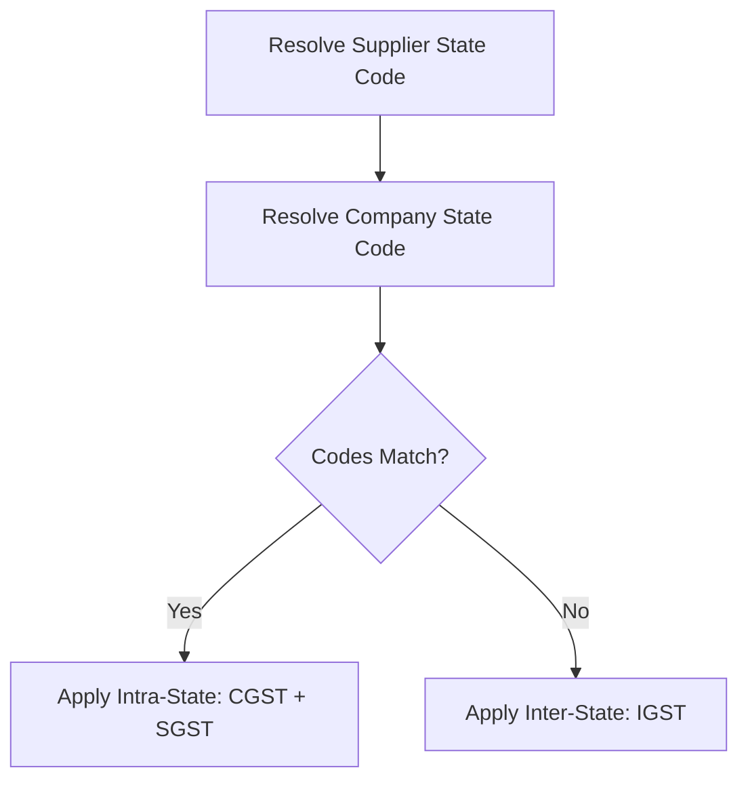

# DIAMO ERP – PHASE 5.1.4
## PURCHASE BOOK – GST ENGINE & INPUT TAX CREDIT (ITC) SPECIFICATION

---

## 1. Executive Summary
This document defines the Enterprise Functional Specification Document (FSD) for the GST Engine and Input Tax Credit (ITC) management system of the Purchase Book in DIAMO ERP. This module ensures compliance with Indian GST regulations, automating tax type routing, rate validations, and ITC eligibility tracking for GSTR-2 reconciliation.

---

## 2. GST Architecture
The Purchase GST Engine matches the tax structures defined for the Sale Book:
*   **State Rules Comparison:** Compares supplier state profiles against company state codes.
*   **Unregistered Suppliers:** Purchases from unregistered suppliers automatically skip tax calculations, forcing CGST/SGST/IGST to `0.00`.

---

## 3. GST Master Data
Tax metrics are retrieved from the following sources:
*   *Company Master:* Active Company GSTIN, Place of Business, and State Code.
*   *Account Master:* Supplier GSTIN, Place of Supply, State Code, and GST Status (Registered, Unregistered, Composition, SEZ).
*   *Quality Master:* Diamond HSN Code, GST Rate (%), Cess Rate (%), and Effective Date.

---

## 4. State Comparison Logic
Tax types are resolved by comparing state prefixes from GSTINs:

---

## 5. GST Calculation Engine
*   **Intra-State Math:** CGST and SGST are split equally from the calculated GST rate:
    $$\text{CGST} = \text{SGST} = \frac{\text{Gross Amount} \times \text{GST \%}}{2}$$
*   **Inter-State Math:** IGST is calculated in full:
    $$\text{IGST} = \text{Gross Amount} \times \text{GST \%}$$
*   **Cess Calculation:** Applied to Gross taxable amounts:
    $$\text{Cess Amount} = \text{Gross Amount} \times \text{Cess \%}$$

---

## 6. Input Tax Credit (ITC)
The system categorizes ITC status during purchase invoice saving:
*   **Eligible ITC:** Standard business purchases of polished/rough diamonds or consumables (available to offset output GST liabilities).
*   **Blocked / Ineligible ITC (Section 17(5)):** Capital items, personal use goods, or write-offs.
*   **Partial ITC:** Items with shared personal and business usage.

---

## 7. GST Validation
*   **GSTIN Format Validation:** The system verifies the supplier's GSTIN format (15-character alphanumeric string matching state prefix codes).
*   **Registration Status Sync:** Unsaved changes are blocked if the supplier is registered but has no valid GSTIN.

---

## 8. HSN Validation
*   **HSN Code Matching:** The grid verifies that HSN codes exist in the database and are active for the purchase date. Missing or inactive HSN codes block the transaction save.

---

## 9. GST Summary Panel
The panel displays:
*   Total Taxable Value (aggregate gross).
*   CGST, SGST, IGST totals.
*   Total Cess Amount.
*   Total Eligible ITC (reconciliation base).
*   Total Net Bill Amount.

---

## 10. Purchase Register
Every saved purchase invoice updates the following registers in real-time:
*   *Purchase Register:* Logs supplier details and invoice values.
*   *GST Purchase Register:* Itemizes transactions by GST type, HSN, and rate.
*   *Input GST Register:* Logs input tax credits by voucher ID.

---

## 11. Ledger Impact
The GST Engine updates the following ledger accounts:
*   **Input CGST Ledger:** Debited for CGST amount.
*   **Input SGST Ledger:** Debited for SGST amount.
*   **Input IGST Ledger:** Debited for IGST amount.
*   **Input Cess Ledger:** Debited for Cess amount.
*   **Purchase Ledger (or Expense):** Debited for Taxable Value.

---

## 12. Business Rules
1.  **Tax Automation:** GST types are determined by the system. Manual overrides are disabled.
2.  **ITC Default Status:** Diamond purchases default to "Eligible ITC" with a 0.25% or 1.5% tax rate (subject to change under GST council rules).
3.  **Unregistered Bypass:** Purchases from unregistered entities skip GST calculations.

---

## 13. Permissions
Access is regulated by the following compliance flags:
*   `override_gst_rates` / `override_hsn_codes`
*   `view_gst_audit_trail` / `export_gst_registers`

---

## 14. Audit
The GST Engine maintains history logs tracking:
*   Original tax rates vs. overridden rates.
*   Change reasons, timestamps, workstation names, and authorizer signatures.

---

## 15. Edge Cases
*   **GST Registration Cancelled:** If a supplier's GST status changes to inactive, future purchases are blocked from claiming ITC.
*   **GST Rate Updates:** The calculation engine resolves tax calculations using rate schedules active on the purchase date.

---

## 16. GST Reports
*   **GSTR-2 Summary:** Consolidates bills to prepare input data for GSTR-2B reconciliations.
*   **ITC Register:** Tracks available input tax credits, categorized by rate and state of origin.

---

## 17. Future Enhancements
*   **GST Portal API Sync:** Verifies supplier GSTIN status directly against GST portal APIs.
*   **GSTR-2B Auto-Reconciliation:** Automatically reconciles local purchase logs against GSTR-2B JSON uploads to flag missing supplier bills.

---

## 18. Architect Recommendations
1.  **State Code Extraction:** Extract the first two digits of the supplier's GSTIN to verify that place-of-supply states match the account profile.
2.  **ITC Flag Storage:** Store an ITC eligibility flag (`ELIGIBLE`, `INELIGIBLE`, `BLOCKED`) at the invoice line level.

---

## 19. Final Completion Checklist
*   [x] Document state comparison rules and tax type routing.
*   [x] Map calculation formulas for CGST, SGST, IGST, and Cess.
*   [x] Define Input Tax Credit (ITC) eligibility rules.
*   [x] Map GSTIN and HSN validation rules.
*   [x] Document GST ledger impacts and compliance reports.
