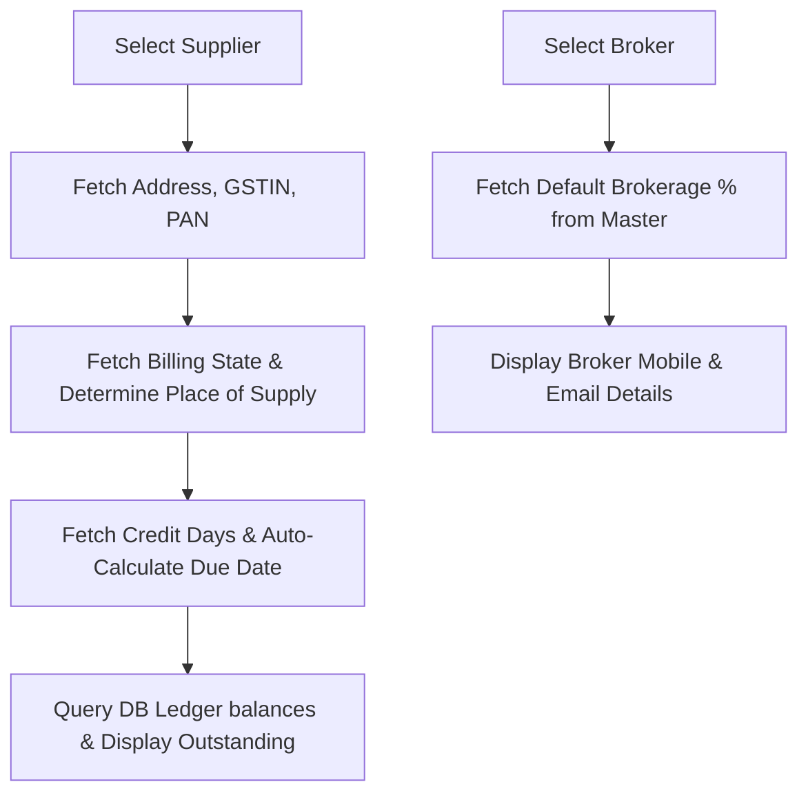

# DIAMO ERP – PHASE 5.1.2
## PURCHASE BOOK – HEADER, SUPPLIER & BROKER SPECIFICATION

---

## 1. Executive Summary
This document defines the Enterprise Functional Specification Document (FSD) for the Header Section, Supplier Details, and Broker Details of the Purchase Book in DIAMO ERP. This specification outlines field properties, auto-generation numbering formats, auto-fetch logic, due date calculations, and validation parameters required to automate entry workflows and maintain database integrity during inventory restocking.

---

## 2. Header Section
The Header Section displays the operational parameters of the transaction voucher.

*   **Voucher Number:** System-generated unique transactional ID (used for ledger audit trails).
*   **Challan Number:** Dropdown selector to import stones from an active import or purchase challan.
*   **Transaction Status:** Choice of: Draft, Saved, Approved, Cancelled.
*   **Metadata Fields:** Created By, Created Date, Modified By, Modified Date (read-only audit details).

---

## 3. Purchase Bill Number Strategy
The Purchase Bill Number is the legal invoice identifier printed on document templates:
*   **Generation Format:**
    $$\text{Purchase Bill Number} = \text{Company Prefix} - \text{PUR} - \text{YYYY} - \text{Sequential Number}$$
    *Example:* `JD-PUR-2026-000452` (Jadhav Diamonds, Purchase Invoice, Year 2026, Sequence #452).
*   **Behavior Rules:**
    *   *Uniqueness:* Indexed in the database as a unique field per company partition.
    *   *Sequencing:* Resets to `000001` at the beginning of each financial year.
    *   *Overrides:* The field is read-only. Manual overrides can be unlocked only by administrators through System Configuration settings.

---

## 4. Supplier Invoice Number
This field stores the invoice number received from the supplier.
*   **Requirements:**
    *   *Mandatory:* Must be entered manually from the physical bill.
    *   *Uniqueness:* Enforce unique constraint checks: `UNIQUE(supplier_id, supplier_invoice_number)` within the active financial year to prevent duplicate billing entries.
    *   *GST Sync:* Critical parameter used for input tax credit (ITC) matching under GSTR-2 reconciliation routines.

---

## 5. Purchase Date Rules
*   **Default Value:** Current System Date.
*   **Calendar Boundaries:** Must fall within the active Financial Year's From/To date limits.
*   **Lock Date Check:** Must be strictly after the company's active `Lock Transaction Upto Date`. If prior, voucher saving is blocked.

---

## 6. Company & Financial Year Behaviour
*   **Company Resolution:** Automatically resolved by the active workspace session. Users cannot swap companies mid-transaction.
*   **Financial Year Resolution:** Resolves based on the selected Purchase Date. If the date changes to a range outside the active financial year, the ERP warns the user to swap active years or correct the input date.

---

## 7. Supplier Section
Selecting a supplier from the Account Master auto-populates the following parameters:
*   **Supplier Name & Billing/Shipping Address:** Legal billing details.
*   **GSTIN & PAN:** Used to evaluate local/state tax calculations.
*   **State & Place of Supply:** Sets tax routing criteria (CGST/SGST vs. IGST).
*   **Outstanding & Credit Limit:** Displays current credit exposure warnings.

---

## 8. Broker Section
Selecting a broker from the Broker Master auto-populates the following parameters:
*   **Broker Name & Contact Details:** Reference parameters for sales commissions.
*   **Brokerage %:** Defaults commission calculations based on the broker's master file terms.
*   **Settlement Status:** Choice of: Unpaid, Paid, Held.

---

## 9. Auto Fetch Logic
The auto-fetch flow executes sequentially upon selecting a party or broker:

---

## 10. Due Date Logic
The system computes the payment due date automatically:
$$\text{Due Date} = \text{Purchase Date} + \text{Credit Days}$$
*   **Interaction:** If the user manually edits the Credit Days input, the Due Date updates instantly. If the user edits the Due Date calendar, the Credit Days count is recalculated.

---

## 11. Supplier Outstanding
The Outstanding panel provides immediate risk warnings using a color-coded indicator:

| Outstanding Ratio | Indicator Color | System Behavior |
| :--- | :--- | :--- |
| $\text{Outstanding} < \text{Credit Limit}$ | **Green** | Clear to proceed. |
| $\text{Outstanding} \ge 90\% \text{ of Credit Limit}$ | **Amber** | Warn user of credit saturation. |
| $\text{Outstanding} > \text{Credit Limit}$ | **Red** | Block invoice saving (requires override). |

---

## 12. Validation Rules
*   **Mandatory Inputs:** Supplier, Purchase Date, Company, and Financial Year must be filled.
*   **Broker Matching:** If Brokerage % is greater than `0.00%`, a Broker must be selected.
*   **Status Verifications:** Block selection of Inactive Suppliers or Inactive Brokers.

---

## 13. Business Rules
1.  **Direct Master Association:** All supplier tax parameters (GSTIN, PAN) must pull directly from the Account Master and remain read-only in the Invoice screen.
2.  **Outstanding Read-Only:** Creditor balances are non-editable and pull directly from database ledger balances.
3.  **Financial Year Validation:** Invoice saving is blocked if no matching financial year is active.

---

## 14. Keyboard Workflow
*   **F4 (Supplier Search):** Focuses the Supplier search dropdown.
*   **F6 (Broker Search):** Focuses the Broker search dropdown.
*   **Ctrl + A (Inline Master):** Open Quick Create Supplier (if focused on Supplier) or Quick Create Broker (if focused on Broker).
*   **Ctrl + Enter (Ledger Open):** Opens the selected supplier's ledger report in a new tab.

---

## 15. Dependencies
*   **Account & Broker Masters:** Provide party coordinates, tax IDs, and default commission terms.
*   **Company & Financial Year Masters:** Restrict transaction boundaries and provide invoice numbering prefixes.

---

## 16. Edge Cases
*   **Deleted Supplier Profile:** If a supplier is deleted, historic invoices are locked. New invoices cannot select the profile.
*   **Blocked Supplier Override:** If a supplier is marked "Blocked", the invoice blocks saving unless an Administrator inputs an override key.
*   **Manual Bill Number Override:** If enabled, the system verifies that the manual input sequence does not collide with existing numbers.

---

## 17. Future Enhancements
*   **Supplier Rating Score:** Displays credit safety ratings based on historical payment performance and delivery speeds.
*   **Recent Suppliers:** Auto-suggests recently selected suppliers at the top of the search dropdown.

---

## 18. Architect Recommendations
1.  **Supplier Invoice Duplicate Checking:** Run an asynchronous API query upon losing focus on the `supplier_invoice_number` field to check if the current supplier has already been billed under the same invoice reference.
2.  **State Lookup Integration:** Ensure the Place of Supply automatically resolves to "Inter-State" if the supplier's GSTIN state prefix differs from the active Company state code.

---

## 19. Final Completion Checklist
*   [x] Document fields, validation rules, and numbering strategies for the Header section.
*   [x] Map supplier details, auto-fetch variables, and credit day warnings.
*   [x] Map broker terms, default commissions, and optional matches.
*   [x] Detail due date calculations and credit limit alert levels.
*   [x] Map keyboard workflow shortcuts and dependencies.
