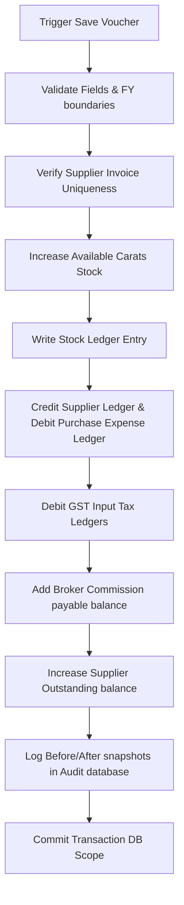

# DIAMO ERP – PHASE 5.1.5
## PURCHASE BOOK – INVENTORY, SUPPLIER LEDGER & OUTSTANDING ENGINE SPECIFICATION

---

## 1. Executive Summary
This document defines the Enterprise Functional Specification Document (FSD) for the Transaction Processing Engine of the Purchase Book in DIAMO ERP. This specification outlines backend database operations, stock replenishment pipelines, accounting ledger adjustments, outstanding allocations, edit/delete transaction rollback logic, and record locking strategies triggered upon saving a Purchase Invoice.

---

## 2. Save Transaction Workflow
When the save command is triggered, the system executes these steps sequentially:

---

## 3. Inventory Engine
Saving a purchase voucher replenishes warehouse diamond stock:
*   **Carats Replenishment:** Adds incoming carat weight to the active inventory registry.
*   **Warehouse Allocations:** Updates available stock balances. If multi-warehouse is active, the stock increments in the primary inward storage location.

---

## 4. Quality Stock Logic
The replenishment flow resolves as follows:
1.  **Item Grade Match:** Resolves Quality IDs from the item grid.
2.  **Stock Balance Recalculation:** Increments the stock count:
    $$\text{New Available Weight} = \text{Current Available Weight} + \text{Inward Weight}$$
3.  **Real-Time Sync:** Refreshes stock statistics on the dashboard.

---

## 5. Stock Ledger
Automatically posts an inventory movement record:
*   *Voucher Details:* Logs Transaction Date, Voucher ID, and Purchase Bill Number.
*   *Carat Movement:* Logs Opening Stock (Carats), Inward Weight, and computed Closing Stock.
*   *Reference:* Captures Supplier Name, Workstation ID, and active user name.

---

## 6. Supplier Ledger
Posts the primary accounting entry:
*   **Supplier Account (Creditor):** Credited for the Net Invoice Value, creating a payable liability.
*   **Cash/Bank Account:** Debited if the operator records an immediate payment in the "Amount Paid" field.

---

## 7. Broker Ledger
If a broker is linked:
*   **Broker Commission Account:** Credited for the computed brokerage fee:
    $$\text{Brokerage Amount} = \text{Gross Amount} \times \frac{\text{Brokerage \%}}{100}$$
*   **Outstanding commission status:** Set to "Unpaid".

---

## 8. Supplier Outstanding Engine
*   **Balance Additions:** Creates a payable record in the outstanding sub-ledger matching the invoice's Net Value.
*   **Ageing Tracking:** Tracks payment due terms ($\text{Purchase Date} + \text{Credit Days}$) to flag overdue payables.

---

## 9. Payment Status
Automatically resolved based on payments made at the time of entry:
*   **Unpaid:** $\text{Amount Paid} = 0.00$.
*   **Partial:** $0.00 < \text{Amount Paid} < \text{Net Invoice Amount}$.
*   **Paid:** $\text{Amount Paid} \ge \text{Net Invoice Amount}$.

---

## 10. Amount Paid Logic
If the invoice includes an immediate payment (`Amount Paid` > 0.00):
*   Reduces the active outstanding balance by the payment value.
*   Generates a Debit entry on the Supplier’s ledger account.
*   Generates a corresponding Credit entry on the Cash or Bank account selected for the payment.

---

## 11. Accounting Impact
*   **Supplier Account:** Credited for Net Invoice Value.
*   **Purchase Expense Account:** Debited for Taxable Value.
*   **Input GST Account:** Debited for calculated CGST/SGST/IGST tax values.
*   **Cash / Bank Account:** Credited for the Amount Paid.
*   **Round Off Account:** Debited/Credited for rounding adjustments.

---

## 12. Report Impact
Saving a Purchase Invoice updates:
*   *Financial Statements:* Balance Sheet (increases inventory assets and payables) and Profit & Loss Statement (logs purchase costs).
*   *Ledgers:* Supplier Ledger, General Ledger, Day Book, Day Book Summary.
*   *Sub-ledgers:* Supplier Outstanding Report, Stock Ledger, GST Input Tax Register.

---

## 13. Edit Workflow
Modifying a saved purchase invoice executes a safe state reset:
1.  **Voucher Locking:** Applies a database lock to block concurrent modifications.
2.  **State Reversal:** Temporarily subtracts the invoice's original carat weight from stock and reverses original ledger adjustments.
3.  **Re-Calculation:** Applies modifications (e.g., changes to rates, weights) and recalculates values.
4.  **Save Pipeline:** Executes the save workflow using the updated values.

---

## 14. Delete Workflow
The system uses a **Soft Delete** pattern:
*   **Flag Update:** Sets the record status to Deleted (hidden from standard listings).
*   **Stock Adjustment:** Deducts the invoice's carat weight from available stock balances.
*   **Ledger Adjustments:** Posts reversing debit/credit journal entries to offset the original purchase postings.

---

## 15. Cancel Workflow
Allows users to void transaction bills:
*   **Status Update:** Voucher status changes to Cancelled.
*   **Posting Reversals:** Reverses inventory and ledger updates to remove transaction effects from accounting reports, maintaining the original invoice number for sequence tracking.

---

## 16. Transaction Locking
*   **Pessimistic Lock:** Opening an invoice in Edit mode sets a locked flag in the database, blocking other users from editing the same record.
*   **Timeout:** Lock releases automatically after 15 minutes of inactivity.

---

## 17. Rollback Strategy
All processing steps occur inside a database transaction block:
*   **Atomicity:** If a step (such as stock update or outstanding entry) fails, the entire transaction is cancelled.
*   **Data Integrity:** The database rolls back to its pre-transaction state, preventing mismatched ledger or stock records.

---

## 18. Audit Engine
Logs transaction changes:
*   *Voucher Identification:* Transaction ID, Purchase Bill Number, and Supplier.
*   *Value State:* Stores the complete before and after JSON data payloads.
*   *Operator Details:* Captures active User ID, Workstation ID, and system timestamp.

---

## 19. Validation Rules
*   **Stock Ledger Checks:** Inward stock weights must be greater than `0.000` carats.
*   **Locked Dates:** Edits are blocked if the invoice date is prior to the company lock date.
*   **Outstanding Verification:** Block edits to invoices that have already been settled or reconciled.

---

## 20. Business Rules
1.  **Direct Stock Updates:** Inventory totals must update immediately upon transaction confirmation.
2.  **Unpaid Lock:** Fully paid purchase vouchers cannot be deleted without first reversing their cash/bank payment entries.
3.  **Active FY Constraint:** Transaction dates must fall within the range of the active financial year.

---

## 21. Edge Cases
*   **Power/Network Failure:** If the connection drops mid-save, database transaction timeouts trigger an automatic rollback.
*   **Duplicate Saves:** Double-clicks on the Save button are blocked by a loading overlay state.

---

## 22. User Experience
*   **Operation Overlay:** Renders a fullscreen modal spinner ("Saving Transaction... Updating Stock and Ledger balances") during posting.
*   **Result Banner:** Displays a green banner showing success or a red alert listing validation errors.

---

## 23. Future Enhancements
*   **Lot and Packet Tracking:** Automatically assigns unique barcode labels to incoming parcels.
*   **AI Inventory Forecasts:** Analyzes historical purchase rates to suggest optimal restock periods.

---

## 24. Architect Recommendations
1.  **Database Concurrency Control:** Wrap database updates in a transaction block to maintain stock balance consistency during concurrent operations.
2.  **Separate Stock Ledgers:** Store stock ledger entries in a dedicated table to isolate inventory logs from accounting ledger tables.

---

## 25. Final Completion Checklist
*   [x] Document Save Transaction Workflow sequences and rollback rules.
*   [x] Map the Inventory Engine carat increment and stock ledger posting rules.
*   [x] Detail Supplier and Broker ledger updates.
*   [x] Map Outstanding and Payment Status classifications.
*   [x] Document Edit/Delete/Cancel workflows and record locking configurations.
