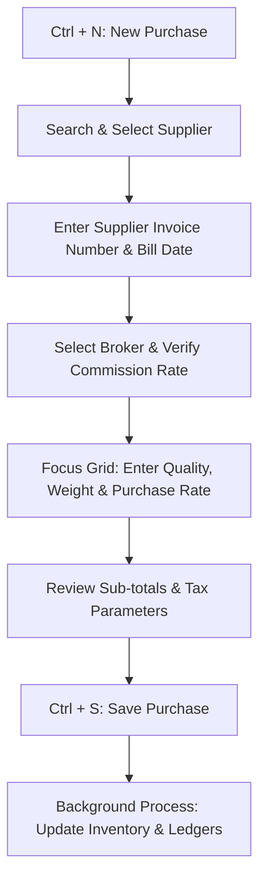

# DIAMO ERP – PHASE 5.1.1
## PURCHASE BOOK – ARCHITECTURE & USER EXPERIENCE SPECIFICATION

---

## 1. Executive Summary
This document defines the Architecture & User Experience Functional Specification Document (FSD) for the Purchase Book module in DIAMO ERP. As a primary entry screen for recording diamond parcel purchases from suppliers, this module is optimized for high-volume entry, low-latency search filters, and keyboard-first operations, inheriting structural UX standards from the Sale Book.

---

## 2. Business Purpose
The Purchase Book records incoming inventory lots from suppliers:
*   **Asset Sourcing Registration:** Logs incoming physical rough or polished diamond lot weights.
*   **Bookkeeping Integrity:** Directly establishes supplier outstanding liabilities (creditors) and offsets inventory assets.
*   **Tax Compliance Audit:** Records inward tax logs (GST input tax credits) and TDS/TCS withholdings on purchases.

---

## 3. Business Importance
*   **Inventory Replenishment:** Serves as the primary source for increasing carat balances in the warehouse.
*   **Cost Capitalization:** Records supplier purchase rates and routes ancillary outlays (freight, customs) to the asset's cost basis.
*   **Payable Management:** Populates outstanding payable ledgers used to track cash requirements.
*   **Tax Audits:** Feeds GSTR-2 reconciliation summaries.

---

## 4. Page Overview
*   **Primary Objective:** Provide a fast, keyboard-first form to record incoming supplier invoices.
*   **Secondary Objectives:** Select active transaction brokers, calculate due dates, and update inventory.
*   **Success Criteria:** Inward lot entries completed in seconds, real-time inventory updates, and duplicate invoice warning flags.

---

## 5. Users & Permissions

| Role | Permissions | Operation Scope |
| :--- | :--- | :--- |
| **Owner / Executive** | View, Export | Reviewing purchase costs, supplier margins, and capital outlays. |
| **Administrator** | Full Access | Creating/editing purchases, deletion overrides, setting lock overrides. |
| **Purchase Executive** | Create, View | Recording incoming purchase invoices. Cannot delete or edit finalized entries. |
| **Inventory Manager** | View | Verifying lot weights and HSN allocations. |
| **Accounts Department** | View, Edit | Auditing purchases, tax reconciliations, payment clears. |
| **Auditor** | View, Export | Reviewing input tax credits. |

---

## 6. Navigation
*   **Module:** Transactions
*   **Category:** Purchase
*   **Breadcrumb Path:** `Transactions / Purchase / Purchase Book`
*   **Target Page URI:** `/transactions/purchase/invoice`

---

## 7. Existing Screen Review
The existing Purchase Book screen operates as a single-page form with clear visual zones:
*   **Header & Supplier Area:** Groups internal bill numbers, supplier invoice numbers, and supplier dropdowns.
*   **Itemized Entry Grid:** Main table for entering diamond line items.
*   **Summary Column:** Renders calculations, tax totals, and remarks fields.
*   *Verdict:* Mechanically sound, but needs a modernized card-based layout, better focus styling, and unified keyboard navigation.

---

## 8. Modern UI Architecture
The layout uses a structured card grid optimized for 1080p desktop monitors:
1.  **Top Header Card:** Displays metadata (Internal Purchase ID, Supplier Invoice Ref, Date, active Company).
2.  **Middle Left Column (70%):** Supplier Selection Card, Broker Allocation Card, and the Itemized Details Grid.
3.  **Middle Right Column (30%):** Summary Totals Card, Tax Breakdown Panel, and Remarks Card.
4.  **Bottom Action Strip:** Aligns command buttons and current user/audit status.

---

## 9. Section-wise Layout
1.  **Header Section:** Displays Internal Bill Number, Supplier Invoice Number, Purchase Date, Voucher Number, Company, and status.
2.  **Supplier Section:** Supplier Name, address lines, GSTIN, credit terms, and current outstanding balance.
3.  **Broker Section:** Broker selector, default commission percentage, and computed commission amount.
4.  **Item Grid:** Table showing columns for: Sr No, Quality ID, HSN, Weight, Rate, Line Discount, and Total Taxable Value. Supports inline master creation (`Ctrl + A`).
5.  **Summary Panel:** Displays sub-totals, discounts, additional shipping charges, tax totals (CGST/SGST/IGST/Cess), round-off offsets, and final invoice value.
6.  **Remarks:** Internal memos, purchase remarks, print footnotes, and future attachment drop zones.

---

## 10. Keyboard Workflow

### Shortcuts Matrix

| Shortcut | Target Action | Description |
| :--- | :--- | :--- |
| **Ctrl + N** | New Purchase | Clears details, focuses supplier selector dropdown. |
| **Ctrl + S** | Save Purchase | Triggers validations and writes voucher to database. |
| **Ctrl + P** | Print | Opens the PDF print preview window. |
| **Ctrl + L** | Open Listing | Navigates to the purchase listing search grid. |
| **Ctrl + F** | Search Supplier | Focuses the search input in the Supplier field. |
| **Ctrl + A** | Quick Master | Opens inline quick-create popup for focused master dropdown. |
| **Enter** | Next Input | Moves focus to the next logical field (replaces Tab). |
| **Shift + Enter** | Previous Input | Moves focus to the previous input field. |
| **Esc** | Close / Cancel | Discards input focus or closes active modal popups. |

---

## 11. Purchase Workflow

---

## 12. Dependencies
*   **Account Master:** Verified supplier profiles provide default billing details and tax codes.
*   **Broker Master:** Provides default commission percentages during invoicing.
*   **Quality Master:** Validates diamond carat weights and HSN numbers in the item grid.
*   **Company & Financial Year Masters:** Restrict transactions to valid calendar ranges.

---

## 13. Search & List Page
The Purchase Book Listing Page `/transactions/purchase` provides a summary of invoices:
*   **Analytical Filters:** Filter by Supplier, Broker, Date Range, Bill Status, or Quality grade.
*   **List Grid:** Displays Purchase Number, Supplier Invoice Number, Date, Supplier Name, Net Value, Broker, and Status.
*   **Keyboard Navigation:** Use Up/Down Arrow keys to select rows, and press `Enter` to open an invoice in edit mode.

---

## 14. Performance Recommendations
*   **Virtual Grid Rendering:** Use virtualization library components to render the item grid when invoices exceed 100 lines.
*   **Local Caching:** Cache Supplier and Quality lists locally to support instant autocompletion in search dropdowns.

---

## 15. Future Enhancements
*   **Supplier Portal Integration:** Automatically import purchase invoices from supplier portals to eliminate manual data entry.
*   **AI Duplicate Detection:** Checks supplier invoice numbers and totals to flag potential duplicate billing entries.
*   **Demand Forecasting:** Analyzes purchase histories and stock levels to predict restocking needs.

---

## 16. Architect Recommendations
1.  **Unique Supplier Invoice Constraint:** Enforce a unique database constraint in MySQL: `UNIQUE(supplier_id, supplier_invoice_number)` to prevent duplicate entry of the same supplier bill.
2.  **Debounce State Updates:** Ensure key inputs in the search listing page are debounced to prevent query lag on low-spec desktop terminals.

---

## 17. Final Completion Checklist
*   [x] Document business purpose and transactional role of the Purchase Book.
*   [x] Establish the layout sections (Header, Supplier, Broker, Item grid, Summary).
*   [x] Map the keyboard shortcuts and tab focus traversal rules.
*   [x] Map the purchase workflow sequence.
*   [x] Document the listing grid filters and performance guidelines.
