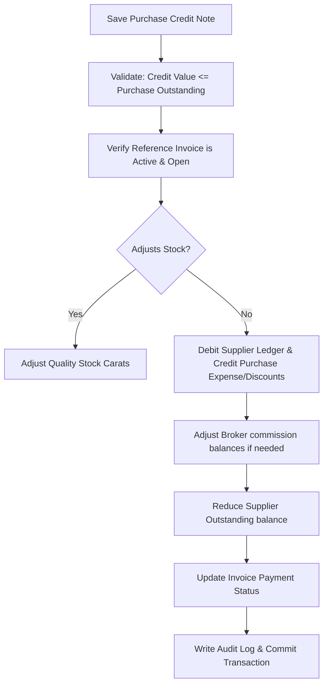

# DIAMO ERP – PHASE 5.3
## PURCHASE CREDIT NOTE – ENTERPRISE FUNCTIONAL SPECIFICATION

---

## 1. Executive Summary
This document defines the Enterprise Functional Specification Document (FSD) for the Purchase Credit Note module in DIAMO ERP. This module processes supplier credit allocations, rate differences, and trade discounts post-purchase billing. It inherits UI grids, search indexes, and audit logs from the Purchase Book while establishing credit-note-specific workflows for reference invoice lookup, financial calculations, input tax reversals, and outstanding supplier ledger reductions.

---

## 2. Business Purpose
A Purchase Credit Note reconciles creditor balances when the purchase price of diamonds drops or when supplier discounts are awarded:
*   **Operational Context:** Reconciles accounting ledgers without changing warehouse carat counts.
*   **Module Distinctions:**
    *   *Purchase Book:* Records inward stock and primary supplier payables.
    *   *Purchase Return (Debit Note):* Reduces stock and payables due to physical goods return.
    *   *Purchase Credit Note:* Reduces payables due to rate differences or discounts.

---

## 3. Purchase Credit Note Workflow
The save transaction engine executes the following steps:

---

## 4. Screen Layout
*   **Header Card:** Credit Note Number, date, company context, and status tags.
*   **Reference Selector Card:** Field to link the parent Purchase Invoice.
*   **Details Pane:** Displays read-only supplier and broker profiles.
*   **Grid Panel:**
    *   *For Pricing Adjustments:* Renders a pre-populated Quality Grid displaying original rates and editable price-difference cells.
    *   *For Discount Adjustments:* Displays a commercial discount entry grid.
*   **Totals Card:** Displays Gross adjust, CGST/SGST/IGST, Round-off, Net Credit value, and outstanding reductions.

---

## 5. Header
*   **Credit Note Number:** Automatically generated. Format:
    $$\text{PCN Number} = \text{Company Prefix} - \text{PCN} - \text{YYYY} - \text{Sequential Number}$$
    *Example:* `JD-PCN-2026-000034`
*   **Credit Note Date:** Defaults to system date (checked against FY bounds).

---

## 6. Reference Purchase Invoice
*   **Primary Mapping:** Selecting a reference invoice auto-populates Supplier, Broker, original item grids, outstanding balances, and GST states. Re-entering billing fields manually is disabled.

---

## 7. Credit Note Types
*   **Rate Difference / Quality Adjustment:** Adjusts base purchase price per carat.
*   **Supplier Discount / Rebate:** Applies commercial discounts or rebates to the invoice.
*   **Freight / Tax Adjustments:** Recovers logistics or tax difference adjustments.

---

## 8. Quality Grid
*   **Pure Charge Credits:** The Quality Grid is read-only or hidden (invoices display only the service discount lines).
*   **Price Adjustments:** Displays line items from the original invoice. Users edit the "Price Difference" column to recalculate line values.

---

## 9. Calculation Engine
Calculates reduced outstanding balances:
*   **Net Credit Calculation:**
    $$\text{Net Credit Amount} = \text{Taxable Discount Difference} + \text{GST Difference} + \text{Cess Difference} \pm \text{Round Off}$$
*   **Outstanding Adjustment:** Deducts the Credit value from outstanding payables:
    $$\text{New Outstanding} = \text{Original Outstanding} - \text{Net Credit Amount}$$

---

## 10. GST Engine
*   **Tax Recalculation:** If the Credit Note decreases the taxable value of an item, the engine calculates the reduced tax liability using the original invoice GST rate.
*   **Exemptions:** Unregistered supplier logic overrides tax calculations, forcing GST amounts to `0.00`.

---

## 11. Supplier Ledger Engine
Accounting posts the following entries:
*   **Supplier Account (Creditor):** Debited for Net Credit Value (reducing payable liability).
*   **Purchase Expense (or Discount Accounts):** Credited for Taxable Difference.
*   **Input GST Accounts (CGST/SGST/IGST):** Credited (reversed) for tax differences.

---

## 12. Outstanding Engine
*   **Outstanding Reduction:** Deducts the credit note amount from the reference purchase invoice's outstanding balance.
*   **Aging Statements:** Shifts the invoice outstanding into lower aging brackets or marks the invoice as cleared.

---

## 13. Inventory Behaviour
*   **Default Behavior:** No inventory or stock ledger updates.
*   **Configurable Corrections:** If company settings permit "Quantity Corrections" on credit notes, the engine adjusts available carats and writes a stock ledger entry.

---

## 14. Payment Status
Automatically resolved based on adjustments:
*   **Open:** Credit Note created but not yet allocated to supplier ledger balances.
*   **Partially Adjusted:** A portion of the credit value is applied to outstanding invoices.
*   **Fully Adjusted / Closed:** The total credit value is fully offset against the supplier's payables.

---

## 15. Validation Rules
*   **Voucher Checks:** Additional value must be greater than `0.00`.
*   **Value Cap:** Credit amount cannot exceed the original invoice outstanding value.
*   **Deleted/Cancelled checks:** Block references to deleted or cancelled invoices.

---

## 16. Business Rules
1.  **Linked Reference Mandatory:** Every Credit Note must reference a valid, active Purchase Invoice.
2.  **GST State Alignment:** Tax calculations use the place of supply of the parent invoice.
3.  **Multiple Credit Notes:** The system allows posting multiple partial credit notes against a single invoice.

---

## 17. Edit/Delete Rules
*   **Edit Rules:** Editing is allowed in "Draft" or "Open" status. Re-calculates and overrides outstanding and tax ledgers.
*   **Soft Delete:** Marks record status as Deleted, reverses ledger deductions, and writes a history audit log.

---

## 18. Print & Export
*   **Printed Layout:** Displays reference purchase invoice number, reason, and credit values. Supports PDF and Excel exports.

---

## 19. List Page
The Purchase Credit Note list page `/transactions/purchase/credit-notes` supports:
*   Searching by Credit Note Number, Reference Purchase, or Supplier.
*   Filtering by Date, Amount, Status, and Credit Type.

---

## 20. Audit
Maintains complete snap history logs showing:
*   `created_by`, `created_date`, `modified_by`, `modified_date`.
*   Before Value (JSON) and After Value (JSON) audit states.

---

## 21. Permissions
Access is regulated by the following flags:
*   `create_purchase_credit_note` / `cancel_purchase_credit_note`
*   `override_credit_amount` / `override_credit_gst`

---

## 22. Report Impact
Saving a Purchase Credit Note updates:
*   *Financial Statements:* Day Book, Ledger Reports, Trial Balance, Profit & Loss (reduces purchase costs/expense), Balance Sheet (reduces payables).
*   *Registers:* Purchase Register, Supplier Ledger, Outstanding Report, GST Reports, Day Book Summary.

---

## 23. Edge Cases
*   **Duplicate Credit Notes:** Alerts the user if a credit note with the same value and supplier is saved twice within 10 minutes.
*   **Parent Invoice Closed:** Allows posting a credit note to adjust balances even if the parent invoice balance is cleared (re-opens outstanding balance).

---

## 24. Future Enhancements
*   **Supplier Portal Integration:** Transmits credit notes directly to the supplier's portal.
*   **AI Adjustment Suggestions:** Analyzes historical purchase rates to suggest optimal credit adjustment values.

---

## 25. Architect Recommendations
1.  **Prisma Version Validation:** Enforce Prisma version flags on parent purchase invoice records to prevent concurrent adjustments from colliding during high-frequency posting hours.
2.  **Float Precision Management:** Enforce javascript decimal math libraries (such as `decimal.js`) in the calculation engine to prevent rounding issues.

---

## 26. Final Completion Checklist
*   [x] Document business purpose and workflow details for the Purchase Credit Note.
*   [x] Review the layout sections (Header, Reference Selector, Grid, Totals).
*   [x] Define calculations, additional charges, and outstanding balances.
*   [x] Map the non-inventory default behaviour and configurable stock corrections.
*   [x] Document validation rules, edit/delete constraints, and permissions.
