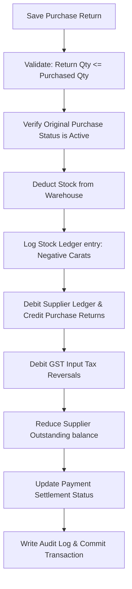

# DIAMO ERP – PHASE 5.2
## PURCHASE RETURN (DEBIT NOTE) – ENTERPRISE FUNCTIONAL SPECIFICATION

---

## 1. Executive Summary
This document defines the Enterprise Functional Specification Document (FSD) for the Purchase Return (Debit Note) module in DIAMO ERP. The Purchase Return module tracks the return of polished or rough diamond shipments back to suppliers. It inherits formatting, GST engines, and audit controls from the Purchase Book while establishing debit-note-specific workflows for reference purchase invoice tracking, return type classifications, stock deduction, and ledger balance reversals.

---

## 2. Business Purpose
A Purchase Return (Debit Note) reconciles transactions when goods are returned to the supplier after purchase invoice registration:
*   **Debit Note Issuance:** A legal document offsetting original creditor balances, reducing payables without cash exchanges.
*   **Operational Distinction:**
    *   *Purchase Book:* Records asset inflow and payable creation.
    *   *Purchase Return:* Reverses asset inflow, deducts inventory, and decrements payables.
    *   *Purchase Credit Note:* Adjusts purchase prices downwards without changing inventory balances.

---

## 3. Purchase Return Workflow
The processing pipeline executes the following checks upon saving a Purchase Return:

---

## 4. Screen Layout
The layout uses a card-based format optimized to display reference data alongside return inputs:
*   **Header Card:** Purchase Return ID, date, status, and active company metadata.
*   **Reference Selector Card:** Input field to search and link an active Purchase Invoice.
*   **Detail Panes:** Displays original supplier and broker profiles as read-only.
*   **Quality Grid (Main):** Pre-populated table showing original invoice line items, editable columns for Return Qty, Return Reason, and Remarks.
*   **Summary Columns:** Calculated aggregates (Gross, GST splits, Round-off, Net Debit, Outstanding balance adjustments).

---

## 5. Header
The Purchase Return Header displays the transaction metadata:
*   **Purchase Return Number:** Automatically generated. Format:
    $$\text{PRN Number} = \text{Company Prefix} - \text{PRN} - \text{YYYY} - \text{Sequential Number}$$
    *Example:* `JD-PRN-2026-000084`
*   **Purchase Return Date:** Defaults to current system date (validated against lock boundaries).
*   **Voucher Number:** Unique internal transaction code.

---

## 6. Reference Purchase Invoice
The Reference Purchase Invoice field is the primary data source:
*   **Selector Search:** Users search by purchase bill number or supplier invoice number.
*   **Auto-Population:** Selecting an invoice loads Supplier name, billing details, broker profiles, original line weights, prices, and tax rates. Re-keying of original billing variables is blocked.

---

## 7. Return Types
The return type classification controls audit routing:
*   **Full Return:** Returns the entire purchase shipment. Sets the original purchase outstanding to zero.
*   **Partial Return:** Returns a subset of items or carat weights.
*   **Damaged Goods:** Deducts inventory lot and links damage logs.
*   **Price Adjustment:** Adjusts invoice prices without physical stock movement.

---

## 8. Quality Grid
*   **Auto-Loading Grid:** Displays original purchase rows.
*   **Locked Columns:** Quality ID, HSN, Base Rate, and original GST % are read-only.
*   **Editable Columns:** Return Quantity (Carats), Return Reason, and Remarks.

---

## 9. Calculation Engine
The system reuses the core Purchase Book calculations, executing them in reverse:
*   **Terms Rate & Gross Reversal:** Calculated based on entered Return Quantity and original purchase rates.
*   **Outstanding Adjustment:** Recalculates remaining supplier balances:
    $$\text{Remaining Outstanding} = \text{Original Outstanding} - \text{Net Debit Amount}$$

---

## 10. GST Engine
*   **Automatic Reversal:** Reverses original Input GST claims (CGST/SGST or IGST) based on the matched purchase invoice state prefix.
*   **Rate Lock:** The tax rate matches the original invoice GST percentage. Manual overrides are blocked.

---

## 11. Inventory Engine
Saving a Purchase Return triggers the Inventory Engine to:
*   **Reduce Stock:** Deducts the returned carat weight from the active inventory catalog.
*   **Write Stock Ledger:** Records a negative carat update line.
*   *Validation:* Verifies that the returned carat weight does not exceed the originally purchased weight, and does not result in negative warehouse stock balances.

---

## 12. Supplier Ledger Engine
Accounting posts the following entries:
*   **Supplier Account:** Debited for Net Debit Value (reducing payable liability).
*   **Purchase Returns Account:** Credited for Taxable Value.
*   **Input GST Accounts (CGST/SGST/IGST):** Credited for reversed tax values.
*   **Broker Commission Account:** Credited for reversed commission liabilities.

---

## 13. Outstanding Engine
*   **Outstanding Reduction:** The debit note amount is allocated against the reference purchase invoice.
*   **Receivable Adjustments:** Adjusts the supplier's active aging statement totals.

---

## 14. Validation Rules
*   **Weight Check:** Return Quantity (carats) cannot exceed originally purchased quantity.
*   **Stock Limit Check:** Enforce validation blocking saving if the return carat weight exceeds active warehouse balances for that Quality ID.
*   **Status Verifications:** Block references to cancelled or deleted purchases.

---

## 15. Business Rules
1.  **Reference Required:** Every Purchase Return must link to a valid Purchase Invoice.
2.  **GST State Alignment:** Tax calculations use the place of supply of the parent invoice.
3.  **Multiple Partial Returns:** The system allows posting multiple partial returns against a single invoice.

---

## 16. Edit/Delete Rules
*   **Edit Constraints:** Allowed only if the purchase return is in "Draft" or "Open" status. Editing restores inventory carats before applying new edits.
*   **Soft Delete:** Marks the record as Deleted, restores the inventory carats and ledger adjustments, then logs an audit record.

---

## 17. Print & Export
*   **Printed Layout:** Includes the company logo, reference purchase invoice number, return reason, and tax debit breakdown. Supports PDF and Excel exports.

---

## 18. List Page
The Purchase Return Listing Page `/transactions/purchase/returns` supports:
*   Searching by Purchase Return Number, Reference Purchase Number, or Supplier.
*   Filtering by Return Date, Amount, Status, and Return Type.

---

## 19. Audit
Maintains complete snap history logs showing:
*   `created_by`, `created_date`, `modified_by`, `modified_date`.
*   Before Value (JSON) and After Value (JSON) audit states.

---

## 20. Permissions
Access is regulated by the following flags:
*   `create_purchase_return` / `cancel_purchase_return`
*   `override_return_quantity` (allows adjusting returns weight).

---

## 21. Edge Cases
*   **Multiple Partial Returns:** If a customer returns 1.00ct on Day 5 and 0.50ct on Day 10, the system tracks cumulative returns to block entries exceeding the original invoice total (e.g., 1.50ct).
*   **GST Rate Shifts:** The engine calculates tax using the rate active on the original invoice date, ignoring subsequent tax rate changes.

---

## 22. Future Enhancements
*   **Barcode Returns:** Scan lot tags to automatically resolve the reference purchase invoice and populate the return grid.
*   **Supplier Portal Integration:** Transmits debit notes directly to the supplier's portal.

---

## 23. Architect Recommendations
1.  **Return Accumulator Queries:** Implement database functions to check cumulative returned weights before saving new returns.
2.  **Unified Transaction scope:** Run stock updates and ledger entries in a single database transaction to prevent inventory mismatches.

---

## 24. Final Completion Checklist
*   [x] Document business purpose and workflows for the Purchase Return module.
*   [x] Review the layout sections (Header, Reference Selector, Return types, Quality grid).
*   [x] Map the inventory deduction rules and supplier ledger entries.
*   [x] Detail due date adjustments, Payment statuses, and validation rules.
*   [x] Map edit/delete rules, permissions, and edge cases.
