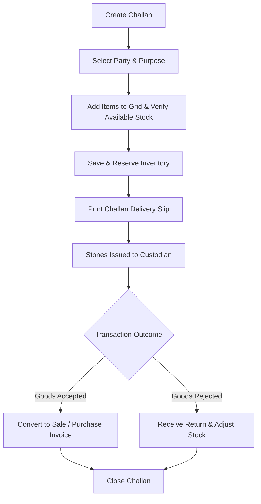

# DIAMO ERP – PHASE 6.1
## CHALLAN BOOK – ARCHITECTURE & BUSINESS WORKFLOW SPECIFICATION

---

## 1. Executive Summary
This document defines the Enterprise Functional Specification Document (FSD) for the Challan Book Architecture and Business Workflow in DIAMO ERP. This module functions as the central engine for tracking physical diamond movements where legal ownership is retained by the company, serving as the architectural foundation for Job Work processing, approval consignments ("Jhanghad"), and branch transfers.

---

## 2. Business Purpose
*   **Definition:** A Challan is a delivery document tracking the physical transit of diamond parcels without transferring ownership.
*   **Operational Context:** In the diamond industry, goods are frequently issued on consignment (Jhanghad) to brokers or potential buyers for inspection, or sent to outsource units for cutting and polishing (Job Work).
*   **Comparisons:**
    *   *Sale/Purchase Book:* Transfer of ownership and revenue.
    *   *Challan Book:* Physical transit only, retaining original ownership.
    *   *Sale/Purchase Order:* Intent to buy/sell; no physical stock changes.

---

## 3. Challan Types
The single Challan module resolves operational workflows using a mandatory **Purpose** selector field:
*   **Trading (Jhanghad / Customer Approval):** Diamond packets issued to brokers or prospective buyers for inspection. Valid for a configured approval window (typically 3 to 10 days).
*   **Job Work:** Issues rough/semi-polished stones to internal or outsource workers for cutting, faceting, boiling, or grading.
*   **Internal Transfer / Exhibition:** Transit of diamond stocks between offices or exhibitions.
*   **Certification:** Dispatching stones to grading labs (e.g., GIA, IGI) for certification.

---

## 4. Module Architecture
The unified Challan module acts as a state router. The selected **Purpose** controls:
1.  **Validation Enforcements:** For example, Job Work requires a linked worker account, while Jhanghad requires a broker selection.
2.  **Inventory Routing:** Determines whether stock is allocated to "Job Work Outward Vault", "Jhanghad Vault", or "Lab Vault".
3.  **Conversion Hooks:** Controls whether the Challan can be converted into a Sale Invoice or a Purchase invoice.

---

## 5. Challan Lifecycle
The status of a Challan evolves through the following stages:
*   `Draft`: Saved entry, no inventory or ledger adjustments.
*   `Issued`: Goods allocated and reserved from stock.
*   `Dispatched / Delivered`: In-transit or received by the custodian.
*   `Pending`: Active consignment, waiting for return or purchase conversion.
*   `Partial Return / Returned`: Goods returned to warehouse.
*   `Converted`: Ownership transferred (converted to Sale/Purchase).
*   `Closed / Cancelled`: Voucher finalized and archived.

---

## 6. Business Workflow
The transactional progression of a Challan operates as follows:

---

## 7. Inventory Philosophy
The Challan system ensures that physical movements do not affect asset values:
*   **Ownership Retention:** Diamond assets remain on the company's balance sheet.
*   **Carat Allocation States:**
    *   $$\text{Available Stock} = \text{Total Stock} - \text{Challan/Reserved Stock}$$
    *   $$\text{Challan Stock} = \text{Jhanghad Vault} + \text{Job Work Outward Vault} + \text{Lab Vault}$$
*   **Stock Ledger:** Inward return steps add carats back to Available Stock, while conversions write a final stock deduction log.

---

## 8. Status Management
Transitions are triggered by user actions or automated system events:
*   `Pending` $\rightarrow$ `Returned`: Triggered upon saving a Return Challan matching the original Challan ID.
*   `Pending` $\rightarrow$ `Converted`: Triggered when selecting the Challan in the Sale Book grid.
*   `Pending` $\rightarrow$ `Overdue`: Triggered by a background cron job if the current date exceeds the Challan's due date.

---

## 9. Users & Permissions
*   **Inventory Manager:** Full rights to create, edit, print, and approve Challans.
*   **Warehouse Staff:** Permitted to view, dispatch, and process inward returns.
*   **Broker:** Read-only access to active Jhanghad lists (via future external portal).
*   **Accounts Department:** View-only access (un-converted Challans have no financial ledger impact).

---

## 10. Module Dependencies
*   **Quality Master:** Validates carat weights and SKU grades.
*   **Sale Book:** Directly consumes Pending Jhanghad Challans to create Sale Invoices.
*   **Job Work Book:** Links Job dispatches to outsourcing records.
*   **Stock Ledger:** Records physical in-out movements.

---

## 11. Search & List Page
The list view `/transactions/challans` supports:
*   **Fuzzy Global Search:** Match Challan IDs, Custodian Names, or Quality grades.
*   **Filter Presets:** Active Jhanghad, Overdue dispatches, Pending Job Work, and Returned.
*   **Grouping:** Group rows by Purpose or Custodian.

---

## 12. Keyboard Workflow
*   **Ctrl + N (New):** Initiates a new Challan entry.
*   **Ctrl + L (List):** Navigates to the search listing grid.
*   **F4 (Party Search):** Focuses the custodian account search field.
*   **F6 (Quality Search):** Focuses the item quality input cell.

---

## 13. Performance Recommendations
*   **Stock Buffer Indexing:** Index database tables on `(quality_id, status)` to support fast available-stock calculations.
*   **Background Cron Operations:** Offload due-date checks and status updates to a background service.

---

## 14. Future Enhancements
*   **RFID Trays Integration:** Scan inventory trays to auto-populate Challan dispatches and returns.
*   **Mobile Approval App:** Allows managers to approve high-value consignments remotely.

---

## 15. Architect Recommendations
1.  **Strict Status Constraint:** Prevent deleting or editing any Challan once it has been converted to a Sale or Purchase invoice.
2.  **Vault-Based Isolation:** Implement separate stock ledger tables for each inventory vault (Jhanghad, Outsource, Certified) to track location transfers.

---

## 16. Final Completion Checklist
*   [x] Document business purpose and differences between Challans and standard invoices.
*   [x] Map the 11 Challan Purposes (Job Work, Jhanghad, Lab, etc.) and routing rules.
*   [x] Define Challan lifecycle statuses and transition triggers.
*   [x] Establish the inventory available-vs-reserved allocation rules.
*   [x] Map listing searches, keyboard hotkeys, and module dependencies.
