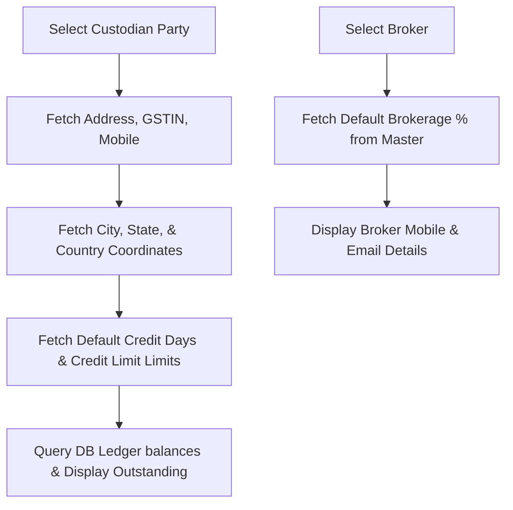

# DIAMO ERP – PHASE 6.2
## CHALLAN BOOK – HEADER, PARTY DETAILS & CHALLAN INFORMATION SPECIFICATION

---

## 1. Executive Summary
This document defines the Enterprise Functional Specification Document (FSD) for the Header Section, Party Details, and Challan Information of the Challan Book in DIAMO ERP. This specification outlines numbering strategies, auto-fetch logic, status tracking, expected return date boundaries, and validation parameters required to automate entry workflows and support unified location tracking for diamonds.

---

## 2. Header Section
The Header Section displays the operational parameters of the transaction voucher.
*   **Challan Date:** Defaults to the system date.
*   **Reference Number:** Optional input field to link external cargo receipts or customer codes.
*   **Voucher Number:** System-generated unique transaction ID.
*   **Metadata Fields:** Created By, Created Date, Modified By, Modified Date (read-only audit details).

---

## 3. Challan Number Strategy
The Challan Number is the legal invoice identifier printed on document templates:
*   **Generation Format:**
    $$\text{Challan Number} = \text{Company Prefix} - \text{CH} - \text{YYYY} - \text{Sequential Number}$$
    *Example:* `JD-CH-2026-000084`
*   **Behavior Rules:**
    *   *Uniqueness:* Indexed in the database as a unique field per company partition.
    *   *Sequencing:* Resets to `000001` at the beginning of each financial year.
    *   *Overrides:* The field is read-only. Manual overrides can be unlocked only by administrators through System Configuration settings.

---

## 4. Purpose Configuration
The **Purpose** field is the primary driver of Challan workflows:
*   *Values:* Job Work, Trading (Jhanghad), Sale Order, Purchase Order, Customer Approval, Broker Sample, Exhibition, Repair, Certification, Internal Transfer.
*   *Workflow Integration:* The selected purpose routes validations (e.g., forcing Expected Return Dates for consignments) and targets stock ledger adjustments (e.g., routing Jhanghad lot weight reserves).

---

## 5. Party Section
*   **Selector Search:** Users search by Account Name.
*   **Auto-Population:** Selecting a party auto-populates the billing address, contact information, GSTIN, and active outstanding balances.

---

## 6. Broker Section
*   **Conditional Selection:** Optional field.
*   **Auto-Population:** Selecting a broker auto-populates the broker's contact details and default commission percentage.

---

## 7. Transport Details
Captures transport parameters for physical transit tracking:
*   *Fields:* Transport Name, Vehicle Number, Driver Name, Driver Mobile, LR Number, Dispatch Through, Transport Remarks.
*   *Validation:* Checked for character limits. LR (Lorry Receipt) Number is required if a shipping company is selected.

---

## 8. Challan Details
*   **Reference Document:** Link reference orders (e.g., Sale Order Number, Purchase Order Number, or Job Order Number).
*   **Prepared By / Approved By:** Identifies the operators responsible for entering and authorizing the dispatch.

---

## 9. Auto Fetch Logic
The auto-fetch flow executes sequentially upon selecting a party or broker:

---

## 10. Party Information Card
Renders a read-only sidebar overlay displaying active risk parameters:
*   Party Name, City, Mobile, GSTIN.
*   Active Outstanding Balance, Credit Limit, Count of Pending Challans.
*   Last transaction date and amount.

---

## 11. Expected Return Date
*   **Mandatory Status:** Required when the Challan Purpose is set to Job Work, Trading, Customer Approval, or Broker Sample.
*   **Validation Rules:** The date must be greater than or equal to the Challan Date. If the date exceeds configured maximum consignment limits (e.g., Jhanghad limit of 15 days), a warning is displayed.

---

## 12. Status Behaviour
The Challan status updates automatically based on workflow events:
*   `Draft`: Saved voucher.
*   `Issued`: Dispatch confirmed, available stock reserved.
*   `Pending`: Waiting for returns or conversions.
*   `Returned / Converted / Cancelled`: Final voucher state.

---

## 13. Validation Rules
*   **Mandatory Fields:** Party, Purpose, Company, Financial Year, and Challan Date must be filled.
*   **Date Checks:** The expected return date must be equal to or after the Challan Date.
*   **Status Warnings:** Warn if the selected party is marked "Blocked" or has overdue outstanding invoices.

---

## 14. Business Rules
1.  **Read-Only Outstanding:** Party outstanding balances cannot be edited and pull directly from database ledger balances.
2.  **Locked Purpose:** The Challan Purpose cannot be changed once stock movements have been committed to the ledger.
3.  **Active FY Constraint:** Challan Dates must fall within the range of the active financial year.

---

## 15. Keyboard Workflow
*   **F4 (Party Search):** Focuses the Party search dropdown.
*   **F6 (Broker Search):** Focuses the Broker search dropdown.
*   **Ctrl + A (Inline Master):** Open Quick Create Party (if focused on Party) or Quick Create Broker (if focused on Broker).
*   **Enter:** Commits cell value and moves focus to the next editable cell (or next row).

---

## 16. Dependencies
*   **Account & Broker Masters:** Provide party coordinates, tax IDs, and default commission terms.
*   **Company & Financial Year Masters:** Restrict transaction boundaries and provide invoice numbering prefixes.

---

## 17. Edge Cases
*   **Expected Return Date Before Challan Date:** The system blocks saving and displays an error message.
*   **Inactive Custodian Party:** The selection is blocked.
*   **Duplicate Reference Warning:** Alerts the user if the Reference Number has already been used on another Challan.

---

## 18. Future Enhancements
*   **Google Maps Integration:** Track the physical route for local dispatches.
*   **Courier Tracking API:** Auto-fetch delivery statuses from courier APIs using tracking IDs.

---

## 19. Architect Recommendations
1.  **State Code Extraction:** Extract the first two digits of the party's GSTIN to verify that place-of-supply states match the account profile.
2.  **Asynchronous Validation:** Perform duplicate reference checks asynchronously when the reference field loses focus.

---

## 20. Final Completion Checklist
*   [x] Document fields, validation rules, and numbering strategies for the Header section.
*   [x] Map party details, auto-fetch variables, and outstanding warnings.
*   [x] Map broker details and commission percentages.
*   [x] Detail expected return date validations and status transition rules.
*   [x] Map transport details and keyboard workflow shortcuts.
