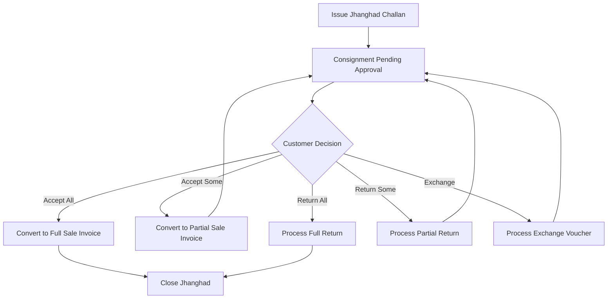

# DIAMO ERP – PHASE 6.8
## CHALLAN BOOK – ISSUE FOR TRADING (JHANGHAD) SPECIFICATION

---

## 1. Executive Summary
This document defines the Enterprise Functional Specification Document (FSD) for the Issue for Trading (Jhanghad) module of the Challan Book in DIAMO ERP. This module tracks consignment diamond dispatches issued to brokers or customers for purchase inspections. It inherits layout styles and location tracking from the Challan Book while establishing trading-specific workflows for approval limits, follow-up parameters, partial returns/purchases, and customer performance metrics.

---

## 2. Business Purpose
The Jhanghad consignment process manages physical dispatches without transferring ownership:
*   **Voucher Scope:** Used when diamond parcels are issued to prospective buyers or brokers for selection.
*   **Operational Distinctions:**
    *   *Sales Invoice:* Immediate ownership transfer and ledger debit.
    *   *Job Work Challan:* Dispatched to technicians for processing (cutting/polishing).
    *   *Jhanghad Consignment:* Temporary custody transfer for purchase inspection, returning unsold stones to the warehouse.

---

## 3. Trading Workflow
The lifecycle of a Jhanghad consignment operates as follows:

---

## 4. Party & Broker
*   **Party Details:** Selecting a customer account auto-populates billing details and their active outstanding credit balance. Renders a read-only performance card displaying: count of active pending Jhanghads, average approval time (days), and historical purchase-to-consignment ratios.
*   **Broker Details:** Selecting a broker auto-populates the broker's default commission rate.

---

## 5. Item Grid
The item grid adds fields to track consignment pricing parameters:
*   **Packet Number / Certificate Number:** References for the diamond lot.
*   **Expected Selling Price:** Intended retail rate per carat.
*   **Reserve Price:** Minimum acceptable rate below which sales executives cannot save conversions without administrator authorization codes.

---

## 6. Approval Engine
*   **Consignment Window:** Automatically calculates the Expiry Date:
    $$\text{Expiry Date} = \text{Issue Date} + \text{Approval Period (Days)}$$
*   *Interaction:* Expiry checks trigger follow-up alerts on the dashboard if approval terms are breached.

---

## 7. Partial Purchase
*   **Workflow:** Custodian decides to purchase a subset of the dispatched carats.
*   **Conversion:** The user links the Jhanghad Challan in the Sale Book, selects the purchased lines, and saves the Sale Invoice.
*   **Inventory Update:** Deducts the purchased weight from Reserved Stock. The remaining weight stays in the Jhanghad Vault under a `Pending` status.

---

## 8. Partial Return
*   **Workflow:** Custodian returns a portion of the packet carats.
*   **Inventory Update:** Deducts the returned carat weight from Reserved Stock and adds it to Available Stock, leaving the remainder in Reserved Stock:
    $$\text{Pending Weight} = \text{Original Issued Weight} - \text{Cumulative Returned Weight}$$
*   *Status:* Challan status changes to `Partial Return`, remaining in `Pending` status.

---

## 9. Full Purchase
*   **Conversion:** Generates a Sale Invoice for all lines on the Jhanghad Challan.
*   **Inventory Update:** Deducts the entire lot weight from Reserved Stock and closes the Challan.

---

## 10. Full Return
*   **Workflow:** Restocks all issued carats to Available Stock.
*   **Inventory Update:** Deducts the returned carat weight from Reserved Stock, adds it to Available Stock, and closes the Challan.

---

## 11. Exchange
*   **Workflow:** Custodian returns an issued lot and receives a replacement lot of a different quality or value.
*   **Inventory Update:** Restocks the returned lot to Available Stock and dispatches the new lot, maintaining both movements under the same Jhanghad ID.

---

## 12. Follow-up Engine
Tracks consignment follow-up tasks:
*   *Parameters:* Issue Date, Expected Return, Last Follow-up, Next Follow-up, and Sales Executive Remarks.
*   *Notifications:* Overdue follow-up reminders are displayed on the dashboard.

---

## 13. Status Engine
Vouchers progress through these statuses:
*   `Draft`: Saved entry.
*   `Issued`: Dispatched, available carats moved to Reserved Stock.
*   `Pending Approval`: Consignment active, waiting for return or conversion.
*   `Partially Returned`: Portions returned.
*   `Partially Purchased`: Portions converted to sales.
*   `Fully Returned / Converted to Sale`: Final closed states.
*   `Expired`: Approval period exceeded without action.

---

## 14. Inventory Behaviour
*   **Vault Tracking:** Dispatches transfer carats from the primary warehouse vault to the "Jhanghad Vault" (retaining ownership on the balance sheet).
*   **Carat Allocation updates:**
    $$\text{Jhanghad Stock} = \text{Current Jhanghad Stock} + \text{Inward Weight}$$
    $$\text{Available Stock} = \text{Current Available Stock} - \text{Inward Weight}$$

---

## 15. Customer Performance
Tracks customer performance metrics:
*   **Average Approval Time:** Average days taken to resolve consignments.
*   **Purchase %:** Ratio of converted sales to total issued carats.
*   **Return %:** Ratio of returned carats to total issued carats.

---

## 16. Report Impact
Saving a Jhanghad entry updates:
*   *Registers:* Trading Register, Pending Jhanghad Report, Consignment Yield Report.
*   *Ledgers:* Customer Performance Logs, Stock Ledger.

---

## 17. Validation
*   **Custodian Verification:** The party must be active in the Account Master.
*   **Weight Constraints:** Weight must be greater than `0.000` carats.
*   **Return Date Check:** Expected Completion Date must be equal to or after the Issue Date.

---

## 18. Business Rules
1.  **Single Status:** A Jhanghad line can have only one final status (Returned or Converted).
2.  **No Double-Booking:** Packets already at a custodian cannot be sent to another process.
3.  **Read-Only Weights:* Original issue weights are locked during return processing.

---

## 19. Permissions
Access is regulated by the following flags:
*   `issue_jhanghad` / `receive_jhanghad`
*   `override_reserve_price` / `override_expiry_dates`

---

## 20. Audit
Logs all status changes:
*   Tracks location updates, custodian transfers, and conversion histories.
*   Logs before and after JSON snapshots, user IDs, and system timestamps.

---

## 21. Notifications
*   **Overdue Alerts:** Alerts users upon saving returns ("Return processed successfully. Stock updated.").
*   **Approval Alerts:** Prompts managers to authorize write-offs or damaged entries.

---

## 22. Printing
The printing engine generates templates for:
*   *Jhanghad Challan:* Technical instructions for the custodian (HSN, target finish, expected weight).
*   *Receipt Slip:* Printed slip confirming receipt of finished stones.

---

## 23. Edge Cases
*   **Customer Refuses Return:** If a customer delays return past the critical overdue threshold (e.g., 30 days), the system locks the customer account, blocking new dispatches.
*   **Price Discrepancy:** If the conversion price is below the reserve price, the system prompts for administrator authorization codes.

---

## 24. Future Enhancements
*   **AI Conversion Predictions:** Analyzes historical custodian conversion patterns to predict potential conversion rates.
*   **AI Follow-up Suggestions:** Recommends optimal follow-up dates based on customer purchase patterns.

---

## 25. Architect Recommendations
1.  **Unique Barcode Constraints:** Enforce unique packet numbers to prevent overlapping dispatches.
2.  **Stateless Tracking API:** Run ageing calculations in background worker processes to prevent UI lag.

---

## 26. Final Completion Checklist
*   [x] Document business purpose and workflows for the Jhanghad module.
*   [x] Map the item grid and approval details fields.
*   [x] Detail follow-up schedules and status transition rules.
*   [x] Map the inventory available-vs-reserved location transfers.
*   [x] Document validation rules, permissions, and edge cases.
