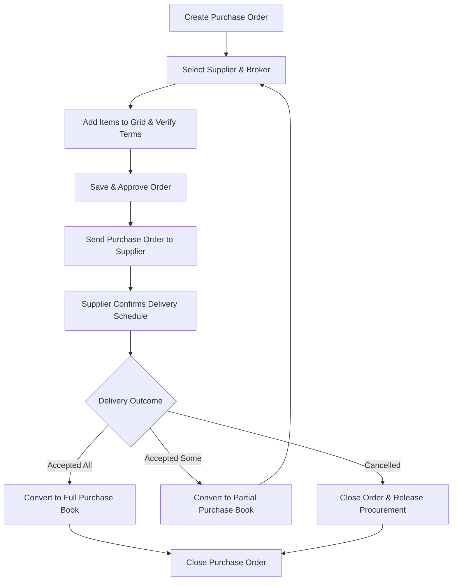

# DIAMO ERP – PHASE 6.10
## CHALLAN BOOK – ISSUE FOR PURCHASE ORDER SPECIFICATION

---

## 1. Executive Summary
This document defines the Enterprise Functional Specification Document (FSD) for the Issue for Purchase Order module of the Challan Book in DIAMO ERP. This module manages purchase orders placed with suppliers, tracking commitments and expected deliveries without increasing physical inventory counts. It inherits layout styles and location tracking from the Challan Book while establishing purchase-specific workflows for order types, partial supplier deliveries, delivery schedules, and supplier rating metrics.

---

## 2. Business Purpose
The Purchase Order process manages supplier commitments before physical restocking:
*   **Voucher Scope:** Used when the company places an order with a supplier.
*   **Operational Distinctions:**
    *   *Purchase Enquiry:* Non-binding request for pricing.
    *   *Purchase Order:* Confirmed commitment to procure; does not increase stock.
    *   *Purchase Book:* Physical receipt of goods; logs warehouse stock increases and accounts payable.

---

## 3. Purchase Order Workflow
The processing pipeline executes the following checks:

---

## 4. Supplier & Broker
*   **Supplier Details:** Selecting a supplier account auto-populates billing details and their active outstanding balance. Renders a read-only performance card displaying: count of active pending orders, average delivery time (days), and historical reliability ratings.
*   **Broker Details:** Selecting a broker auto-populates the broker's default commission rate.

---

## 5. Item Grid
The item grid adds fields to track procurement parameters:
*   **HSN Code:** Tax category reference.
*   **Expected Purchase Rate:** Target rate per carat.
*   **Received Quantity:** Carat weight already delivered.
*   **Pending Quantity:** Remaining carats to be delivered.
*   **Required Delivery Date:** Target delivery date for the line.

---

## 6. Order Types
The system supports configurable procurement categories:
*   *Values:* Normal Purchase, Urgent Purchase, Import Purchase, Domestic Purchase, Broker Purchase, Stock Replenishment, Special Order, Custom Order, Manufacturing Requirement, Emergency Purchase.

---

## 7. Delivery Workflow
*   **Workflow:** Supplier dispatches are reconciled against the purchase order. Saving a delivery creates a Purchase Book entry, which updates the physical inventory.

---

## 8. Partial Delivery
*   **Workflow:** Supplier delivers a portion of the ordered carats.
*   **Conversion:** The user links the Purchase Order in the Purchase Book, selects the delivered lines, and saves the entry.
*   **Inventory Update:** Increases warehouse inventory by the delivered weight. The remaining weight stays under a `Pending` status.

---

## 9. Full Delivery
*   **Conversion:** Generates a Purchase Book entry for all lines on the Purchase Order.
*   **Inventory Update:** Increases warehouse inventory by the entire order weight and closes the Order.

---

## 10. Cancellation
*   **Workflow:** If the order is cancelled before delivery, the system releases the pending procurement and closes the order, logging the action in the audit trail.

---

## 11. Delivery Schedule
Tracks delivery parameters:
*   *Parameters:* Expected Delivery Date, Actual Delivery Date, Pending Delivery, Delayed Delivery, Supplier Commitment, and Delivery Performance.

---

## 12. Status Engine
Vouchers progress through these statuses:
*   `Draft`: Saved entry.
*   `Created`: Order validated.
*   `Sent to Supplier`: Order transmitted.
*   `Confirmed`: Supplier accepted terms.
*   `Partially Delivered`: Portions received.
*   `Fully Delivered / Converted to Purchase`: Final closed states.
*   `Cancelled / Closed`: final voucher states.

---

## 13. Inventory Behaviour
*   **No Stock Increase:** Creating a Purchase Order does **NOT** increase physical inventory counts.
*   **Procurement Audit:** The order is tracked as a pending procurement until a Purchase Book entry is saved:
    $$\text{Warehouse Inventory} = \text{Current Warehouse Inventory} + \text{Delivered Weight}$$

---

## 14. Supplier Performance
Tracks supplier performance metrics:
*   **Average Delivery Time:** Average days taken to fulfill orders.
*   **Late Deliveries:** Count of orders delivered past the expected date.
*   **Supplier Reliability:** Ratio of fulfilled carats to total ordered weights.

---

## 15. Report Impact
Saving a Purchase Order entry updates:
*   *Registers:* Purchase Order Register, Pending Purchase Orders, Delivery Report, Supplier Performance Report.
*   *Ledgers:* Stock Ledger.

---

## 16. Validation
*   **Supplier Verification:** The party must be active in the Account Master.
*   **Weight Constraints:** Weight must be greater than `0.000` carats.
*   **Return Date Check:** Expected Completion Date must be equal to or after the Issue Date.

---

## 17. Business Rules
1.  **Strict Reference Constraint:** Incoming finished goods must reference the original Purchase Order.
2.  **No Double-Booking:** Packets already at a custodian cannot be sent to another process.
3.  **Read-Only Weights:** Original issue weights are locked during return processing.

---

## 18. Permissions
Access is regulated by the following flags:
*   `create_purchase_order` / `approve_purchase_order`
*   `receive_purchase_order` / `override_delivery_date`

---

## 19. Audit
Logs all status changes:
*   Tracks location updates, custodian transfers, and conversion histories.
*   Logs before and after JSON snapshots, user IDs, and system timestamps.

---

## 20. Notifications
*   **Toast Notifications:** Alerts users upon saving returns ("Return processed successfully. Stock updated.").
*   **Approval Alerts:** Prompts managers to authorize write-offs or damaged entries.

---

## 21. Printing
The printing engine generates templates for:
*   *Purchase Order:* Technical instructions for the custodian (HSN, target finish, expected weight).
*   *Dispatch Slip:* Printed slip confirming receipt of finished stones.

---

## 22. Edge Cases
*   **Supplier Rejects Order:** If a supplier rejects order terms, the order status changes to `Cancelled`, releasing the pending procurement.
*   **Rate Changes:** If the supplier changes rates, saving the Purchase Book with the updated rates logs a rate variance in the supplier rating system.

---

## 23. Future Enhancements
*   **Vendor Portal:** Allows suppliers to log deliveries and update order dispatch statuses directly.
*   **AI Supplier Selection:** Recommends optimal vendors based on historical pricing and on-time delivery ratings.

---

## 24. Architect Recommendations
1.  **Unique Barcode Constraints:** Enforce unique packet numbers to prevent overlapping dispatches.
2.  **Stateless Tracking API:** Run ageing calculations in background worker processes to prevent UI lag.

---

## 25. Final Completion Checklist
*   [x] Document business purpose and workflows for the Purchase Order module.
*   [x] Map the item grid and expected delivery details fields.
*   [x] Detail delivery schedules and status transition rules.
*   [x] Map the inventory available-vs-reserved location transfers.
*   [x] Document validation rules, permissions, and edge cases.
