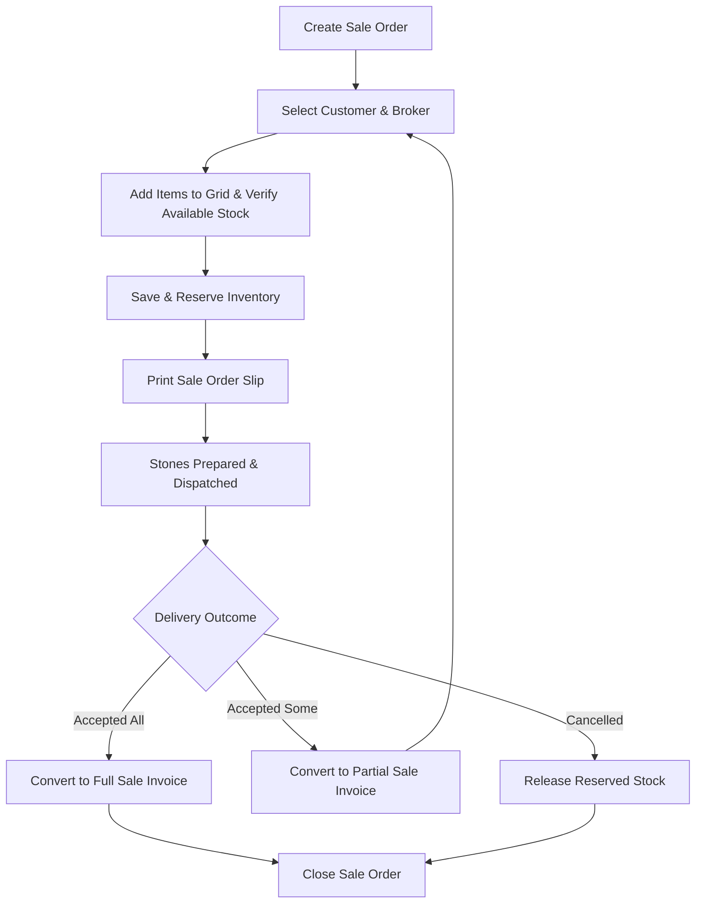

# DIAMO ERP – PHASE 6.9
## CHALLAN BOOK – ISSUE FOR SALE ORDER SPECIFICATION

---

## 1. Executive Summary
This document defines the Enterprise Functional Specification Document (FSD) for the Issue for Sale Order module of the Challan Book in DIAMO ERP. This module manages diamond dispatches to customers who have confirmed orders, reserving warehouse inventory until final billing. It inherits layout styles and location tracking from the Challan Book while establishing order-specific workflows for order types, partial delivery adjustments, delivery schedules, and customer order history.

---

## 2. Business Purpose
The Sale Order consignment process manages dispatches before final invoice generation:
*   **Voucher Scope:** Used when a customer confirms an order but the final Sale Invoice is pending.
*   **Operational Distinctions:**
    *   *Quotation:* Non-binding price estimate; does not affect stock.
    *   *Sale Order:* Confirmed commitment; reserves warehouse stock.
    *   *Sale Invoice:* Final ownership transfer and debtor balance ledger debit.

---

## 3. Sale Order Workflow
The processing pipeline executes the following checks:

---

## 4. Customer & Broker
*   **Customer Details:** Selecting a customer account auto-populates billing details and their active outstanding credit balance. Renders a read-only performance card displaying: count of active pending orders, average order value, and historical purchase-to-consignment ratios.
*   **Broker Details:** Selecting a broker auto-populates the broker's default commission rate.

---

## 5. Item Grid
The item grid adds fields to track order dispatch parameters:
*   **Packet Number:** References for the diamond lot.
*   **Reserved Quantity:** Carat weight locked for this order.
*   **Delivered Quantity:** Carats already invoiced.
*   **Pending Quantity:** Remaining carats to be dispatched.
*   **Expected Dispatch Date:** Target dispatch date for the line.

---

## 6. Order Types
The system supports configurable order categories:
*   *Values:* Normal Order, Urgent Order, Export Order, Domestic Order, Broker Order, Repeat Order, Sample Order, Custom Order.

---

## 7. Delivery Workflow
*   **Workflow:** Orders are dispatched based on scheduled dates. Saving a dispatch updates the order's status and reserves inventory.

---

## 8. Partial Delivery
*   **Workflow:** Custodian decides to purchase a subset of the dispatched carats.
*   **Conversion:** The user links the Sale Order in the Sale Book, selects the purchased lines, and saves the Sale Invoice.
*   **Inventory Update:** Deducts the purchased weight from Reserved Stock. The remaining weight stays in the Jhanghad Vault under a `Pending` status.

---

## 9. Full Delivery
*   **Conversion:** Generates a Sale Invoice for all lines on the Sale Order.
*   **Inventory Update:** Deducts the entire lot weight from Reserved Stock and closes the Order.

---

## 10. Cancellation
*   **Workflow:** If the order is cancelled before dispatch, the system releases the reserved stock and closes the order, logging the action in the audit trail.

---

## 11. Delivery Schedule
Tracks delivery parameters:
*   *Parameters:* Expected Delivery, Actual Delivery, Pending Delivery, Delivery Delay, Delivery Executive, and Dispatch Status.

---

## 12. Status Engine
Vouchers progress through these statuses:
*   `Draft`: Saved entry.
*   `Confirmed`: Order validated.
*   `Approved`: Manager approved.
*   `Reserved`: Available stock reserved.
*   `Ready for Dispatch`: Stones packed.
*   `Partially Delivered`: Portions invoiced.
*   `Fully Delivered / Converted to Sale`: Final closed states.
*   `Cancelled / Closed`: final voucher states.

---

## 13. Inventory Behaviour
*   **Vault Tracking:** Dispatches transfer carats from the primary warehouse vault to the "Sale Order Vault" (retaining ownership on the balance sheet).
*   **Carat Allocation updates:**
    $$\text{Sale Order Stock} = \text{Current Sale Order Stock} + \text{Inward Weight}$$
    $$\text{Available Stock} = \text{Current Available Stock} - \text{Inward Weight}$$

---

## 14. Customer Order History
Tracks customer performance metrics:
*   **Average Order Value:** Average value of confirmed orders.
*   **Conversion Rate:** Ratio of converted sales to total issued carats.
*   **Average Delivery Time:** Average days taken to resolve dispatches.

---

## 15. Report Impact
Saving a Sale Order entry updates:
*   *Registers:* Sale Order Register, Pending Order Report, Delivery Report, Reserved Stock Report.
*   *Ledgers:* Customer Performance Logs, Stock Ledger.

---

## 16. Validation
*   **Customer Verification:** The party must be active in the Account Master.
*   **Weight Constraints:** Weight must be greater than `0.000` carats.
*   **Return Date Check:** Expected Completion Date must be equal to or after the Issue Date.

---

## 17. Business Rules
1.  **Strict Reference Constraint:** Incoming finished goods must reference the original Sale Order.
2.  **No Double-Booking:** Packets already at a custodian cannot be sent to another process.
3.  **Read-Only Weights:** Original issue weights are locked during return processing.

---

## 18. Permissions
Access is regulated by the following flags:
*   `create_sale_order` / `approve_sale_order`
*   `dispatch_sale_order` / `override_delivery_date`

---

## 19. Audit
Logs all status changes:
*   Tracks location updates, custodian transfers, and conversion histories.
*   Logs before and after JSON snapshots, user IDs, and system timestamps.

---

## 20. Notifications
*   **Toast Notifications:** Alerts users upon saving returns ("Return processed successfully. Stock updated.").
*   **Approval Alerts:** Prompts managers to authorize write-offs or damaged entries.

---

## 21. Printing
The printing engine generates templates for:
*   *Sale Order:* Technical instructions for the custodian (HSN, target finish, expected weight).
*   *Dispatch Slip:* Printed slip confirming receipt of finished stones.

---

## 22. Edge Cases
*   **Insufficient Stock Override:** If stock is unavailable, the system prompts for administrator override keys to save the order as backordered.
*   **Double-Booking Prevention:** If two users edit separate orders for the same Quality ID, database locks resolve conflicts.

---

## 23. Future Enhancements
*   **Barcode Picking:** Scan barcodes to verify packets match the order picking list.
*   **GPS Delivery Tracking:** Real-time route tracking for local dispatches.

---

## 24. Architect Recommendations
1.  **Unique Barcode Constraints:** Enforce unique packet numbers to prevent overlapping dispatches.
2.  **Stateless Tracking API:** Run ageing calculations in background worker processes to prevent UI lag.

---

## 25. Final Completion Checklist
*   [x] Document business purpose and workflows for the Sale Order module.
*   [x] Map the item grid and expected delivery details fields.
*   [x] Detail delivery schedules and status transition rules.
*   [x] Map the inventory available-vs-reserved location transfers.
*   [x] Document validation rules, permissions, and edge cases.
