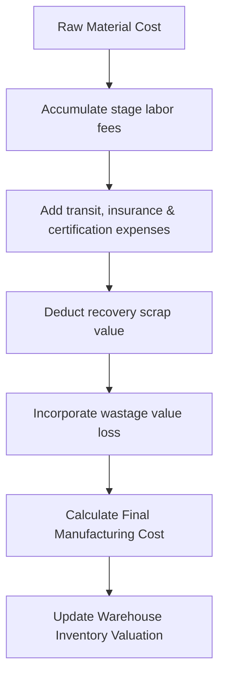

# DIAMO ERP – PHASE 7.2
## JOB COSTING ENGINE SPECIFICATION

---

## 1. Executive Summary
This document defines the Enterprise Functional Specification Document (FSD) for the shared Job Costing Engine of DIAMO ERP. The costing engine is designed as a reusable enterprise service to calculate production costs, process yields, labor expenses, and quality transformations. It updates inventory valuations and generates profitability reports across multiple modules.

---

## 2. Business Purpose
Reconciling processing costs is essential for accurate inventory valuation:
*   **Operational Context:** Accumulates expenses across multi-stage processes (planning, sawing, laser, polishing).
*   **Operational Distinctions:**
    *   *Purchase Cost:* Initial lot acquisition cost.
    *   *Manufacturing Cost:* Accumulated cost including raw material, labor, wastage, and transit.
    *   *Inventory Valuation:* Adjusts the asset value on the balance sheet post-processing.

---

## 3. Cost Components
The engine tracks several cost components:
*   **Raw Material Cost:** Cost basis of the rough diamond.
*   **Processing Cost:** Expenses from sawing, laser cutting, bruting, or polishing.
*   **Labor Cost:** Fees paid to internal technicians or external contractors.
*   **Wastage Cost:** Material value lost during cutting or polishing.
*   **Additional Expenses:** Freight, insurance, and certification charges.

---

## 4. Cost Calculation Flow
The calculation pipeline executes the following checks:

---

## 5. Labour Cost
Supports multiple calculation configurations:
*   **Per Carat (Input/Output Weight):** Labor fee based on weight.
*   **Per Piece / Fixed Fee:** Flat labor rates.
*   **Mixed Costing:** Combining fixed setups with per-carat rates.

---

## 6. Process Costing
Tracks process cost segments individually:
*   *Values:* Planning, Sawing, Laser cutting, Bruting, Polishing, Certification, Grading, Boiling/Cleaning.
*   *Grid:* Each item row maintains its own process category and actual labor cost.

---

## 7. Multi-Stage Costing
*   **Cost Accumulation:** Tracks lot histories across multiple processes (e.g., Planning $\rightarrow$ Sawing $\rightarrow$ Polishing), accumulating costs at each stage.
*   **Audit Trail:** Retains costing details for each process step.

---

## 8. Wastage Cost
Calculates value lost during processing:
*   **Formula:**
    $$\text{Raw Carat Cost} = \frac{\text{Raw Material Cost}}{\text{Issued Weight}}$$
    $$\text{Wastage Loss Value} = (\text{Issued Weight} - \text{Returned Weight}) \times \text{Raw Carat Cost}$$
    $$\text{Recovery Value} = \text{Returned Scrap Weight} \times \text{Scrap Rate}$$
    $$\text{Net Wastage Cost} = \text{Wastage Loss Value} - \text{Recovery Value}$$

---

## 9. Quality Transformation
*   **Transformation Mapping:** Documents the transition from Rough Quality (Source) to Polished Quality (Target).
*   **Revaluation:** Re-evaluates the stock asset value based on the target quality grade while preserving previous cost histories.

---

## 10. Inventory Valuation
Updates diamond costs in the inventory registry:
*   **Manufacturing Cost Basis:**
    $$\text{New Cost Basis} = \text{Raw Cost} + \text{Total Labor} + \text{Additional Expenses} + \text{Net Wastage Cost}$$
*   **Valuation Methods:** Supports average cost and last-purchase cost methods.

---

## 11. Profitability
Calculates profitability metrics:
*   **Formula:**
    $$\text{Gross Profit} = \text{Job Income} - \text{Total Job Cost}$$
    $$\text{Net Profit} = \text{Gross Profit} - \text{Additional Overhead Expenses}$$

---

## 12. Auto Calculations
Provides real-time updates for:
*   Cost per carat, cost per piece, average labor, and yield percentages.
*   **Round-off Rules:** Rounds values to 2 decimal places.

---

## 13. Report Impact
Saving a transaction updates:
*   *Registers:* Cost Register, Manufacturing Register, Stock Ledger, Profitability Reports.

---

## 14. Validation
*   **Negative cost validation:** Blocks saving if calculated costs are negative.
*   **Validation Rules:** Quality IDs and packet references must be active.

---

## 15. Business Rules
1.  **Strict Accumulation:** Every job expense must increase the manufacturing cost basis.
2.  **No Cost Deletion:** Historical costing steps are archived and cannot be deleted.
3.  **Wastage Limit:** Wastage deviations exceeding configured thresholds require manager approval.

---

## 16. Permissions
Access is regulated by the following flags:
*   `view_costing_data` / `override_labour_rates`
*   `approve_cost_adjustments` / `recalculate_inventory_costs`

---

## 17. Audit
Logs all status changes:
*   Tracks location updates, custodian transfers, and conversion histories.
*   Logs before and after JSON snapshots, user IDs, and system timestamps.

---

## 18. Reports
Generates yield and costing analysis:
*   *Job Cost Sheet:* Itemizes stage costs for a diamond lot.
*   *Cost Variance Report:* Compares estimated costs against actual charges.

---

## 19. Edge Cases
*   **Quality Splits:** When a lot is split into multiple packets, accumulated costs are distributed proportionally based on weight or value ratios.
*   **Reopen Job:** Reopening a job reverses ledger revaluations.

---

## 20. Future Enhancements
*   **AI Cost Predictions:** Analyzes rough diamond shapes to predict polished yield weights.
*   **IoT Machine Integration:** Syncs polishing machine run times to calculate labor costs automatically.

---

## 21. Architect Recommendations
1.  **Unique Barcode Constraints:** Enforce unique packet numbers to prevent overlapping dispatches.
2.  **Stateless Costing API:** Run costing calculations in background worker processes to prevent UI lag.

---

## 22. Final Completion Checklist
*   [x] Document cost components and calculation workflows.
*   [x] Define labor costing methods and multi-stage accumulation.
*   [x] Establish revaluation formulas and yield tolerances.
*   [x] Map validations, permissions, and audit log rules.
*   [x] Document quality split cost allocations.
