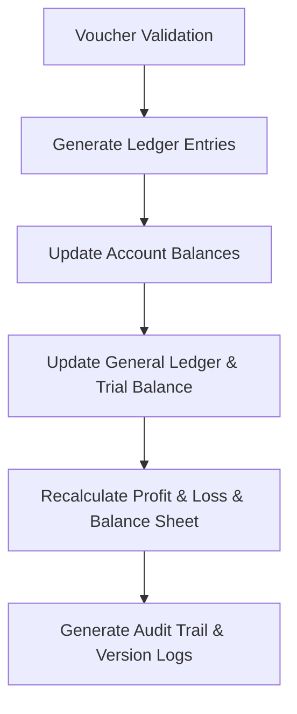

# DIAMO ERP – PHASE 8.5
## JOURNAL VOUCHER – LEDGER POSTING, APPROVAL & AUDIT ENGINE SPECIFICATION

---

## 1. Executive Summary
This document defines the Enterprise Functional Specification Document (FSD) for the Ledger Posting, Approval Workflow, and Audit system of DIAMO ERP. This module acts as the shared transaction core for the application, ensuring that all financial records are validated, authorized, posted, and audited under strict double-entry and GAAP compliance.

---

## 2. Business Purpose
Ledger posting validates and logs transaction data:
*   **Operational Context:** Establishes a transaction framework to prevent data corruption.
*   **Voucher States:**
    *   *Draft:* Unposted, editable entries.
    *   *Posted:* Read-only entries that update financial reports.
    *   *Reversed:* Compensating transaction offset entries.

---

## 3. Ledger Posting Engine
The posting pipeline executes the following checks:

---

## 4. Accounting Principles
Enforces fundamental accounting rules:
*   **Double-Entry Rule:** Total debits must equal total credits.
*   **Period Matching:** Restricts postings to the active financial year.
*   **Historical Integrity:** Locked financial years cannot accept new vouchers.

---

## 5. Ledger Impact
Automatically updates:
*   *Ledgers:* General Ledger, Trial Balance, GST Ledger, TDS Ledger, Accounts Receivable/Payable.

---

## 6. Posting Status
Vouchers progress through these statuses:
*   `Draft` $\rightarrow$ `Pending Approval` $\rightarrow$ `Approved` $\rightarrow$ `Posted` $\rightarrow$ `Reversed` $\rightarrow$ `Cancelled`.

---

## 7. Approval Workflow
Supports configurable multi-level approvals:
*   **Maker-Checker Workflow:** An accountant creates a draft JV (`Maker`), which must be authorized by an manager (`Checker`) before posting.

---

## 8. Approval Rules
*   **Rule Engine:** Approval routing paths are triggered dynamically based on amount thresholds, journal types, or tax overrides.

---

## 9. Posting Validation
Checks executed prior to posting:
*   Verifies that total debits equal total credits.
*   Confirms selected accounts are active and the financial period is open.

---

## 10. Reversal Engine
*   **Compensating Entries:** Posted vouchers cannot be modified. Adjustments generate a linked Reversal Voucher, which posts opposing entries to balance the accounts.

---

## 11. Cancellation
*   **Cancellation Rules:** Only draft vouchers can be cancelled. Cancelling a posted voucher requires generating a reversal voucher.

---

## 12. Version History
*   **Version Comparison:** Modifying a voucher creates a new version history entry (v1, v2), tracking changed fields and previous values.

---

## 13. Audit Trail
*   **Audit Logging:** Logs user IDs, timestamps, machine IDs, and status changes for every voucher action.

---

## 14. Reference Integrity
*   **Linking:** Links between JVs and source invoices or job card receipts remain immutable once posted.

---

## 15. Account Balance Update
*   **Balance Recalculation:** Computes running balances, outstanding balances, and aging bands for accounts in real-time.

---

## 16. Report Impact
*   **Report Updates:** Real-time updates to the Trial Balance, Balance Sheet, Profit & Loss, GST Register, and TDS reports.

---

## 17. Notifications
*   **System Alerts:** Sends notifications for vouchers pending approval, posted entries, or posting failures.

---

## 18. Search
*   **Index Fields:** Searchable by Voucher Number, Account Name, Reference ID, Narration, Status, and Date.

---

## 19. Filters
*   **Filter Options:** Filters by Date Range, Journal Type, Status, and Amount Range.

---

## 20. Permissions
Access is regulated by the following flags:
*   `create_jv` / `approve_jv`
*   `post_jv` / `reverse_jv`

---

## 21. Security
*   **Data Security:** Role-Based Access Control (RBAC), multi-tenant isolation, and financial year locks protect financial records.

---

## 22. Error Handling
*   **Rollback Protection:** System timeouts or validation failures during posting trigger database rollbacks to prevent ledger imbalances.

---

## 23. Edge Cases
*   **Closed Period Postings:** Blocks saving JVs in closed financial periods.
*   **Deactivated Accounts:** Blocks postings to deactivated account ledgers.

---

## 24. Business Rules
1.  **Strict Balance Constraint:** Voucher save blocked if variance is not zero.
2.  **No Edits on Posted JVs:** Corrections must use the Reversal Voucher workflow.
3.  **Approval Logs:** Historical approval records cannot be deleted.

---

## 25. Future Enhancements
*   **AI Accrual Suggestions:** Recommends monthly accruals based on historical patterns.
*   **E-Signatures:** Integrates digital signatures for voucher approvals.

---

## 26. Architect Recommendations
1.  **Unique Barcode Constraints:** Enforce unique packet numbers to prevent overlapping dispatches.
2.  **Stateless Tracking API:** Run ageing calculations in background worker processes to prevent UI lag.

---

## 27. Final Completion Checklist
*   [x] Document journal types and entry modes (Simple vs. Advanced).
*   [x] Map the posting pipeline and double-entry validation equations.
*   [x] Detail the reversal voucher workflow and status flows.
*   [x] Map validations, permissions, and audit log rules.
*   [x] Document report and ledger integrations.
