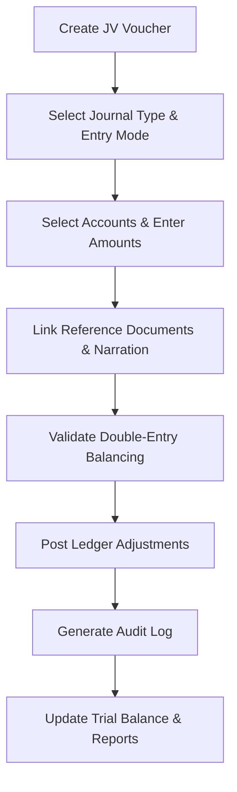

# DIAMO ERP – PHASE 8.1
## JOURNAL VOUCHER (JV BOOK) – ARCHITECTURE & WORKFLOW SPECIFICATION

---

## 1. Executive Summary
This document defines the Enterprise Functional Specification Document (FSD) for the Journal Voucher (JV Book) module of DIAMO ERP. This module acts as the centralized accounting adjustment engine of DIAMO ERP, handling all non-cash, non-bank, and non-inventory trade adjustments. It outlines entry modes (Simple vs. Advanced), tax provisioning (GST/TDS), audit log tracks, and reversal posting logic.

---

## 2. Business Purpose
Reconciling non-trade accounting entries is essential for financial reporting:
*   **Operational Context:** Provides an engine to record ledger adjustments, write-offs, depreciation, and tax allocations.
*   **Operational Distinctions:**
    *   *Sales/Purchase Books:* Direct trading records affecting product inventory.
    *   *Cash/Bank Books:* Real-time cash flow receipts and payments.
    *   *Journal Vouchers:* Internal accounting adjustments that do not involve immediate physical stock movement or cash exchanges.

---

## 3. Journal Types
Supports configurable adjustment categories:
*   *Values:* General Journal, Adjustment Journal, Opening Journal, Closing Journal, Rectification Journal, GST Adjustment, TDS Adjustment, Depreciation Provision, Salary Provision, Interest Accrual, Brokerage Allocation.

---

## 4. Entry Modes
The system supports two voucher entry configurations:
*   **Simple Mode:** Traditional single-debit, single-credit entry layout for fast postings.
*   **Advanced Mode:** Multi-line grid supporting unlimited debit and credit ledger allocations, automatically verifying that:
    $$\sum \text{Debit Amounts} = \sum \text{Credit Amounts}$$

---

## 5. Workflow
The processing pipeline executes the following checks:

---

## 6. Header
Tracks voucher metadata:
*   **Voucher Number:** Auto-generated key following the format: `JD-JV-YYYY-#####`.
*   **Voucher Date:** Posting date for the ledger.
*   **Journal Type:** Category selector.
*   **Posting Status:** Voucher state (Draft, Pending Approval, Posted).

---

## 7. Auto Numbering
*   **Format:** Generates sequentially based on company settings (e.g., `JD-JV-2026-000084`). Duplicate check algorithms prevent sequence overlap.

---

## 8. Account Selection
*   **Auto-Fetch:** Selecting an account from the Account Master populates: Account Name, Account Group, GSTIN, PAN, State prefix, current outstanding balance, and tax configuration rules.

---

## 9. Reference Linking
*   **Traceability:** Allows JVs to link directly to reference documents: Sale Invoices, Purchase Invoices, Job expenses, Bank Vouchers, or Custodian IDs.

---

## 10. Narration
*   **Narration Fields:** Supports Header Narration (applies to the entire voucher) and Line Narration (applies to specific ledger rows in Advanced Mode).

---

## 11. Attachments
*   **Voucher Attachments:** Users can attach supporting documents (PDFs, images, Excel sheets) representing bank advice, tax sheets, or auditor sign-offs.

---

## 12. Posting Logic
Saving a voucher executes the following updates in a single transaction scope:
1.  Validates that debits equal credits.
2.  Posts updates to the General Ledger.
3.  Recalculates balances for the Trial Balance, Profit & Loss, and Balance Sheet.
4.  Logs the action in the system audit trail.

---

## 13. Status Flow
Vouchers progress through these statuses:
*   `Draft`: Saved entry.
*   `Pending Approval`: Waiting for manager authorization.
*   `Posted`: Ledger accounts updated.
*   `Cancelled`: Voided voucher.
*   `Reversed`: Reversal voucher posted.

---

## 14. Accounting Principles
*   **Double-Entry Rule:** The system blocks saving if the debit total does not equal the credit total:
    $$\text{Variance} = \sum \text{Debits} - \sum \text{Credits} = 0.00$$

---

## 15. Reversal
*   **Reversal Workflow:** Posted JVs cannot be edited. Corrections require posting a linked Reversal Voucher, which automatically generates opposing debit/credit lines.

---

## 16. List Page
Displays accounting adjustments:
*   *Columns:* Voucher Number, Date, Journal Type, Total Debit, Total Credit, Status, Reference, and Narration.

---

## 17. Search
Supports filters for: Voucher Number, Account Name, Reference ID, Amount, Journal Type, Narration, and User.

---

## 18. Filters
Provides filters for: Today, Yesterday, This Month, Journal Type, Status, and Amount Range.

---

## 19. Report Impact
Saving a JV updates:
*   *Reports:* General Ledger, Trial Balance, Profit & Loss, Balance Sheet, GST Adjustments, TDS Reports.

---

## 20. Validation
*   **Balancing Check:** Total debits must equal total credits.
*   **Account Check:** Selected accounts must be active in the Account Master.
*   **Date Check:** Posting date must fall within the active financial year and after the lock date.

---

## 21. Business Rules
1.  **Strict Balance Constraint:** Voucher save blocked if variance is not zero.
2.  **No Edits on Posted JVs:** Corrections must use the Reversal Voucher workflow.
3.  **Soft Deletes:** Deletions use the soft delete pattern, reversing ledger postings.

---

## 22. Permissions
Access is regulated by the following flags:
*   `create_jv` / `approve_jv`
*   `post_jv` / `reverse_jv`

---

## 23. Audit
Logs all status changes:
*   Tracks ledger changes, tax adjustments, and file attachments.
*   Logs before and after JSON snapshots, user IDs, and system timestamps.

---

## 24. Notifications
*   **Approval Alerts:** Alerts managers when a JV requires approval.
*   **Error Alerts:** Alerts users if a posting failed due to database or validation issues.

---

## 25. Printing
Generates print templates for:
*   *JV slip:* Itemizes debit/credit ledger accounts, narration details, and sign-off blocks.

---

## 26. Edge Cases
*   **Closed Period Postings:** If a user attempts to save a JV in a closed financial year, saving is blocked.
*   **Rollback Protection:** System timeouts during posting trigger database rollbacks to prevent ledger imbalances.

---

## 27. Future Enhancements
*   **AI Accrual Suggestions:** Recommends salary or interest provision entries based on historical monthly patterns.
*   **Recurring Journals:** Automates monthly depreciation postings.

---

## 28. Architect Recommendations
1.  **Unique Barcode Constraints:** Enforce unique packet numbers to prevent overlapping dispatches.
2.  **Stateless Tracking API:** Run ageing calculations in background worker processes to prevent UI lag.

---

## 29. Final Completion Checklist
*   [x] Document journal types and entry modes (Simple vs. Advanced).
*   [x] Map the posting pipeline and double-entry validation equations.
*   [x] Detail the reversal voucher workflow and status flows.
*   [x] Map validations, permissions, and audit log rules.
*   [x] Document report and ledger integrations.
