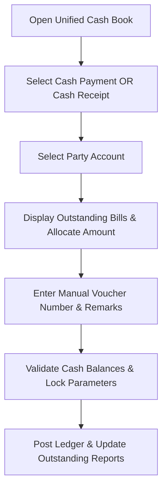

# DIAMO ERP – PHASE 9.1
## CASH BOOK – ARCHITECTURE & WORKFLOW SPECIFICATION

---

## 1. Executive Summary
This document defines the Enterprise Functional Specification Document (FSD) for the Cash Book module of DIAMO ERP. This module replaces separate cash payment and cash receipt forms with a single unified Cash Book interface. Changing the transaction type dynamically adjusts accounting models, outstanding allocations, and dashboard reports.

---

## 2. Business Purpose
Unified cash tracking secures liquidity monitoring:
*   **Operational Context:** Manages petty cash payments, client cash collections, and vendor settlements.
*   **Operational Distinctions:**
    *   *Cash Book:* Records transactions involving physical currency.
    *   *Bank Book:* Records bank ledger payments, cheques, and transfers.
    *   *Journal Voucher:* Records non-cash adjustments.

---

## 3. Module Overview
*   **Module Location:** Transactions $\rightarrow$ Cash Book.
*   **Design Paradigm:** A single screen layout. Selecting `Cash Payment` or `Cash Receipt` dynamically switches transaction logic and database write paths.

---

## 4. Workflow
The processing pipeline executes the following checks:

---

## 5. Header
Tracks voucher session metadata:
*   **Company / Financial Year:** Active tenant context.
*   **Transaction Type:** Toggle selector (`Cash Payment` / `Cash Receipt`).
*   **Cash Account:** Selects active currency accounts (e.g., Office Cash).
*   **Voucher Date:** Transaction posting date.
*   **Voucher Number:** Manual field for office voucher registration.

---

## 6. Transaction Types
*   **Cash Payment:** Credits Cash, Debits Party/Expense accounts.
*   **Cash Receipt:** Debits Cash, Credits Party/Income accounts.

---

## 7. Reference Bill
*   **Bill Linkages:** The entry links to a source document: Sale Invoice, Purchase Invoice, Sales Return, Purchase Return, or Job Book ID.

---

## 8. Outstanding Bill Selection
When a party is selected, the system displays an outstanding bill allocation grid:
*   **Grid Columns:** Bill Number, Date, Original Value, Paid Value, Outstanding Balance, Payment Allocation.
*   *Allocation Types:* Supports single bill allocations, multi-bill splits, partial payments, and automatic allocation (allocates payments to the oldest bills first).

---

## 9. Manual Voucher Number
*   **Manual Override:** Features a manual voucher input field to link entries to physical paper slips, manual receipts, or internal reference books.

---

## 10. Party Selection
*   **Auto-Lookup:** Selecting an account from the Account Master populates: Party Name, State prefix, GSTIN, PAN, and current outstanding balances.

---

## 11. Auto Fetch
Selecting a Reference Bill automatically fetches:
*   Bill Date, Bill Amount, Pending Outstanding Balance, and Customer/Supplier categorization.

---

## 12. Ledger Posting
Double-entry ledger rules applied dynamically:
*   **Cash Payment:**
    *   *Debit:* Party Account / Expense Ledger.
    *   *Credit:* Selected Cash Account.
*   **Cash Receipt:**
    *   *Debit:* Selected Cash Account.
    *   *Credit:* Party Account / Income Ledger.

---

## 13. Cash Balance
*   **Real-Time Cash Counter:** The screen displays: Opening Cash, Cash In, Cash Out, and Running Balance.
*   **Negative Balance Validation:** If the transaction reduces cash below `0.00`, the system blocks saving or displays warnings based on company policy.

---

## 14. Validation
*   **Voucher Integrity:** Checks for duplicate manual voucher numbers.
*   **Period Lock:** Postings must fall within the active financial year and after the lock date.
*   **Amount Check:** Voucher amounts must be greater than `0.00`.

---

## 15. Business Rules
1.  **Direct Allocation Rule:** Receipts and payments must adjust outstanding invoices first before recording advances.
2.  **No Edits on Posted Cash Books:** Adjustments require posting a Reversal Voucher.
3.  **Cross-Party Allocation Check:** Users cannot allocate cash allocations to bills belonging to other parties.

---

## 16. Recent Entries
*   **Sidebar Panel:** Renders a list of the 10 most recent cash vouchers.
*   *Interaction:* Allows users to quickly open, edit, or reverse transactions from the list.

---

## 17. List Page
Displays cash adjustments:
*   *Columns:* Voucher Number, Date, Transaction Type, Party Name, Amount, status (Draft/Posted/Reversed), and User.

---

## 18. Search
Supports filters for: Voucher Number, Party Name, Reference Bill, Amount, Narration, and Date.

---

## 19. Filters
Provides filters for: Cash Payment, Cash Receipt, Today, Yesterday, This Month, and Amount Range.

---

## 20. Report Impact
Saving a Cash Book entry updates:
*   *Reports:* Cash Book, Cash Register, General Ledger, Trial Balance, Accounts Outstanding, and Balance Sheet.

---

## 21. Permissions
Access is regulated by the following flags:
*   `create_cash_voucher` / `post_cash_voucher`
*   `override_negative_cash` / `backdate_cash_entry`

---

## 22. Audit
Logs all status changes:
*   Tracks manual voucher overrides, outstanding adjustments, and cash allocations.
*   Logs before and after JSON snapshots, user IDs, and system timestamps.

---

## 23. Notifications
*   **Liquidity Alerts:** Warns users when cash balances drop below threshold limits.
*   **Transaction Alerts:** Sends notifications for cash payments or receipts above specified values.

---

## 24. Architect Recommendations
1.  **Unique Barcode Constraints:** Enforce unique packet numbers to prevent overlapping dispatches.
2.  **Stateless Tracking API:** Run ageing calculations in background worker processes to prevent UI lag.

---

## 25. Final Completion Checklist
*   [x] Document journal types and entry modes (Simple vs. Advanced).
*   [x] Map the posting pipeline and double-entry validation equations.
*   [x] Detail the reversal voucher workflow and status flows.
*   [x] Map validations, permissions, and audit log rules.
*   [x] Document report and ledger integrations.
