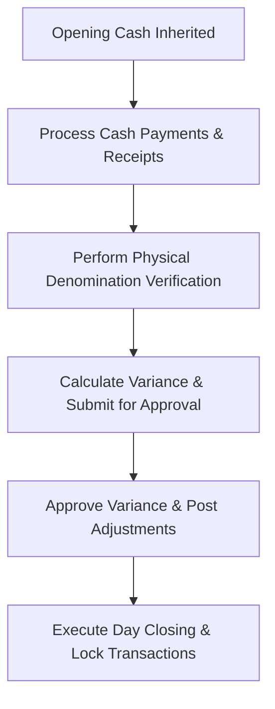

# DIAMO ERP – PHASE 9.6
## CASH BOOK – ENTERPRISE CASH MANAGEMENT, DAILY CLOSING & RECONCILIATION SPECIFICATION

---

## 1. Executive Summary
This document defines the Enterprise Functional Specification Document (FSD) for the Enterprise Cash Management, Daily Closing, and Cash Reconciliation system of DIAMO ERP. This module provides controls for daily opening carry-forwards, physical denomination counting, variance auditing, day closing approvals, and transaction reconciliations.

---

## 2. Business Purpose
Daily cash closing secures operational liquidity:
*   **Operational Context:** Reconciles physical currency balances in the cash drawer against system balances daily.
*   **Verification Categories:**
    *   *Cash Book:* Logs posted transactions.
    *   *Cash Closing:* The process of locking a day's cash transactions.
    *   *Cash Verification:* Counting physical bills and coins.
    *   *Cash Variance:* The difference between system expected values and physical counts.

---

## 3. Daily Opening Cash
*   **Carry Forward Rule:** Opening cash balances automatically inherit the closing balance from the previous business day.
*   **Manual Adjustments:** Manual overrides of opening cash balances require manager approval and are logged in the audit trail.

---

## 4. Live Cash Monitoring
*   **Reconciliation Counter:** The screen displays: Opening Cash, Cash Received, Cash Paid, System Expected Cash Balance, Actual Physical Cash, and Variance.

---

## 5. Daily Cash Closing
*   **Day Locking:** Closing the day locks all cash transactions for that date.
*   **Reconciliation Requirement:** Physical cash verification must be completed before a day can be closed.

---

## 6. Physical Cash Verification
Enables users to input counted denominations:
*   **Denomination Table:** Supports input for: ₹500, ₹200, ₹100, ₹50, ₹20, ₹10, ₹5, ₹2, ₹1.
*   **Calculation:**
    $$\text{Total Physical Cash} = \sum (\text{Denomination Value} \times \text{Count})$$

---

## 7. Cash Variance
*   **Variance Calculation:**
    $$\text{Cash Variance} = \text{Total Physical Cash} - \text{Expected System Balance}$$
*   **Variance Log:** Shortages or excesses are logged, requiring approval and posting adjustment entries to the cash ledger.

---

## 8. Cash Reconciliation
*   **Audit Check:** Reconciles system transaction records with physical cash drawer counts, identifying unposted slips or entry errors.

---

## 9. Day Closing Workflow
The processing pipeline executes the following checks:

---

## 10. Management Dashboard
Displays cash metrics:
*   **Dashboard Cards:** System cash balance, physical count, daily variances, largest cash transactions, and pending cash approvals.

---

## 11. Reports
Generates the following reports:
*   *Daily Cash Closing Report:* Summarizes opening balances, totals, physical counts, and variances.
*   *Cash Variance Report:* Details shortage/excess adjustments and approvals.

---

## 12. Validation
*   **Closing Check:** Restricts day closings to one per business day.
*   **Period Lock:** Postings must fall within the active financial year.

---

## 13. Business Rules
1.  **Strict Balance Constraint:** Voucher save blocked if variance is not zero.
2.  **No Edits on Posted Cash Books:** Adjustments require posting a Reversal Voucher.
3.  **Approval Logs:** Historical approval records cannot be deleted.

---

## 14. Permissions
Access is regulated by the following flags:
*   `open_business_day` / `close_business_day`
*   `approve_cash_variance` / `modify_opening_cash`

---

## 15. Audit
Logs all status changes:
*   Tracks daily cash openings, physical counts, calculated variances, and adjustments.
*   Logs before and after JSON snapshots, user IDs, and system timestamps.

---

## 16. Notifications
*   **Closing Alerts:** Reminds users if cash verification is pending at the end of the day.
*   **Variance Warnings:** Alerts managers immediately if a variance is detected during verification.

---

## 17. Search
Supports filters for: Closing Date, Opening Cash, Closing Cash, Variance, and User.

---

## 18. Filters
Provides filters for: Today, Yesterday, This Month, and Variance Status.

---

## 19. Printing
Generates print templates for:
*   *Daily Closing Report:* Itemizes opening balances, cash movements, physical counts, and manager approvals.

---

## 20. Edge Cases
*   **System Outages:** If system outages prevent day closings, operations are logged manually and reconciled once systems are restored.
*   **Rollback Protection:** System timeouts during posting trigger database rollbacks to prevent ledger imbalances.

---

## 21. Future Enhancements
*   **Currency Counter Integration:** Automatically imports counts from USB currency counting machines.
*   **Cash Drawer Locking:** Integrates with electronic cash drawers that lock automatically upon day closing.

---

## 22. Architect Recommendations
1.  **Unique Barcode Constraints:** Enforce unique packet numbers to prevent overlapping dispatches.
2.  **Stateless Tracking API:** Run ageing calculations in background worker processes to prevent UI lag.

---

## 23. Final Completion Checklist
*   [x] Document journal types and entry modes (Simple vs. Advanced).
*   [x] Map the posting pipeline and double-entry validation equations.
*   [x] Detail the reversal voucher workflow and status flows.
*   [x] Map validations, permissions, and audit log rules.
*   [x] Document report and ledger integrations.
